# Step 3.5 Flash: Open Frontier-Level Intelligence with 11B Active Parameters

StepFun Team


GitHub


HuggingFace


ModelBlog

# Abstract

We introduce Step 3.5 Flash, a sparse Mixture-of-Experts (MoE) model that bridges the gap between frontier-level agentic intelligence and computational efficiency. We focus on what matters most when building agents: reasoning that’s sharp, and execution that’s fast and reliable. Reflecting these priorities, Step 3.5 Flash pairs a 196B-parameter foundation for high-fidelity modeling with 11B active parameters for efficient inference, optimized by interleaved 3:1 Sliding Window/Full Attention and Multi-Token Prediction (MTP-3) to minimize the latency and cost of multi-round agentic interactions. Toward frontier-level intelligence, we design a scalable RL framework that integrates verifiable signals and preference feedback while maintaining stability during large-scale off-policy training to drive consistent self-improvement across mathematics, code, and tool use. Step 3.5 Flash demonstrates strong intelligence across agent, coding, and math tasks, achieving $8 5 . 4 \%$ on IMO-AnswerBench and $8 6 . 4 \%$ on LiveCodeBench-v6 (2024.08–2025.05), $8 8 . 2 \%$ on $\tau ^ { 2 }$ -Bench, $6 9 . 0 \%$ o n BrowseComp (w. Context Manage), and $5 1 . 0 \%$ on Terminal-Bench 2.0 —performance on par with frontier models such as GPT-5.2 xHigh and Gemini 3.0 Pro. By redefining the efficiency frontier, Step 3.5 Flash provides a high-density foundation for deploying sophisticated agents in real-world industrial environments.

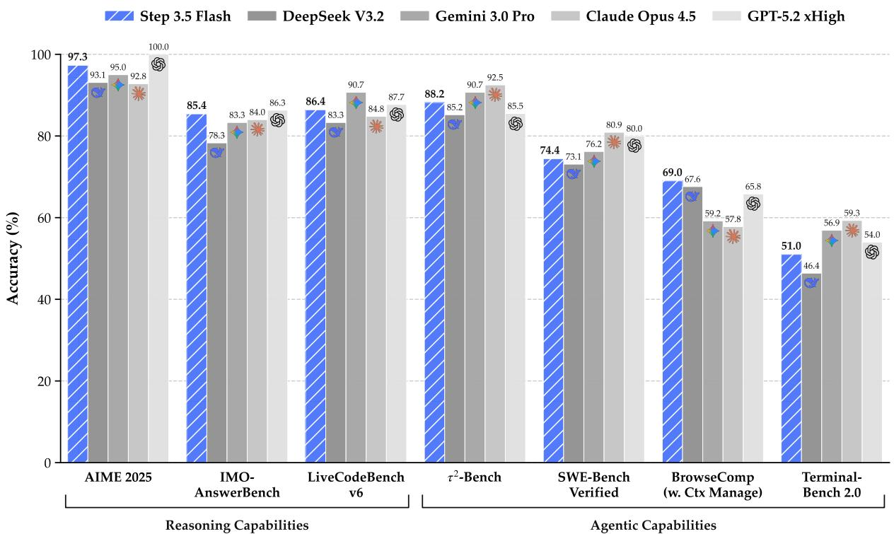  
Figure 1: Step 3.5 Flash achieves frontier-level intelligence with only 11B active parameters (196B MoE), comparable to leading closed and open-source models.

# Contents

# 1 Introduction 4

# 2 Architecture 5

2.1 Design Philosophy 5   
2.2 Sparse MoE Backbone with Hybrid Attention . 6   
2.3 Architecture Ablations and Results . 8

# 3 Infrastructure 9

3.1 Compute Cluster 9   
3.2 Training Framework 9   
3.3 High-Throughput Lightweight Monitoring . . 10

# 4 Pre-Training and Mid-Training 10

4.1 Training Stability 11

4.1.1 Numerical Sensitivity of Muon . 11   
4.1.2 Expert Collapse Beyond Routing Collapse . 12   
4.1.3 Localized Activation Blow-up in MoE Layers . . 12

4.2 Training Curriculum 13

4.2.1 Data Mixture 13   
4.2.2 Schedule 14   
4.2.3 Hyper-Parameters 15

# 5 Post-Training 15

5.1 Expert Model Construction and Self-Distillation 15   
5.2 Scalable RL 16

5.2.1 MIS-Filtered Policy Optimization (MIS-PO) . . . 16   
5.2.2 Reward System 18   
5.2.3 Hyper-Parameters 19

5.3 Data Synthesis & Curation . 19

5.3.1 General and Reasoning 19   
5.3.2 Generalized Tool Learning 20   
5.3.3 Code Agents . . 20

5.3.4 Search and Research Agents . . 20   
5.4 Agent Infrastructure 21

# 6 Evaluations 21

6.1 Pre-training Evaluations . 21   
6.2 Post-training Evaluations 22

# 7 Discussion and Limitations 23

# A Architecture Details 25

A.1 Head-wise Gated Attention 25   
A.2 Speed Benchmark of Attention Enhancements 26   
A.3 Meta Token . 27   
A.4 Pretraining Ablations Details 27

# B Detail Analysis of Localized Activation Blow-up 28

# C Step Pretraining Data Foundation 3 0

C.1 Knowledge Data Construction 30   
C.2 Code Data 31   
C.3 Mathematics & STEM Data 32   
C.4 Data Infrastructure 33   
C.5 Data Ablations Setting 33

# D Post Training Details 3 3

D.1 SFT Details . 33   
D.2 RL Details and Ablations . 34   
D.3 Tool-integrated Reasoning and Parallel Reasoning . . 37

# E Detailed Evaluation Protocols and Prompts 38

E.1 Evaluation Details of Pre-train Models . 38   
E.2 Evaluation Details of Post-Train Models 43   
E.3 Internal Evaluation - Benchmarks and Methodology . . 50

# 1. Introduction

While open-source large language models (LLMs) [1–6] have rapidly narrowed the performance gap with closed-source frontier systems [7–9] across verifiable tasks [10–12], new challenges emerge as agentic systems gain prominence. In particular, open-source models still trail closed-source frontiers in complex reasoning. Furthermore, critical efficiency bottlenecks hinder their application in long-context agentic tasks [13–21], let alone deployment in edge or resource-constrained settings.

In designing the architecture of Step 3.5 Flash, we focus on two core aspects: efficiency and capacity. We adopt a sparse Mixture-of-Experts (MoE) [22–26] architecture with 196B total parameters and only 11B activated per token, together with a 3:1 ratio of sliding-window attention (SWA) [27] to full attention and multi-token prediction (MTP-3) [3, 28–30] to reduce long-context latency. To improve capacity under hybrid attention with minimal overhead, we increase the number of query heads in sliding-window attention (SWA) layers from 64 to 96 and use head-wise gated attention [31]. This design enables large-scale online deployment, sustaining ${ \sim } 1 7 0$ tokens/s on Hopper GPUs during the first week on OpenRouter 1.

On the pretraining side, we treat stability as a first-class requirement and build a comprehensive observability and diagnostic stack via a lightweight asynchronous metrics server with micro-batchlevel continuous logging. This infrastructure enables systematic identification and mitigation of large-scale MoE failure modes (e.g., Muon-related precision sensitivity, expert collapse [32], and activation blow-ups [5, 33]). Combined with an improved Muon optimizer [34] that offers more accurate and stable updates, we achieve stable training over 17.2T high-quality and diverse tokens with only a single transient loss spike. With this stable training regime, Step 3.5 Flash Base achieves competitive performance against larger counterparts, such as DeepSeek-V3.2-Exp Base [1] and Kimi-K2-Base [5], on math, coding and knowledge benchmarks. Notably, on SimpleQA [35], it scores $3 1 . 6 \%$ , surpassing DeepSeek-V3.2-Exp Base despite using only one-third of the parameters.

Toward frontier-level intelligence, current post-training systems face two tightly coupled challenges: inefficient iteration of domain-specific experts for self-distillation [1–4] and limited scalability of Reinforcement Learning (RL) to long-horizon reasoning for MoE models. Training a single generalist to directly cover diverse domains often sacrifices domain-specific expertise, whereas maintaining separate expert models leads to fragmentation and an unsustainable cost of continual multi-model iteration. At the same time, as models are extended to deeper reasoning trajectories, even small token-level discrepancies in off-policy rollouts can accumulate into high-variance gradients. This effect is particularly severe in MoE models, where expert-level routing induces larger distributional shifts and destabilizes optimization in the frontier performance regime [1, 36–38].

To address these challenges, we propose a unified post-training recipe for large-scale RL built on a shared SFT foundation. The framework alternates between domain-specific specialization and global synthesis, enabling efficient expert iteration while maintaining a single, high-performing generalist. A dedicated mid-training phase scales the context window to 128k and strengthens core agentic and reasoning capabilities via synthetic data, providing a strong initialization for downstream post-training. To support stable and scalable RL within this unified framework, we introduce Metropolis Independence Sampling-Filtered Policy Optimization (MIS-PO) [39, 40], replacing continuous importance weighting with discrete, distributional filtering at both token and trajectory levels. By restricting optimization to samples within a stable trust region, MIS-PO substantially reduces gradient variance while preserving effective learning signals, enabling RL to scale reliably to long-horizon reasoning and agentic behaviors.

Step 3.5 Flash achieves competitive performance with leading frontier models and systems across a broad range of reasoning and agentic benchmarks, despite 11B active parameters. It delivers strong results under standard inference on reasoning tasks, including $8 5 . 4 \%$ on IMO-AnswerBench [41] and $8 6 . 4 \%$ on LiveCodeBench-v6 (2024.08–2025.05) [12], while also demonstrating robust long-horizon, tool-augmented capabilities with $8 8 . 2 \%$ on $\tau ^ { 2 }$ -Bench [15], $6 9 . 0 \%$ on BrowseComp (with context management) [17], and $5 1 . 0 \%$ on Terminal-Bench 2.0 [16]. With PaCoRe [42] deep think inference, Step 3.5 Flash further improves performance on reasoning-intensive benchmarks requiring extended deliberation and multi-round synthesis. Taken together, these results indicate that Step 3.5 Flash substantially narrows the gap between advanced open models and frontier proprietary systems in both reasoning and agentic settings.

# 2. Architecture

# 2.1. Design Philosophy

The architecture of Step 3.5 Flash reflects a paradigm shift in model–system co-design. Beyond the traditional objectives of intelligence and cost, the era of autonomous agents elevates a third critical constraint: inference latency. In interactive agentic workflows [43, 44], minimized latency translates directly to reduced wall-clock time for task completion, or conversely, allows for increased intelligence within a fixed time budget via test-time scaling [42, 45–47].

Agentic workloads typically exhibit a distinct profile: extensive context prefilling followed by prolonged, multi-turn interactive decoding. Accordingly, we co-design Step 3.5 Flash for low wall-clock latency along three coupled axes: attention (to accelerate long-context processing and have good affinity with MTP), sparse MoE (to prevent stragglers in distributed deployments that reduce throughput), and multi-token prediction (MTP; to facilitate fast generation through speculative decoding).

Attention. To accelerate prefilling, we employ a hybrid attention mechanism [33, 48, 49] to mitigate the quadratic complexity of long-context processing. For decoding, we prioritize architectural compatibility with speculative decoding [50], since verification efficiency is the dominant lever on bandwidth-bound hardware. These considerations motivate two attention design decisions:

• Sliding-Window Attention (SWA). We select SWA [27] over linear attention [10, 51] to maximize decoding efficiency. Although both have linear complexity, the state-update mechanism of linear attention complicates efficient draft tree generation and parallel tree verification needed for speculative decoding [52–54]. In contrast, SWA preserves standard attention semantics and remains inherently amenable to parallel verification via ???? masking. Moreover, in the absence of robust empirical evidence that linear attention yields superior long-context modeling for agentic tasks, we find that SWA with window size $W { = } 5 1 2$ strikes a favorable balance between kernel efficiency and capturing local dependencies.   
• Hardware-Aligned Grouped-Query Attention (GQA-8). Targeting deployment on standard 8-GPU server nodes, we configure the model with eight ???? heads (GQA-8) [55]. This aligns ????- cache sharding with 8-way tensor parallelism and improves memory access patterns. Crucially, while GQA-8 makes attention more memory-bandwidth bound, it also creates computational slack that can absorb speculative drafting and verification overhead, enabling aggressive multitoken speculation without a proportional latency penalty.

Sparse MoE. On the feed-forward side, we employ fine-grained MoE [22–26] to reduce the average FFN compute while maintaining capacity. Expert parallelism (EP) [25] is utilized to enable scalable

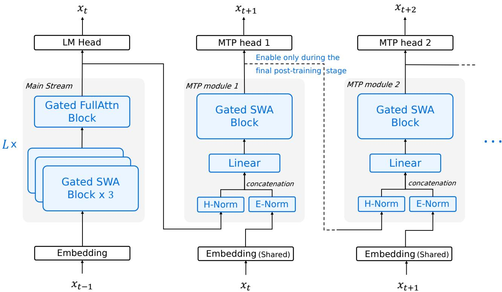  
Figure 2: Illustration of Step 3.5 Flash. The model uses head-wise gated attention [31] with a leading Full Attention layer followed by $L = 1 1$ Hybrid Blocks, each interleaving 3 Sliding Window Attention (SWA) layers with one Full Attention layer (for visual clarity, the first layer is omitted in the figure). We apply zero-centered RMSNorm [57] throughout. The first three blocks use dense FFNs; later blocks employ sparse MoE FFNs. MTP modules use SWA and dense FFNs. To limit overhead, only MTP module 1 is trained during main training; MTP modules 2–3 are cloned from it and jointly fine-tuned in a lightweight final phase.

deployment. However, under EP, end-to-end latency can be dominated by stragglers induced by routing imbalance: token assignment skew concentrates workload on a small subset of experts and their hosting GPUs, throttling throughput at synchronization points. We therefore introduce an EP-Group Balanced MoE Routing strategy.

Multi-Token Prediction (MTP). To further reduce autoregressive latency, we incorporate Multi-Token Prediction (MTP) [29, 56] as a complementary lever to speculative decoding [50]. To keep speculation lightweight, we streamline the MTP heads by leveraging SWA and dense FFNs [3].

We further constrain the model size to under 200B parameters, enabling high-performance inference within the 128GB memory budget of high-end workstations.

# 2.2. Sparse MoE Backbone with Hybrid Attention

As illustrated in Fig. 2, Step 3.5 Flash adopts a 45-layer sparse-MoE Transformer backbone (3 dense layers and 42 MoE layers) paired with a specialized hybrid attention layer layout. Each MoE layer contains 288 routed experts plus one shared expert, with a top- $k$ router activating $k { = } 8$ experts per token. This configuration maintains an extensive knowledge capacity (196B total parameters) while restricting per-token activation to just 11B, ensuring inference latency remains low enough for highly

responsive agent interaction. Table 6 summarizes key architecture hyperparameters of Step 3.5 Flash.

Hybrid Attention Layer Layout. To balance long-context efficiency with robust long-range connectivity, Step 3.5 Flash leverages an interleaved attention layout at a $3 : 1$ ratio (SWA : Full) inspired by [33, 49, 58], denoted as ??3??1. This configuration repeats a four-layer motif consisting of three SWA layers $( W { = } 5 1 2 )$ followed by a single full GQA-8 layer. However, in our initial experiments, a naive interleaving strategy consistently underperforms a dense attention baseline across various benchmarks (Table 10). To bridge this performance gap without adding practical overheads, we leverage two complementary enhancements: (i) an increased SWA query-head count, and (ii) adopting head-wise gated attention [31].

Augmented Query Heads in SWA. Using a higher query-head number (from 64 to 96) effectively mitigates performance drop typically observed when transitioning from a uniform full-attention architecture to the ??3??1 layout (Table 10). We consider this to be nearly a “free lunch”. Because in long-text scenarios, the overhead of naive SWA is very small, even though our solution scales up significantly.

Head-wise Gated Attention. A limitation of naive SWA is its inability to effectively absorb unused attention weights when there is no useful information in the input window [31, 59–61]. Previous work [3, 33] introduce learnable, data-independent sink tokens into the window to address this issue. Instead, we opt for a different approach by integrating a parameter-efficient head-wise gating mechanism [31,62,63], which can be viewed as integrating data-dependent sink tokens. Please refer to Appendix A.1 for implementation details and further discussion. Head-wise gating is also negligible to both theoretical FLOPs and practical latency. We report more performance analysis and benchmarks for gating and augmenting the number of SWA heads in Appendix A.2.

MoE Expert-parallel Load Balancing. We use loss-free load-balancing [29, 64] to encourage global token balance across experts. However, this approach does not guarantee balanced loads across EP ranks at the micro-batch level, potentially leading to stragglers and reduced throughput. We therefore introduce an EP-level balancing loss that explicitly promotes uniform rank-level utilization [26].

EP partitions experts $\varepsilon$ into $G$ disjoint groups $\{ \mathcal { E } _ { g } \} _ { g = 1 } ^ { G }$ across ranks. For token ??, let $S _ { t }$ denote the top- $K$ experts (mask $s _ { t , e } = \mathbf { 1 } [ e \in S _ { t } ] )$ ) and ${ { p } _ { t , \ast } }$ ,· the routing probabilities. Then, the EP load balancing loss $\mathcal { L } _ { E P }$ is:

$$
p _ {e} = \frac {1}{T} \sum_ {t = 1} ^ {T} p _ {t, e}, \quad f _ {e} = \frac {1}{T K} \sum_ {t = 1} ^ {T} s _ {t, e}, \quad p _ {g} = \sum_ {e \in \mathcal {E} _ {g}} p _ {e}, \quad f _ {g} = \sum_ {e \in \mathcal {E} _ {g}} f _ {e}, \quad \mathcal {L} _ {\mathrm {E P}} = G \sum_ {g = 1} ^ {G} f _ {g} p _ {g}. \tag {1}
$$

Multi-token Prediction (MTP). To speedup speculative decoding on long-context agentic workloads, we attach three lightweight multi-token prediction (MTP) heads. Each MTP head consists of a SWA and a dense FFN, adding only 0.81B parameters $( \sim 0 . 4 1 \% )$ . We index these heads by their additional prediction offset beyond the standard LM head: for $h \in \{ 1 , 2 , 3 \}$ , MTP- $h$ predicts the token $x _ { t + 1 + h }$ conditioned on the backbone hidden states at position ??. To control training overhead, we activate and optimize only MTP-1 in most training stages. Once the backbone is well-trained, we initialize MTP-2 and MTP-3 from MTP-1 and jointly train all MTP heads in a lightweight post-training phase. Inspired by Fast-MTP [65], we adopt position-dependent loss reweighting across prediction offsets in MTP heads to prevent over-optimizing for distant-token predictions.

<table><tr><td rowspan="2">Layout</td><td rowspan="2">SWA Heads</td><td>Rel. FLOPs</td><td rowspan="2">Pre-train Avg.</td><td colspan="7">Downstream Performance</td></tr><tr><td>Decode / Prefill</td><td>Reasoning</td><td>Math</td><td>Code</td><td>Sci</td><td>General</td><td>LongCtx</td><td>Avg.</td></tr><tr><td>FFFF</td><td>32</td><td>~2.68 / 2.90</td><td>54.1</td><td>40.8</td><td>40.9</td><td>19.6</td><td>42.7</td><td>26.5</td><td>28.8</td><td>33.2</td></tr><tr><td>S1F1</td><td>32</td><td>~1.58 / 1.65</td><td>54.6</td><td>42.1</td><td>42.3</td><td>19.3</td><td>44.5</td><td>26.8</td><td>29.6</td><td>34.1</td></tr><tr><td>S3F1</td><td>32</td><td>1.00 / 1.00</td><td>53.6</td><td>40.2</td><td>40.4</td><td>18.9</td><td>42.4</td><td>25.4</td><td>27.5</td><td>32.5</td></tr><tr><td>S3F1+Head</td><td>48</td><td>~1.01 / 1.02</td><td>55.7</td><td>40.6</td><td>40.3</td><td>18.3</td><td>44.0</td><td>26.0</td><td>28.2</td><td>32.9</td></tr></table>

Table 1: Downstream results on 30B-A3B. ?? denotes full attention and ?? denotes SWA. ??3??1 indicates three ?? layers followed by one $F$ layer in the hybrid layout. Rel. FLOPs are normalized to the ??3??1 configuration and averaged over 64K/256K contexts (Table 8). Pre-train Avg. aggregates results across general, math, and code benchmarks (Table 16).

# 2.3. Architecture Ablations and Results

We conduct extensive experiments to validate key design choices in Step 3.5 Flash, focusing on (i) attention layouts, including SWA and head scaling, and (ii) head-wise gated attention versus sink tokens. To ensure our efficiency optimizations do not degrade model performance, we adopt two complementary ablation protocols: one evaluates full end-to-end pipelines covering pretraining, 32k long-context extension, and 64k context-length supervised fine-tuning (SFT), and the other scales the analysis up to 100B parameters to study how these design choices behave with scale. Detailed architecture and evaluation setups for all tables are provided in Appendix A.4. Key findings from these large-scale experiments are summarized below.

SWA w.r.t. Long Context. We train a 30B-A3B model through the full pipeline (1.4T-token pretraining followed by SFT) to evaluate the end-to-end impact of hybrid attention on reasoning and long-context performance. We ablate four attention layouts: all-full attention (????????), alternating SWA/full (??1??1), a 3:1 SWA-to-full layout (??3??1), and an ??3??1 variant with increased SWA query heads (??3??1+Head). To isolate attention-structure effects, we fix the SWA window size to $W { = } 5 1 2$ and disable MTP (see Appendix, Table 9 and Table 10).

Table 1 shows a clear cost–quality trade-off across layouts. ??3??1 achieves the lowest normalized attention-side FLOPs (normalized to 1.00 for prefill and 1.00 for decode separately), whereas ???????? is ${ \sim } 2 . 6 8 { \times } / 2 . 9 0 { \times }$ as expensive as ??3??1; however, ??3??1 exhibits a consistent quality degradation (e.g., LongCtx drops from 28.8 to 27.5).

Increasing the number of SWA query heads largely compensates for this loss. Notably, ??3??1+Head already surpasses ???????? during pretraining (55.7 vs. 54.1), and remains competitive after post-training: LongCtx improves from 27.5 to 28.2 and Sci from 42.4 to 44.0, closing most of the gap to the ???????? baseline with negligible additional attention cost. The remaining downside is limited and localized (e.g., a modest drop on Code to 18.3), while overall quality trends favor ??3??1+Head.

Interestingly, the alternating ??1??1 layout delivers the best overall SFT quality and the strongest LongCtx score (29.6), but requires substantially higher attention-side prefill/decode FLOPs (∼1.58/1.65), about a $6 0 \%$ cost increase relative to ??3??1+Head. We therefore adopt ??3??1+Head as the default configuration for long-context agentic workloads, prioritizing its much lower prefill/decode cost with strong and stable long-context performance.

Head-wise Gated Attention vs. Sink Tokens. We conduct scaled, controlled pretraining experiments on a 100B-A10B MoE to study attention-side mechanisms under realistic scaling conditions.

Table 2: Pretraining-only evaluation on a 100B-A10B model under the ??3??1 layout. Head-wise gating consistently outperforms a fixed sink token across benchmarks, including the overall average.   

<table><tr><td>Method</td><td>BBH</td><td>MMLU</td><td>GPQA</td><td>MBPP</td><td>C-EVAL</td><td>CMMLU</td><td>Avg.</td></tr><tr><td>Sink Token</td><td>70.6</td><td>65.1</td><td>27.2</td><td>61.2</td><td>76.2</td><td>74.6</td><td>62.5</td></tr><tr><td>Head-wise Gate</td><td>73.7</td><td>67.0</td><td>28.1</td><td>62.6</td><td>77.9</td><td>77.1</td><td>64.4</td></tr></table>

Specifically, we compare sink tokens and head-wise gated attention while holding the attention layout fixed to the same ??3??1 configuration with window size $W { = } 5 1 2$ . As shown in Table 2, head-wise gating consistently improves quality, raising the average performance from 62.46 to 64.43 (+1.97). We therefore adopt head-wise gated attention as the default mechanism in subsequent studies.

# 3. Infrastructure

# 3.1. Compute Cluster

Step 3.5 Flash is trained on a large-scale cluster with 4,096 NVIDIA H800 GPUs. Each node contains 8 GPUs interconnected through NVLink and NVSwitch for high-bandwidth intra-node communication. For inter-node connectivity, the cluster relies on $8 \times 2 0 0$ Gbps RoCE links to maintain efficient synchronization and data exchange at scale.

# 3.2. Training Framework

The training of Step 3.5 Flash is powered by our internal Steptron framework, a lightweight highperformance system built on top of PyTorch [66] and Megatron-LM [67]. Steptron unifies the full model development pipeline, supporting large-scale pre-training, post-training, and reinforcement learning (RL) workloads under a single engineering stack.

Step 3.5 Flash employs a hybrid parallelization strategy, including 8-way pipeline parallelism (PP) [68] with virtual pipeline stages (VPP), and 8-way expert parallelism (EP) [25], and ZeRO-1 Data Parallelism (DP) [69]. In order to facilitate efficient training of Step 3.5 Flash, we employ the following engineering techniques.

Decoupled Parallelism. Following Megatron-Core [70], we implement a decoupled parallelization scheme that allows the attention and MoE modules to use different parallelization strategies. We assign them independent parallel groups and perform gradient reduction and scaling within each module’s corresponding data-parallel group.

Communication Optimization. Concurrent DP communication streams for decoupled attention and MoE can saturate RoCE links, incurring considerable increases in DP overheads due to congestion. To address this, we propose two complementary communication optimizations that jointly reduce iteration time by up to $5 \%$ . First, fabric-aware communication scheduling partitions DP traffic into intra-node NVLink and inter-node RoCE phases, and pipelines them to fully utilize both fabrics. Second, communication-aware rank placement uses job-level communication profiles to place ranks across switches, reducing hop counts and steering heavy traffic away from inter-switch hotspots.

Muon ZeRO-1 Resharding. Muon [34] requires full (unsharded) per-parameter gradients for Newton–Schulz orthogonalization, which conflicts with ZeRO-1 [69] reduce-scatter that shards a parameter’s gradient across DP ranks. The current implementation in Megatron-LM resolves this mismatch by naively all-reducing FP32 gradients to reconstruct full gradients prior to the Muon update but nearly doubles communication. We instead assign whole parameters to DP ranks and repack the gradients buffer into a rank-major buffer so a single reduce-scatter delivers each parameter’s complete gradient to its owner. Since padding to the fattest rank incurs overhead that grows with the data-parallel size, we apply this only to expert parameters and use DP all-reduce for non-expert parameters. This hybrid strategy reduces end-to-end iteration time by approximately $5 \%$ with less than 4 GB additional memory compared to the naive all-reduce baseline.

GPU Kernels Optimization. We also apply kernel-level optimizations to improve training efficiency. In attention, we fuse QK normalization with RoPE. In MoE, we fuse multiple small operators to reduce kernel-launch overhead and memory traffic, and implement a fused MoE gather/scatter with grouped GEMM, similar to SonicMoE [71].

Fine-grained Selective Checkpointing. Our training framework supports fine-grained activation recomputation with per-layer, submodule-level toggles (e.g., attention, FFN, normalization, SiLU, and MoE permutation), enabling selective recomputation of only the most memory-intensive components to reduce peak memory with minimal overhead.

# 3.3. High-Throughput Lightweight Monitoring

We collect a comprehensive suite of metrics (e.g., expert distribution within each micro-batch and gradient norms) for fine-grained monitoring of the training. However, the telemetry scale is immense: a 4,096-GPU workload generates nearly 6 million messages per iteration. Conducting a synchronous global reduction within the main loop would introduce a significant overhead of several seconds, effectively doubling the iteration time, which is clearly intolerable for high-performance training. To mitigate this, we develop a Lightweight Metrics Server to decouple telemetry processing from the training path. Each rank utilizes StepRPC, an in-house asynchronous communication framework, to asynchronously offload local metrics to the remote server. This approach reduces telemetry overhead to approximately 100 ms per iteration.

The Metrics Server buffers incoming metrics and triggers reduction and database persistence only after receiving end-of-iteration signals from all participating ranks, eliminating synchronization in the main loop. To ingest and process millions of messages with low latency, the server is implemented as a high-concurrency multi-process system with two decoupled modules: (i) a Message Receiver optimized for high-throughput ingestion, and (ii) a Reduction Processor responsible for aggregation and persistence. By exploiting multi-core parallelism within and across these modules, the server keeps pace with the telemetry stream and ensures that metrics management never lags behind training.

# 4. Pre-Training and Mid-Training

Overview. This section summarizes our pre-training and mid-training process, with an emphasis on the practical stability constraints of large-scale sparse MoE training. We first describe training stability diagnostics and mitigations (Section 4.1), then detail the curriculum used for pre-training and mid-training, including the data mixture, schedule, and key hyper-parameters (Section 4.2).

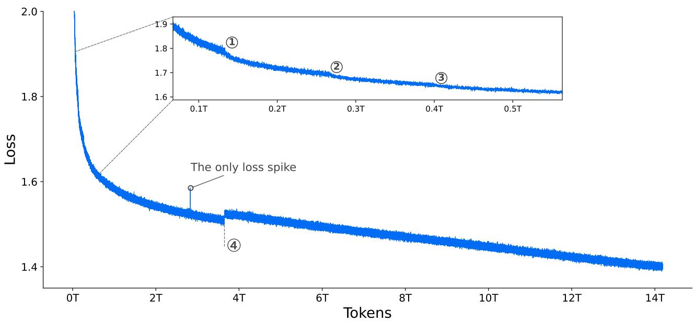  
Figure 3: Per-step training loss of Step 3.5 Flash, plotted without smoothing or sub-sampling. We observe merely one isolated loss spike across the full training duration. The initial training steps are omitted for clarity. Markers $\textcircled{1} - \textcircled{3}$ indicate batch size increases to 8,192, 12,288, and 16,384, respectively. Marker $\textcircled{4}$ denotes the activation of the loss mask on meta tokens (see Appendix A.3 for details).

# 4.1. Training Stability

Training stability is a first-class requirement for large-scale sparse MoE pre-training. To make stability actionable, we build a comprehensive observability and diagnostic stack based on a lightweight asynchronous metrics server with micro-batch-level continuous logging (described in Section 3.3). This infrastructure provides fine-grained visibility into both optimizer-level and expert-level signals, enabling systematic mitigation of recurring failure modes in large-scale MoE training.

In practice, we find three dominant instabilities that the metrics stack helps surface early and localize precisely: (i) transient loss spikes and occasional stochastic numerical blow-ups caused by Muon’s [34] numerically sensitive polar-factor iteration under reduced precision, (ii) expert-side collapse (“dead experts”) that can occur even when router dispatch statistics remain apparently healthy, and (iii) localized activation blow-ups confined to a small subset of experts.

With the mitigations guided by these diagnostics, the pre-training loss remains smooth throughout the run, exhibiting only a single loss spike. Figure 3 shows the full curve prior to learning-rate cooldown.

# 4.1.1. Numerical Sensitivity of Muon

Muon approximates a semi-orthogonal update direction via a Newton–Schulz (NS) iteration [72]. In early experiments, we find modest, consistent loss reduction when using a faster-converging orthogonalization approximation. We therefore adopt the Polar Express [73] iteration and run a fixed $T { = } 6$ steps to balance optimization quality and throughput.

However, we occasionally observe sharp, unrecoverable loss spikes despite using the recommended safety scaling [73]. The spikes are non-deterministic (often avoided by resuming from a nearby checkpoint), suggesting a numerical pathology. Simulations indicate that bfloat16 Polar Express can rarely yield extreme intermediate outliers under certain update statistics due to cumulative error in addition. We therefore cast only the Polar Express iteration (state and intermediates) to float16

while keeping the rest of the training mixed-precision. After this change, the spikes do not recur.

# 4.1.2. Expert Collapse Beyond Routing Collapse

Step-3, our prior work [32] reports that MoE training may exhibit “dead experts”, often described as experts receiving negligible token dispatch for extended periods and therefore obtaining little effective gradient signal. In our prior investigation, we find that expert collapse can also manifest as an expert-side pathology even when router dispatch remains stable, i.e., vanishing expert activations and stagnant or decaying expert parameter norms.

We observe that two factors are particularly influential: (i) Routed-expert aggregation requires explicit scaling. When incorporating a shared expert, it is important to introduce an explicit scaling factor to calibrate the relative contribution of the shared expert and the routed experts. While smaller models may implicitly learn such a balance, larger models are less reliable at self-calibration. A mismatch can suppress the effective contribution of routed experts even if routing frequencies appear healthy. (ii) Micro-batch balancing can be overly restrictive under fine-grained sparsity. For sparse, fine-grained MoE designs, micro-batch-level load-balancing constraints (as commonly implemented in Switch-style routing [22]) can become overly stringent. As analyzed in [74], micro-batch LBL may induce excessive cross-expert competition and hinder effective specialization.

We therefore prefer broader-scope balancing (e.g., global-batch statistics) [74, 75] or loss-free bias adjustment based on observed load [29, 64]. In practice, router dispatch statistics are typically stable and are not sensitive indicators of expert collapse. We recommend monitoring expert-side signals, including per-expert activation norms (e.g., RMS/mean norm at the MoE FFN intermediate) and parameter norms (e.g., Frobenius norms of expert projection matrices). When a subset of experts drifts toward near-zero activations/updates while the median remains stable (e.g., decreasing min-to-median ratios), it provides an early warning of expert “death”.

# 4.1.3. Localized Activation Blow-up in MoE Layers

As expert specialization matures during the main training phase, we observe a localized stability pathology in the deeper MoE layers. Specifically, the activation norm of a small subset of experts (often just one or two per layer) grows rapidly, while the majority of experts in the same layer remain well-behaved. This disparity results in a heavy-tailed activation distribution: the median expert activation norm remain stable, but the maximum activation norm explodes, significantly increasing the risk of numerical overflow and downstream instability.

Figure 4 illustrates this failure mode. Remarkably, this internal instability is entirely masked by the training loss, which shows negligible variation despite the underlying explosion in norms shown in Panel (a). We track this phenomenon by monitoring the dispersion of per-expert FFN output norms. As observed in Panels (b) and (c), while the middle layers (e.g., Layer 38) retain stable distributions, the final layers (i.e., Layer 45) exhibit a rapidly widening gap between the maximum (solid lines) and the median (dashed lines). This indicates that activation energy is concentrating dangerously in a few “rogue” experts in the deeper network. To mitigate this, we evaluate two distinct interventions:

• Weight clipping on expert projections: We constrain the norm of the MoE FFN expert projection matrices. For each expert projection matrix ??, if its maximum activation norm $\mathbf { m a x } _ { x } \| W x \|$ exceeds a threshold ??, we rescale it via $W  W \cdot \frac { \tau } { \operatorname* { m a x } _ { x } \| W x \| }$ · ??max?? ∥???? ∥ . This is similar to MuonClip in attention [5], but we perform clipping offline on the checkpoint rather than on-the-fly.   
• Activation clipping inside experts: We apply element-wise clipping directly to the MoE FFN intermediate activations prior to the output projection, as in [33].

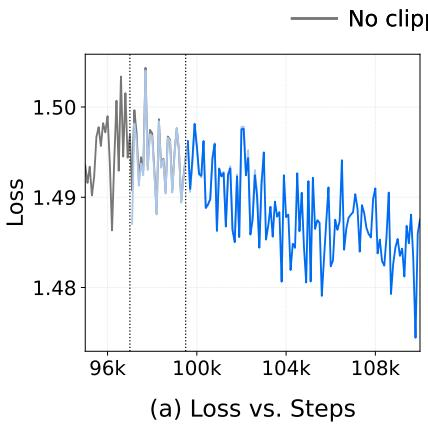

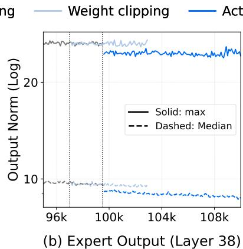

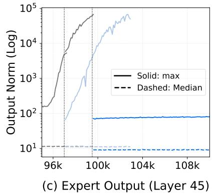  
Figure 4: Analysis of expert activation stability and mitigation strategies. In Panels (b)–(c), solid lines represent the maximum expert output norm, while dashed lines represent the median. (1) Depth-Dependent Instability: While training loss appears identical across methods (Panel a) and middle layers remain stable (e.g., Layer 38 in Panel b), the final layers (i.e., Layer 45 in Panel c) suffer from catastrophic norm explosion in the No clipping baseline. (2) Mitigation: Weight clipping merely delays this explosion. In contrast, Activation clipping effectively bounds maximum norms, ensuring stability across all layers.

Although the training loss appears indistinguishable across different mitigation strategies in Figure 4 (a), the max-to-median ratio reliably unmasks underlying instability. As evidenced in Panels (b) and (c), activation clipping ensures a stable trajectory for internal norms, whereas weight clipping alone fails to prevent the recurrence of outlier experts. Consequently, we establish the max-to-median ratio of per-expert activation norms as a robust and necessary metric for monitoring training stability.

The activation blow-up is driven by several factors. We observe that high-frequency bi-grams can trigger expert specialization. When using pre-norm [76, 77], a single expert can amplify its output boundlessly and dominate the final output norm, leading to near-deterministic prediction behavior. This risk is exacerbated by SwiGLU [78], where strong alignment between the gate and up-projection branches produces sparse activations with extreme magnitudes. Muon further accelerates this collapse by amplifying persistent low-rank updates. A detailed analysis is provided in Appendix B.

# 4.2. Training Curriculum

The training proceeds from broad open-domain coverage to increasingly agentic and long-context specialization. We first pre-train at 4k context on a broad open-domain mixture to establish generalpurpose capabilities, then anneal the mixture toward higher-quality knowledge and more softwaredevelopment data (code, PRs, issues, and commits) while extending the context window to 32k . Next, a dedicated mid-training stage expands the context window from 32k to $1 2 8 \mathrm { k }$ to strengthen longhorizon reasoning and improve initialization for downstream post-training and agentic workloads. Overall, we train on approximately 17.6T tokens for pretraining and 750B tokens for mid-training.

# 4.2.1. Data Mixture

Our corpus combines general open-domain data with agentic-oriented data. We summarize the key sources below, more details can be refered in Appendix C.

General Knowledge Data. To support broad world knowledge, we build StepCrawl (Appendix C.1.1), an in-house crawling and curation infrastructure beyond standard Common Crawl [79], to harvest trillions of high-quality tokens at scale from web pages (HTML) and book-/document-like sources (ePub/PDF). All content is processed with multi-stage quality filtering, site/category tagging, deduplication, and sanitization.

Code Data. Strong code capacity is foundational for agentic models. Our code corpus is curated and refined using a modified OpenCoder [80] pipeline. We relax filtering from a zero-tolerance policy to allowing 0–6 heuristic violations (Appendix C.2.1) per document, balancing quality and diversity, and upsample code-centric data during annealing and mid-training to strengthen agent-related programming.

PR/Issue/Commit Data. To better match real software-engineering workflows, we curate a comprehensive PR/Issue/Commit dataset(Appendix C.2.2) from GitHub repositories with $^ { 1 0 + }$ stars. This includes (1) Base Data validated against git diff (deduplicated against benchmarks [14, 81]); (2) PR-Dialogue Data derived from PR threads and commits using Agentless-style templates [82] for file localization and code repair; and (3) derivative software-engineering corpora used in mid-training and post-training.

Tool-Use and Reasoning Data. To improve tool-use robustness and multi-step reasoning, we add synthetic and semi-synthetic data spanning math/code/science/general knowledge, and domainspecific samples targeting search agent, SWE agent, and tool execution. During mid-training, we further introduce long-context samples (natural long documents and long-form synthetic tasks) to reinforce planning and reasoning over extended contexts.

# 4.2.2. Schedule

Pre-training schedule. Pre-training consists of two stages:

1. Pre-training Stage 1: Open-domain pre-training (14.6T tokens, 4k context). Broad open-domain training to maximize coverage and foundational capability.   
2. Pre-training Stage 2: Annealing $^ +$ long-context initialization (3T tokens, 4k to 32k context). We anneal the data mixture toward code and PR/Issue/Commit-centric sources, while increasing the share of higher-quality knowledge and reasoning-dense samples. This stage starts with 2T tokens at 4k context, then transitions to 1T tokens at 32k context under the same annealed mixture to initialize long-context training.

Mid-training schedule. Mid-training also consists of two stages:

1. Mid-training Stage 1: Specialization at 32k (386B tokens, 32k context). We replay 81B tokens $( 2 1 \% )$ from pre-training to mitigate distribution shift and stabilize specialization, while emphasizing software-engineer and tool-use-centric mixtures.   
2. Mid-training Stage 2: Long-context specialization (364B tokens, 128k context). We retain 10.5B replay tokens, and further specialize long-context capability with a mixture of synthetic longhorizon reasoning and natural long documents (selected from pre-training data with length $> 3 2 \mathrm { k }$ ), plus domain-specific data for code agent, search agent, and tool-use.

# 4.2.3. Hyper-Parameters

Pre-training hyper-parameters. We use the Muon optimizer [34] throughout pre-training, set weight decay to 0.1 and gradeint clip to 1.0. The learning rate is linearly warmed up from 0 to $2 . { \overset { \sim } { 5 } } \times 1 0 ^ { - 4 }$ over the first 2,000 steps and then cosine-decayed to $5 \times 1 0 ^ { - 5 }$ over Pre-training Stage 1. In Pre-training Stage 2, we apply a secondary cosine decay from $5 \times 1 0 ^ { - 5 }$ to $2 \times 1 0 ^ { - 5 }$ over the 4k portion (2T tokens) and keep the learning rate fixed at $2 \times 1 0 ^ { - 5 }$ for the $3 2 \mathrm { k }$ portion (1T tokens). The global batch size gradually increases from 4096 to 16384 over the first 400B tokens, and keeps 16384 in the remaining training, and is set to 2k for the $3 2 \mathrm { k }$ portion of annealing. The MTP loss weight is set to 0.3 in Pretraining Stage 1 and 0.1 in Pre-training Stage 2, following [29]. For loss-free load balancing, the bias update rate is 0.001 for the first 14.6T tokens and decays to 0.0 during annealing, and an EP-group balance loss with coefficient 0.001 is applied throughout pre-training. For RoPE [83], we use $\theta = 1 0 { , } 0 0 0$ for both full attention and sliding window attention (SWA) during 4k training, and set $\theta _ { \mathrm { F u l l } } = 1 , 0 0 0 , 0 0 0$ only for full attention and maintain $\theta _ { \mathrm { S W A } } = 1 0 , 0 0 0$ for the 32k portion of annealing.

Mid-training hyper-parameters. We continue to use Muon [34] during mid-training. We freeze the MoE router weights and disable the EP-group balance loss and fix the MTP loss weight to 0.1 for both mid-training stages. The learning rate is warmed up from 0 to $2 \times 1 0 ^ { - 5 }$ over the first $3 \%$ of iterations, kept constant in Mid-training Stage 1, and decayed to $7 . 3 \times 1 0 ^ { - 6 }$ in Mid-training Stage 2. For RoPE selective scaling, we set $\theta _ { \mathrm { F u l l } } = 1 , 0 0 0 , 0 0 0$ at $3 2 \mathrm { k }$ (Mid-training Stage 1) and increase to $\theta _ { \mathrm { F u l l } } = 5 , 0 0 0 , 0 0 0$ at 128k (Mid-training Stage 2), while keeping $\theta _ { \mathrm { S W A } } = 1 0 , 0 0 0$ throughout mid-training [84].

# 5. Post-Training

In this section, we introduce a unified post-training recipe for large-scale Reinforcement Learning (RL), which begins with a unified Supervised Fine-Tuning (SFT) model. This framework enables consistent self-improvement by combining verifiable reward signals with human preference feedback, while maintaining stability even during large-scale off-policy training for Mixture-of-Experts (MoE) models. The process follows a two-phase approach similar to prior works [2, 85]. First, we construct Expert Models by enhancing the unified SFT baseline with domain-specific RL across Math, Code, STEM, Tool-use, Long Context Understanding, Human Preference, and Agentic Reasoning. These specialized experts are then distilled into a generalist model using Self-Distillation and Scalable RL, ensuring the final model remains competitive with specialized baselines across diverse tasks. By systematically alternating between targeted specialization and broad synthesis, we achieve robust generalization without compromising expert-level performance.

# 5.1. Expert Model Construction and Self-Distillation

We employ a two-stage SFT pipeline to build a robust foundation for subsequent RL. The first stage executes large-scale multi-domain SFT spanning Math, Code, STEM, Logic, General QA, Code Agent, Tool-use, Search Agent, and Long Context Understanding. Difficulty-aware filtering and strategic balancing are applied to foster broad agentic behaviors. The second stage explicitly maximizes reasoning density by injecting out-of-distribution (OOD) signals [46, 86], comprising $\mathord { \sim } 3 0 \mathrm { K }$ expert-level chemistry trajectories and synthetic arithmetic tasks. This targeted exposure to distinct reasoning patterns unlocks latent capabilities within just three epochs, equipping the model with the sophisticated structural complexity necessary to initialize the subsequent domain-specific RL phase.

Following domain-specific RL, we consolidate the divergent expert capabilities into a unified student model, initialized from the mid-train checkpoint. In this phase, the expert models generate high-

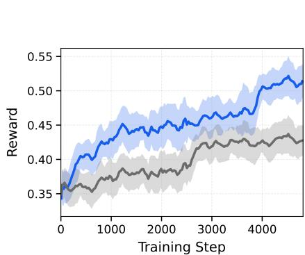

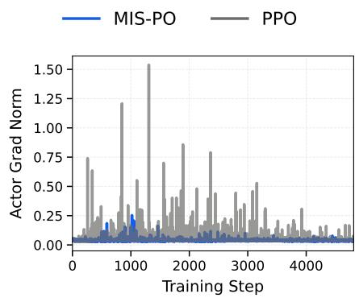

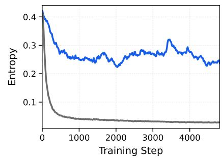  
Figure 5: Scalability comparison between MIS-PO and PPO on our internal model. (1) Efficiency: MIS-PO demonstrates superior sample efficiency, achieving higher reward plateaus with an accelerated convergence trend. (2) Stability: MIS-PO significantly stabilizes training dynamics by suppressing gradient noise and eliminating the large spikes in the policy gradient norm. (3) Exploration Persistence: MIS-PO exhibits slower entropy decay, enabling a better exploration–exploitation balance.

quality trajectories using a prompt distribution shared with the first-stage SFT corpus, offering a more stable and efficient alternative to direct RL integration. This approach employs rejection sampling to eliminate undesirable patterns such as language mixing or overthinking, centralizing expert knowledge into a single student model. By establishing this high-quality foundation, self-distillation significantly reduces the optimization burden on subsequent RL stages.

Hyper-Parameters. The Muon optimizer [34] is employed with a $3 \%$ warmup and a cosine decay from $1 . 0 \times 1 0 ^ { - 5 }$ to $5 . 0 \times 1 0 ^ { - 6 }$ . We freeze the MoE router weights and disable the EP-group balance loss similar to mid-training. The SFT training is executed with an MTP loss weight of 0.1, a global batch size of 32, and a global sequence length of 128k. Regarding Rotary Position Embeddings (RoPE) [83], we maintain $\theta _ { S W A } = 1 0 , 0 0 0$ and adjust $\theta _ { F u l l } = 5 , 0 0 0 , 0 0 0$ to accommodate the 128k context length [84].

# 5.2. Scalable RL

In RL for LLMs, we optimize a policy $\pi _ { \theta }$ to maximize terminal rewards over trajectories $\tau =$ $( s _ { 0 } , a _ { 0 } , \ldots , s _ { T } )$ , where $a _ { t }$ denotes the token generated at state $s _ { t }$ . For reasoning tasks, however, this process faces severe instability arising from high gradient variance, further amplified by extremely long horizons and model scale (Figure 5 (2)). This variance primarily from infrastructure divergence between high-throughput inference engines and training frameworks, as well as the off-policy misalignment inherent to iterative updates. In such settings, importance sampling is inherently unstable, as minor token-level probability shifts compound into noisy gradients that impede convergence.

# 5.2.1. MIS-Filtered Policy Optimization (MIS-PO)

To address these stability challenges, we propose MIS-PO, a method inspired by Metropolis Independence Sampling (MIS) [39, 40]. We treat the inference policy as a proposal distribution and the training policy as the target, restricting updates to samples that remain sufficiently close to the target distribution. Unlike importance sampling, which scales gradients by bounded ratios and often suffers from high variance, MIS-PO applies binary masking to filter off-distribution samples and treats retained trajectories as effectively on-policy, resulting in significantly reduced gradient variance and stable optimization.

Formally, we define a binary indicator function $\mathbb { I } ( x ) = \mathbb { 1 } [ \rho _ { \operatorname* { m i n } } \le x \le \rho _ { \operatorname* { m a x } } ]$ and apply it at two distinct granularities. At the token level, the function filters the probability ratio $x _ { t } = \pi _ { \theta _ { \mathrm { o l d } } } ( a _ { t } | s _ { t } ) / \pi _ { \theta _ { \mathrm { v l l m } } } ( a _ { t } | s _ { t } )$ to suppress localized mismatches between the training and inference policies [37]. At the trajectory level, we apply the same indicator to the geometric mean ratio $\begin{array} { r } { \bar { \rho } ( \tau ) = ( \prod _ { t } x _ { t } ) ^ { \frac { 1 } { T } } } \end{array}$ , effectively discarding entire trajectories that have drifted significantly from the target distribution. The reformulated actor loss replaces continuous importance weights with these dual-level discrete masks:

$$
\mathcal {L} _ {a c t o r} = - \mathbb {E} _ {\tau \sim \pi_ {\theta_ {\mathrm {v l l m}}}} \left[ \mathbb {I} (x _ {t}) \cdot \mathbb {I} (\bar {\rho} (\tau)) \cdot \log \pi_ {\theta} (a _ {t} | s _ {t}) \cdot \hat {A} _ {t} \right]. \tag {2}
$$

By treating valid samples as effectively on-policy, this objective substantially reduces gradient variance for long-horizon reasoning tasks under a trust-region constraint. Figure 5 presents an ablation study over approximately 5,000 training steps, where MIS-PO exhibits significantly lower noise in the actor gradient norm than PPO, indicating improved scalability. More ablations are shown in Appendix D.2.3.

To further stabilize training dynamics, we employ several techniques: Truncation-Aware Value Bootstrapping [87] to correct the ambitious reward bias introduced by context-length truncation and Routing Confidence monitoring to predict instability specific to MoE architectures.

Truncation-Aware Value Bootstrapping. Assigning zero rewards to context-truncated trajectories conflates truncation with task failure. This ambiguity penalizes long-chain reasoning by failing to distinguish between incomplete and incorrect outcomes. To address this, we replace the zero reward with a bootstrapped value estimate of the final state, effectively treating truncation as a horizon interruption rather than a terminal failure. The modified reward for trajectory $\tau _ { i }$ is defined as:

$$
\hat {R} _ {i} = \left\{ \begin{array}{l l} V _ {\phi} \left(s _ {T}\right) & \text {i f t h e r e s p o n s e i s t r u n c a t e d}, \\ R _ {i} & \text {o t h e r w i s e}. \end{array} \right. \tag {3}
$$

Empirically, this truncation-aware value bootstrapping stabilizes training even at truncation rates as high as $2 0 \%$ , preventing the reward degradation typically triggered by incomplete trajectories [88, 89]. Ablation studies confirm that this technique is particularly beneficial for competition-level benchmarks, where long-horizon reasoning makes truncation effects most prevalent.

Routing Confidence as a Stability Proxy. Recent studies [36, 38] bridge RL stability with MoE routing consistency. Building on this, we propose the Routing Confidence $\left( \Sigma _ { k } \right)$ as a proxy for stability, which is the average probability mass of activated experts. Low $\Sigma _ { k }$ implies high routing uncertainty, which amplifies the training-inference mismatch. Through preliminary experiments, we identify a distinct stability phase transition: models with low routing confidence are brittle and require extreme stabilization (e.g., Router Replay [1, 36, 38], strict on-policy updates [90]). In contrast, models with high routing confidence maintain robustness, enabling off-policy training without complex interventions.

RL Training Dynamics. To provide a holistic view of our method, we illustrate the RL with verifiable rewards (RLVR) training dynamics and downstream evaluation improvements of Step 3.5 Flash in Figure 6. The steady rise in training rewards suggests a stable and effective learning process. Furthermore, Step 3.5 Flash achieves consistent performance gains across diverse evaluation benchmarks. Specifically, we observe substantial improvements of $+ 3 . 2 \%$ on IMO-AnswerBench [91], $+ 6 . 1 \%$ on CF-Div2-Stepfun-cpp (our custom coding benchmark, described in Appendix E.2.1), $+ 1 0 . 6 \%$ on ARC-AGI-1 [92], and $+ 3 . 4 \%$ on $\mathrm { H L E } _ { \mathrm { t e x t } }$ [93].

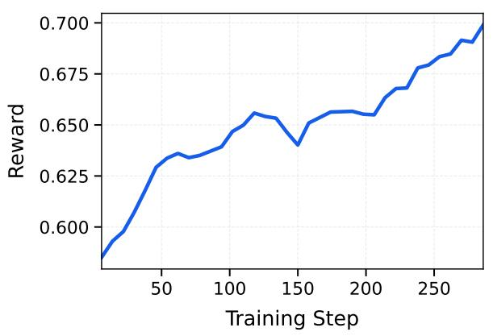

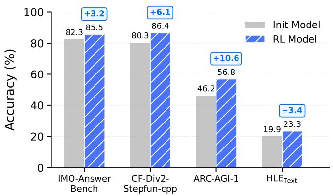  
Figure 6: RL training dynamics and cross-domain improvements of Step 3.5 Flash. RL drives steady reward growth (left) and delivers consistent accuracy boosts across multiple benchmarks (right).

# 5.2.2. Reward System

We decouple the RL framework into RL with verifiable rewards (RLVR [94]) and RL with nonverifiable rewards (e.g., RLHF [95] ), each supported by a distinct reward tailored to its supervision characteristics.

Verifiable Rewards. For RLVR, each prompt is paired with a task-specific verifier that outputs a reward. The rule-based checkers are used for logic, instruction following, and code, while model-based verifiers are employed for STEM tasks. In ablation studies over 450 RL training steps on our internal model, using model-based verifiers for STEM tasks outperforms direct vanilla math-verify by an average of $2 . 0 \%$ ; additional details are provided in Appendix D.2.2.

Non-Verifiable Reward. We address non-verifiable tasks using a pairwise generative reward model (GenRM [96]) that benchmarks responses against a fixed reference. GenRM is a reasoning model that outputs a confidence score indicating the likelihood of a response winning. This score is subsequently converted into a Bradley–Terry win rate [97] to serve as the reward signal. Length control is modeled within GenRM as a confidence score penalty and propagated to the win-rate reward, effectively suppressing excessive length growth during RL training. We further ensure robustness by assigning zero reward to responses with fabricated citations, overconfident claims, or language inconsistencies.

Agent Reward. Search tasks are evaluated using an LLM based on entity-matching scores. For report generation, a rubric-based LLM judge evaluates the research query, rubric specifications, and candidate reports, producing ternary judgments (satisfied, partially satisfied, unsatisfied) [98]. As the intermediate category often misaligns with expert preferences, we map the outputs to asymmetric binary rewards, yielding clearer learning signals and faster convergence toward expert-aligned behaviors.

GenRM Training and MetaRM. We initialize the GenRM by fine-tuning our SFT model with RM-specific prompts. For RL training, we use curated pairwise preference data with a logsigmoid loss similar to the scalar reward model formulation. To improve the robustness of GenRM, we penalize responses exhibiting spurious reasoning (i.e., correct preference derived from flawed logic) by integrating MetaRM, an additional verifier that reduces the training reward when such patterns

Table 3: Data Statistics of first-stage SFT.   

<table><tr><td>Domain</td><td>Num Samples</td><td>Tokens</td><td>Corpus Contribution</td></tr><tr><td>Math</td><td>68055</td><td>0.98B</td><td>11.19%</td></tr><tr><td>Code</td><td>86421</td><td>1.23B</td><td>21.10%</td></tr><tr><td>STEM</td><td>120399</td><td>0.55B</td><td>6.31%</td></tr><tr><td>Logic</td><td>93323</td><td>0.81B</td><td>13.87%</td></tr><tr><td>General</td><td>314495</td><td>0.80B</td><td>9.16%</td></tr><tr><td>Code Agent</td><td>37240</td><td>0.90B</td><td>17.70%</td></tr><tr><td>Tool-use</td><td>114507</td><td>0.76B</td><td>8.72%</td></tr><tr><td>Search Agent</td><td>20256</td><td>0.50B</td><td>8.75%</td></tr><tr><td>Long Context</td><td>15565</td><td>0.70B</td><td>4.00%</td></tr><tr><td>Total</td><td>870687</td><td>7.23B</td><td>100.00%</td></tr></table>

are detected. In ablation studies spanning 200 RL training steps on our internal model, MetaRMaugmented GenRM outperforms vanilla GenRM by $0 . 5 \% - 3 \%$ on every benchmark.

# 5.2.3. Hyper-Parameters

For rollout, we set both the sampling temperature and top- $p$ to 1.0 with a maximum sequence length of 128k tokens. Per generation, we sample 256 unique prompts with 16 responses each for reasoning tasks, 512 unique prompts with 8 responses each for human preference tasks, and 128 unique prompts with 8 responses each for tool-use tasks. After rollout, completed samples are partitioned into mini-batches and used for training over a single epoch, with 4 mini-batches for the actor and 12 mini-batches for the critic. Optimization is performed using the Muon optimizer with a weight decay of 0.1. The actor is trained with a learning rate of $2 \times 1 0 ^ { - 6 }$ and 20 warmup steps, while the critic uses a learning rate of $5 \times 1 0 ^ { - 6 }$ with 50 warmup steps. Following ORZ [90], we set both ?? and ?? to 1. We further adopt an unbiased KL loss [85] with a coefficient of 0.001 in the final stage. For Equation (2), the token-level and trajectory-level masking bounds are set to [0.5, 2] and [0.996, 1.001], respectively.

# 5.3. Data Synthesis & Curation

We construct a diverse and difficulty-balanced prompt pool by aggregating open-source data, synthetic generations, and user trajectories. A unified synthesis and curation pipeline is applied, combining strict global filtering with domain-specific refinement to maximize reasoning density. Data quality is ensured through a hybrid of rule-based heuristics and model-based fidelity checks. The resulting dataset contains 871k samples (7.23B tokens), with detailed statistics summarized in Table 3.

# 5.3.1. General and Reasoning

Our training corpus aggregates community prompts, expert responses, and synthetic data from diverse open-source, including Mathematics [90, 99–110], Coding [111–113], and Science and Open-ended QA [114–117]. To maximize reasoning density, we employ a unified pipeline that couples strict global filtering with domain-specific refinement, enforcing quality via a hybrid of rule-based heuristics and model-based fidelity checks. Specifically, in mathematics, we ensure numerical stability through specialist-guided rejection sampling and synthetic large-number arithmetic. For programming, we prioritize offline executability by selecting rigorous algorithmic challenges while strictly purging RAG-related hallucinations. In particular, we mitigate the model’s tendency to falsely claim access to

external search engines or pretend to retrieve online solutions. Furthermore, we restrict scientific data to unambiguous questions with unique, determinable solutions.

To enable generalization across practical scenarios, we expand open-source checkers2 and augment samples with several real-world constraints. In parallel, we collect general prompts from open-source, synthetic, and user trajectories to form a diverse, difficulty-balanced pool. This process yields a high-fidelity dataset comprising millions of samples at the billion-token scale.

# 5.3.2. Generalized Tool Learning

We propose an execution-driven data generation framework for learning reliable tool-use behaviors in intelligent agents, addressing key limitations of existing synthetic pipelines such as data inconsistency, lack of verifiability, and model hallucinations. Instead of relying on random exploration [118, 119] or model-based simulation [5, 120], our approach decomposes tool-use behavior into atomic intents and models them using a finite state machine (FSM), explicitly separating abstract tool-call logic from parameterized execution constraints. Data is generated through a sample–execute–verify loop with rejection sampling, where all candidate trajectories are executed in real environments and validated by deterministic feedback, ensuring fidelity and eliminating hallucinated behaviors. By compositionally combining atomic intents, the framework supports scalable generation of complex, controllable tooluse scenarios. Using this paradigm, we construct over 100K high-quality trajectories totaling billions of tokens, providing precise supervision for tool-based planning, reasoning, and execution.

# 5.3.3. Code Agents

Code agents can self-improve through a closed-loop intervention between verifiable environment construction and solution generation, where executable feedback continuously refines both capabilities. We treat environment construction as a first-class capability alongside bug fixing and feature implementation, synthesizing it under verifiable reward signals. To this end, we develop a specialized agentic pipeline evolved from the SWE-factory [121] framework, incorporating a cross-task memory pool that retrieves historical build successes as few-shot demonstrations and a loop-detection mechanism to prevent redundant exploration. This pipeline achieves a $4 0 \%$ environment-building success rate, forming a positive feedback loop for model self-evolution through dense supervision from construction trajectories, including shell commands and error recovery. To further improve signal quality, we normalize environment construction trajectories by abstracting and masking transient failures and redundant execution patterns that do not contribute to the final resolution. The bootstrapped environments function as dynamic testbeds, leveraging execution feedback and unit tests to generate high-quality synthetic data and reward signals for continuous alignment. Empirically, we observe a bidirectional transfer: construction expertise accelerates coding performance, while coding within these environments further improves construction accuracy, as shown in DockSmith [122]. Leveraging this evolution pipeline, we curate 50K verified environments spanning over 15K GitHub repositories and more than 20 programming languages. This diverse collection captures a broad spectrum of real-world scenarios, providing a robust foundation for training generalist code agents.

# 5.3.4. Search and Research Agents

To facilitate advanced information-seeking, our pipeline integrates graph-based and multi-document synthesis to enforce multi-hop reasoning. By performing topological expansions on knowledge graphs (e.g., Wikidata5m [123]) and simulating cross-website browsing trajectories, we generate data that reflects real-world research complexity. Crucially, to guarantee the necessity of external retrieval, we

validate generated queries against DeepSeek-R1 [124], systematically excluding instances solvable by this strong reasoning model without tool interaction. The resulting trajectories are refined through a structured report generation pipeline [125] that enforces rigorous instruction compliance and structural integrity. Specifically, we enforce strict adherence to preset research plans, discarding any trajectories that deviate from the structure. Subsequently, valid outputs undergo iterative cleaning via modelbased judgers and heuristic rules to resolve fine-grained issues such as informal writing, temporal hallucinations, and mixed-language artifacts. This end-to-end approach achieves industry-leading performance on the RES EA RC HRUBR IC S [21] benchmark.

# 5.4. Agent Infrastructure

Reasoning with Tool-Use Template Design. To effectively integrate reasoning and agentic capabilities into a single foundation model, it is crucial to determine the appropriate templates for the thinking process and tool usage. Regarding the reasoning template, we evaluate three management strategies. The approach of discarding reasoning history at every turn [124], while incentivizing independent generation, leads to task failure in long-horizon tasks(e.g., coding sessions exceeding 100 turns). Conversely, retaining the full reasoning history incurs prohibitive context consumption, which rapidly saturates the model’s capacity and blocks subsequent tool invocations. To resolve this, we adopt a selective retention strategy: preserving reasoning traces exclusively for the tool-use trajectory triggered by the most recent user instruction. This design achieves an optimal trade-off between reasoning coherence and context efficiency, a practice aligned with recent frontier models [85, 126]. Regarding the tool-use template, we compared the prevalent JSON and XML formats. The rigid syntax of JSON, including escape sequences and delimiters, frequently induces parsing errors in small, under-trained models. In contrast, the XML format allows for flat string output with significantly lower grammatical overhead. Therefore, we select the XML format to ensure robustness in complex, real-world agentic coding scenarios.

Scalable Code Agent Infrastructure. Our integrated architecture focuses on scalable session management and cross-framework generalization to facilitate high-throughput agentic coding. Central to this is a proprietary Session-Router that orchestrates container lifecycles via Kubernetes and ensures interaction consistency through Tmux. This architecture supports thousands of concurrent environments with seamless state persistence, eliminating the need for manual, scaffold-specific Docker configurations. To ensure high generalization across diverse agentic workflows, we trained the model to adapt to a wide spectrum of interaction frameworks, ranging from academic standards (e.g., Open-Hands [127], SWE-agent [128], and Terminus-2 [16]) to enterprise grade protocols (e.g., Kilocode [129], Roocode [130], and ClaudeCode [131]). By exposing the model to these varied interaction paradigms during training, we effectively prevent it from overfitting to specific pipeline patterns, ensuring it remains robust regardless of the underlying execution environment.

# 6. Evaluations

# 6.1. Pre-training Evaluations

Evaluation Setup. We evaluate Step 3.5 Flash on a series of benchmarks, encompassing various capabilities: (1) General language understanding and reasoning, including BBH [132], MMLU [133], MMLU-Redux [134], MMLU-Pro [135], HellaSwag [136], WinoGrande [137], GPQA [138], SuperG-PQA [139], and SimpleQA [140]. (2) Mathematics reasoning, including GSM8K [141] and MATH [142]. (3) Coding, including HumanEval [143], MBPP [144], HumanEval+, $\mathrm { M B P P + }$ [145] and MultiPL-E [146]. (4) Chinese understanding, including C-Eval [147], CMMLU [148], and C-SimpleQA [149].

Table 4: Pre-training evaluation results. * denotes cases where the original score was unavailable; we report results evaluated under the same test conditions as Step 3.5 Flash for fair comparison. † indicates Deepseek scores quoted from the MiMo-V2-Flash report [30].   

<table><tr><td>Benchmark</td><td># Shots</td><td>Step 3.5 Flash Base</td><td>MiMo-V2 Flash Base</td><td>GLM-4.5 Base</td><td>DeepSeek V3.1 Base</td><td>DeepSeek V3.2 Exp Base</td><td>Kimi-K2 Base</td></tr><tr><td># Activated Params</td><td>-</td><td>11B</td><td>15B</td><td>32B</td><td>37B</td><td>37B</td><td>32B</td></tr><tr><td># Total Params</td><td>-</td><td>196B</td><td>309B</td><td>355B</td><td>671B</td><td>671B</td><td>1043B</td></tr><tr><td colspan="8">GENERAL</td></tr><tr><td>BBH</td><td>3-shot</td><td>88.2</td><td>88.5</td><td>86.2</td><td>88.2†</td><td>88.7†</td><td>88.7</td></tr><tr><td>MMLU</td><td>5-shot</td><td>85.8</td><td>86.7</td><td>86.1</td><td>87.4†</td><td>87.8†</td><td>87.8</td></tr><tr><td>MMLU-Redux</td><td>5-shot</td><td>89.2</td><td>90.6</td><td>-</td><td>90.0†</td><td>90.4†</td><td>90.2</td></tr><tr><td>MMLU-Pro</td><td>5-shot</td><td>62.3</td><td>73.2</td><td>-</td><td>58.8†</td><td>62.1†</td><td>69.2</td></tr><tr><td>HellaSwag</td><td>10-shot</td><td>90.2</td><td>88.5</td><td>87.1</td><td>89.2†</td><td>89.4†</td><td>94.6</td></tr><tr><td>WinoGrande</td><td>5-shot</td><td>79.1</td><td>83.8</td><td>-</td><td>85.9†</td><td>85.6†</td><td>85.3</td></tr><tr><td>GPQA</td><td>5-shot</td><td>41.7</td><td>43.5*</td><td>33.5*</td><td>43.1*</td><td>37.3*</td><td>43.1*</td></tr><tr><td>SuperGPQA</td><td>5-shot</td><td>41.0</td><td>41.1</td><td>-</td><td>42.3†</td><td>43.6†</td><td>44.7</td></tr><tr><td>SimpleQA</td><td>5-shot</td><td>31.6</td><td>20.6</td><td>30.0</td><td>26.3†</td><td>27.0†</td><td>35.3</td></tr><tr><td colspan="8">MATHEMATICS</td></tr><tr><td>GSM8K</td><td>8-shot</td><td>88.2</td><td>92.3</td><td>87.6</td><td>91.4†</td><td>91.1†</td><td>92.1</td></tr><tr><td>MATH</td><td>4-shot</td><td>66.8</td><td>71.0</td><td>62.6</td><td>62.6†</td><td>62.5†</td><td>70.2</td></tr><tr><td colspan="8">CODE</td></tr><tr><td>HumanEval</td><td>3-shot</td><td>81.1</td><td>77.4*</td><td>79.8*</td><td>72.5*</td><td>67.7*</td><td>84.8*</td></tr><tr><td>MBPP</td><td>3-shot</td><td>79.4</td><td>81.0*</td><td>81.6*</td><td>74.6*</td><td>75.6*</td><td>89.0*</td></tr><tr><td>HumanEval+</td><td>0-shot</td><td>72.0</td><td>70.7</td><td>-</td><td>64.6†</td><td>67.7†</td><td>-</td></tr><tr><td>MBPP+</td><td>0-shot</td><td>70.6</td><td>71.4</td><td>-</td><td>72.2†</td><td>69.8†</td><td>-</td></tr><tr><td>MultiPL-E HumanEval</td><td>0-shot</td><td>67.7</td><td>59.5</td><td>-</td><td>45.9†</td><td>45.7†</td><td>60.5</td></tr><tr><td>MultiPL-E MBPP</td><td>0-shot</td><td>58.0</td><td>56.7</td><td>-</td><td>52.5†</td><td>50.6†</td><td>58.8</td></tr><tr><td colspan="8">CHINESE</td></tr><tr><td>C-EVAL</td><td>5-shot</td><td>89.6</td><td>87.9</td><td>86.9</td><td>90.0†</td><td>91.0†</td><td>92.5</td></tr><tr><td>CMMLU</td><td>5-shot</td><td>88.9</td><td>87.4</td><td>-</td><td>88.8†</td><td>88.9†</td><td>90.9</td></tr><tr><td>C-SimpleQA</td><td>5-shot</td><td>63.2</td><td>61.5</td><td>70.1</td><td>70.9†</td><td>68.0†</td><td>77.6</td></tr></table>

Evaluation Results. Table 4 summarizes the pre-training evaluation of Step 3.5 Flash across general reasoning, mathematics, code, and Chinese benchmarks. Despite activating only 11B parameters (196B total), Step 3.5 Flash remains broadly competitive with substantially larger sparse baselines (15–37B activated; 309–1043B total), demonstrating a strong accuracy–efficiency trade-off. On core general benchmarks, Step 3.5 Flash achieves 88.2 on BBH (within 0.5 of the best) and 85.8 on MMLU. Notably, Step 3.5 Flash reaches 31.6 on SimpleQA, outperforming DeepSeek-V3.2-Exp Base (27.0) while using only 196B total parameters versus 671B (i.e., ${ \sim } 3 . 4 \times$ total parameters), highlighting stronger capability density per parameter budget. Step 3.5 Flash further demonstrates strong coding capabilities, including 81.1 on HumanEval, 67.7 on MultiPL-E HumanEval and 58.0 on MultiPL-E MBPP. Overall, these results show that Step 3.5 Flash delivers high strong performance per activated compute, providing a solid foundation for downstream reasoning and agentic post-training.

# 6.2. Post-training Evaluations

We evaluate Step 3.5 Flash on representative benchmarks, including the reasoning oritend HLE (text subset) [150], MMLU-Pro [135], GPQA-Diamond [138], AIME2025 [10], HMMT [11], IMO-AnswerBench [91]; the coding related LiveCodeBench-v6 (2024.08-2025.05) [12], CF-Div2-Step (Ap-

pendix E.2.1): our custom CodeForces3 Div2 Benchmark, SWE-Bench Verified [13] and SWE-Bench Multilingual [14]; the agent series $\tau ^ { 2 }$ -Bench [15], Terminal-Bench 2.0 [16], GAIA [19], BrowseComp [17], xbench-DeepSearch [20], BrowseComp-zh [18], and RES EA RC HRUBRI CS [21]; the general related ArenaHard v2 [151], IFBench [152] and MultiChallenge [153]; and the long-context related LongBench v2 [154], MRCR [155] 4, FRAMES [156] and RepoQA [157].

We further investigate the test-time scaling properties of Step 3.5 Flash on reasoning, general, and long-context benchmarks by adopting the Parallel Coordinated Reasoning (PaCoRe) paradigm [42]. Leveraging Step 3.5 Flash’s extreme inference efficiency, this approach decouples reasoning capacity from context limitations by launching parallel reasoning trajectories and synthesizing their insights into higher-fidelity solutions via multi round coordination. Specifically, we employ a multi-round PaCoRe trajectory configuration as $\vec { K } = \left[ 4 , 4 , 4 , 4 \right]$ , yielding significant gains across benchmarks.

We maintain a maximum sequence length of $2 5 6 \mathrm { k } ,$ using the default decoding configuration with decoding temperature and top-p of 1.0. And we apply YaRN [158] with a scaling factor of 2.0 on top of the original 128k positional embeddings, restricting it to full-attention layers only. We report pass@1 accuracy for all approaches based on average performance of multiple independent generations per problem: 64 for AIME 2025, HMMT 2025 Feb., and HMMT 2025 Nov.; 8 for IMO-AnswerBench, LiveCodeBench, GPQA-Diamond, and MultiChallenge; 1 for HLE and 4 runs for all other benchmarks. More details are provided in Appendix E.2.

Evaluation Results. Table 5 presents a comprehensive comparison of Step 3.5 Flash against a broad set of strong baselines across reasoning, code agents, general agents, long-context understanding, and general capability benchmarks. Despite activating only 11B parameters (196B total), Step 3.5 Flash demonstrates strong performance across a wide range of tasks, particularly excelling on reasoningintensive benchmarks such as AIME 2025, HMMT 2025 Feb., HMMT 2025 Nov., IMO-AnswerBench, and LiveCodeBench-v6. It consistently outperforms open-source models with larger parameter counts and achieves performance on par with frontier models such as GPT-5.2 xHigh and Gemini 3.0 Pro. Notably, Step 3.5 Flash achieves strong results on agentic evaluations, including SWE-Bench Verified, Terminal-Bench 2.0, BrowseComp (with Context Manager), GAIA, and $\tau ^ { 2 }$ -Bench, highlighting robust tool-use and long-horizon decision-making capabilities. Overall, these results indicate that Step 3.5 Flash delivers strong agentic and reasoning performance with substantially lower active parameter counts.

# 7. Discussion and Limitations

Token Efficiency. Step 3.5 Flash achieves frontier-level intelligence but currently requires longer generation trajectories than Gemini 3.0 Pro to reach comparable quality. Next step we will prune and compress the thinking for better efficiency while maintaining the same competitive performance.

Efficient Universal Mastery. We aim to unify generalist versatility with deep domain expertise. To achieve this efficiently, we are advancing variants of on-policy distillation, allowing the model to internalize expert behaviors with higher sample efficiency.

<table><tr><td>Benchmark</td><td colspan="2">Step 3.5 Flash
Vanilla PaCoRe</td><td>MiniMax M2.1</td><td>MiMo V2 Flash</td><td>GLM 4.7</td><td>DeepSeek V3.2</td><td>Kimi K2.5</td><td>Gemini 3.0 Pro</td><td>Claude Opus 4.5</td><td>GPT-5.2 xHigh</td></tr><tr><td># Activated params</td><td colspan="2">11B</td><td>10B</td><td>15B</td><td>32B</td><td>37B</td><td>32B</td><td>-</td><td>-</td><td>-</td></tr><tr><td># Total params</td><td colspan="2">196B</td><td>230B</td><td>309B</td><td>355B</td><td>671B</td><td>1T</td><td>-</td><td>-</td><td>-</td></tr><tr><td colspan="11">REASONING</td></tr><tr><td>AIME 2025</td><td>97.3</td><td>99.9</td><td>83.0</td><td>95.1*</td><td>95.7</td><td>93.1</td><td>96.1</td><td>95.0</td><td>92.8</td><td>100.0</td></tr><tr><td>HMMT 2025 Feb.</td><td>98.4</td><td>100.0</td><td>71.0*</td><td>95.4*</td><td>97.1</td><td>92.5</td><td>95.4</td><td>97.5†</td><td>92.9†</td><td>99.4</td></tr><tr><td>HMMT 2025 Nov.</td><td>94.0</td><td>97.8</td><td>74.3*</td><td>91.0*</td><td>93.5</td><td>90.2</td><td>91.1</td><td>94.5†</td><td>91.7*</td><td>97.1*</td></tr><tr><td>IMO-AnswerBench</td><td>85.4</td><td>88.8</td><td>60.4*</td><td>80.9*</td><td>82.0</td><td>78.3</td><td>81.8</td><td>83.3†</td><td>84.0†</td><td>86.3†</td></tr><tr><td>LiveCodeBench-v6</td><td>86.4</td><td>88.9</td><td>75.4*</td><td>81.6*</td><td>84.9</td><td>83.3</td><td>85.0</td><td>90.7†</td><td>84.8†</td><td>87.7†</td></tr><tr><td>CF-Div2-Stepfun-cpp</td><td>86.1</td><td>93.3</td><td>59.0*</td><td>46.9*</td><td>74.1*</td><td>81.6*</td><td>73.6*</td><td>83.5*</td><td>72.2*</td><td>-</td></tr><tr><td>MMLU-Pro</td><td>84.4</td><td>84.8</td><td>88.0</td><td>84.9</td><td>84.3</td><td>85.0</td><td>87.1</td><td>90.1†</td><td>89.5†</td><td>87.4†</td></tr><tr><td>GPQA-Diamond</td><td>83.5</td><td>85.0</td><td>83.0</td><td>84.1*</td><td>85.7</td><td>82.4</td><td>87.6</td><td>91.9</td><td>87.0</td><td>92.4</td></tr><tr><td>HLEtext</td><td>23.1</td><td>27.9</td><td>22.2</td><td>22.1</td><td>24.8</td><td>25.1</td><td>31.5</td><td>37.7†</td><td>30.8†</td><td>35.5†</td></tr><tr><td colspan="11">CODE AGENT</td></tr><tr><td>SWE Verified</td><td>74.4</td><td>-</td><td>74.0</td><td>73.4</td><td>73.8</td><td>73.1</td><td>76.8</td><td>76.2</td><td>80.9</td><td>80.0</td></tr><tr><td>SWE Multilingual</td><td>67.4</td><td>-</td><td>72.5</td><td>71.7</td><td>66.7</td><td>70.2</td><td>73.0</td><td>65.0†</td><td>77.5†</td><td>72.0†</td></tr><tr><td>Terminal-Bench 2.0</td><td>51.0</td><td>-</td><td>47.9</td><td>38.5</td><td>41.0</td><td>46.4</td><td>50.8</td><td>56.9†</td><td>59.3†</td><td>54.0†</td></tr><tr><td colspan="11">GENERAL AGENT</td></tr><tr><td>BrowseComp</td><td>51.6</td><td>-</td><td>47.4</td><td>45.4</td><td>52.0</td><td>51.4</td><td>60.6</td><td>37.8†</td><td>37.0†</td><td>-</td></tr><tr><td>BrowseComp (w. Ctx Manage)</td><td>69.0</td><td>-</td><td>62.0</td><td>58.3</td><td>67.5</td><td>67.6</td><td>74.9</td><td>59.2†</td><td>57.8†</td><td>65.8</td></tr><tr><td>BrowseComp-ZH</td><td>66.9</td><td>-</td><td>47.8*</td><td>51.2*</td><td>66.6</td><td>65.0</td><td>62.3*</td><td>66.8*</td><td>62.4*</td><td>76.1*</td></tr><tr><td>GAIA</td><td>84.5</td><td>-</td><td>64.3*</td><td>78.2*</td><td>61.9*</td><td>75.1*</td><td>75.9*</td><td>76.6*</td><td>76.1*</td><td>83.5*</td></tr><tr><td>xbench-DeepSearch-2505</td><td>83.7</td><td>-</td><td>68.7*</td><td>69.3*</td><td>72.0*</td><td>78.0*</td><td>76.7*</td><td>78.3*</td><td>77.0*</td><td>83.0*</td></tr><tr><td>xbench-DeepSearch-2510</td><td>56.3</td><td>-</td><td>43.0*</td><td>44.0*</td><td>52.3*</td><td>55.7*</td><td>40.0†</td><td>57.7*</td><td>59.3*</td><td>67.0*</td></tr><tr><td>RESEARCHRUBRICS</td><td>65.3</td><td>-</td><td>60.2*</td><td>54.3*</td><td>62.0*</td><td>55.8*</td><td>59.5*</td><td>50.1*</td><td>61.6*</td><td>57.8*</td></tr><tr><td>τ2-Bench</td><td>88.2</td><td>-</td><td>86.6*</td><td>84.1*</td><td>87.4</td><td>85.2*</td><td>85.4*</td><td>90.7</td><td>92.5</td><td>85.5*</td></tr><tr><td colspan="11">GENERAL</td></tr><tr><td>Arena-Hard-v2.0</td><td>74.0</td><td>93.1</td><td>63.1*</td><td>68.2*</td><td>73.1*</td><td>66.0*</td><td>85.8*</td><td>81.7†</td><td>76.7†</td><td>80.6†</td></tr><tr><td>MultiChallenge</td><td>55.7</td><td>60.8</td><td>50.5*</td><td>44.3*</td><td>67.8*</td><td>57.1*</td><td>73.6*</td><td>71.8*</td><td>65.8*</td><td>71.9*</td></tr><tr><td>IFBench</td><td>67.4</td><td>56.8</td><td>70.0</td><td>64.0†</td><td>68.0†</td><td>61.0†</td><td>72.8*</td><td>70.4†</td><td>58.0†</td><td>75.4†</td></tr><tr><td colspan="11">LONG CONTEXT</td></tr><tr><td>LongBench v2</td><td>57.5</td><td>62.0</td><td>53.9*</td><td>60.6†</td><td>59.1*</td><td>58.4†</td><td>61.0</td><td>70.0*</td><td>67.8*</td><td>62.4*</td></tr><tr><td>MRCR-8needle</td><td>28.8</td><td>26.3</td><td>20.0†</td><td>19.9†</td><td>25.4†</td><td>27.2†</td><td>36.5*</td><td>73.0†</td><td>54.0*</td><td>88.2*</td></tr><tr><td>FRAMES-Oracle</td><td>76.5</td><td>77.2</td><td>76.5*</td><td>78.0*</td><td>75.1*</td><td>80.1*</td><td>77.4*</td><td>79.7*</td><td>85.8*</td><td>87.3*</td></tr><tr><td>RepoQA</td><td>88.5</td><td>88.7</td><td>88.2*</td><td>91.2*</td><td>89.5*</td><td>91.9*</td><td>89.8*</td><td>91.5*</td><td>95.7*</td><td>93.8*</td></tr></table>

Table 5: Comparison between Step 3.5 Flash and closed/open models. * denotes cases where the original score was unavailable or inferior to our reproduced result; we therefore report results evaluated under the same test conditions as Step 3.5 Flash for fair comparison. † indicates scores quoted from non-official sources, including technical reports, or independent evaluation platforms. Our evaluation on HLE focuses on the text-only subset. BrowseComp (w. Ctx Manage) denotes the evaluation of BrowseComp with a Context Management enabled.

RL for Open-World Agentic Tasks. While Step 3.5 Flash demonstrates competitive performance on academic agentic benchmarks, the next frontier of agentic AI necessitates the application of RL to intricate, expert-level tasks found in professional work, advanced engineering, and scientific research. Solving these challenges is a prerequisite for deploying agents capable of genuine autonomy.

Operational Scope and Constraints. Step 3.5 Flash is tailored for coding and work-centric tasks, but may experience reduced stability during distribution shifts. This typically occurs in highly specialized domains or long-horizon, multi-turn dialogues, where the model may exhibit repetitive reasoning, mixed-language outputs, or inconsistencies in time and identity awareness.

# Appendix

# A. Architecture Details

Table 6 summarizes key architecture hyper-parameters of Step 3.5 Flash.

<table><tr><td>Hyper-Parameter</td><td>Value</td></tr><tr><td colspan="2">BACKBONE</td></tr><tr><td>Vocabulary size (V)</td><td>128,896</td></tr><tr><td>Model width (dmodel)</td><td>4096</td></tr><tr><td>Transformer blocks</td><td>45 (3 dense + 42 MoE)</td></tr><tr><td colspan="2">MOE FFN</td></tr><tr><td>Experts per MoE block</td><td>288 + 1 shared</td></tr><tr><td>Routing</td><td>top-k = 8</td></tr><tr><td>Dense FFN hidden size</td><td>11,264</td></tr><tr><td>MoE expert hidden size</td><td>1,280</td></tr><tr><td colspan="2">ATTENTION</td></tr><tr><td>Hybrid block structure</td><td>3 SWA blocks + 1 full attention block</td></tr><tr><td>SWA window size</td><td>512</td></tr><tr><td>KV heads (GQA)</td><td>8</td></tr><tr><td>Query heads (full / SWA)</td><td>64 / 96</td></tr><tr><td>Gate Type</td><td>head-wise on output</td></tr><tr><td>Head dimension</td><td>128</td></tr><tr><td>RoPE θ</td><td>10,000</td></tr><tr><td>RoPE dims (full / SWA)</td><td>64 / 128</td></tr><tr><td colspan="2">MULTI-TOKEN PREDICTION</td></tr><tr><td>MTP blocks</td><td>3 (Dense SWA)</td></tr><tr><td colspan="2">PARAMETER COUNTS</td></tr><tr><td>Total params (backbone)</td><td>196B</td></tr><tr><td>Activated params / token (backbone)</td><td>11B</td></tr><tr><td>Total params (with MTP3)</td><td>198B</td></tr><tr><td>Activated params / token (with MTP3)</td><td>13B</td></tr></table>

Table 6: Key architecture hyper-parameters of Step 3.5 Flash. “Activated params” are reported per token and exclude embedding/output matrices.

# A.1. Head-wise Gated Attention

Each attention head is assigned a lightweight, input-dependent scalar gate, allowing the model to dynamically modulate information flow across the hybrid layout with negligible computational overhead.

Formally, for a (single) head of dimension $d$ , let $\pmb q _ { i } , \pmb k _ { j } , \pmb \nu _ { j } \in \mathbb { R } ^ { d }$ denote the query vector at position ?? and the key and value vectors at position $j ,$ the scaled dot-product scores ??, the corresponding attention weights $\alpha$ and the outputs $\boldsymbol { y }$ are computed as follows:

$$
s _ {i, j} = \left\langle \boldsymbol {q} _ {i}, \boldsymbol {k} _ {j} \right\rangle / \sqrt {d}, \quad Z _ {i} = \sum_ {j ^ {\prime}} \exp \left(s _ {i, j ^ {\prime}}\right), \quad \alpha_ {i, j} = \exp \left(s _ {i, j}\right) / Z _ {i}, \quad \boldsymbol {y} _ {i} = \sum_ {j} \alpha_ {i, j} \boldsymbol {v} _ {j}. \tag {4}
$$

Given the input representation $x _ { i }$ at position $i ,$ we compute a head-wise gate $g _ { i }$ to modulate the head output:

$$
g _ {i} = \sigma (\boldsymbol {w} _ {\text {g a t e}} ^ {\top} \boldsymbol {x} _ {i}), \qquad o _ {i} ^ {\text {g a t e}} = g _ {i} \boldsymbol {y} _ {i}, \tag {5}
$$

where $\sigma ( \cdot )$ is the sigmoid function and ${ \pmb w } _ { g a t e }$ is a learnable vector.

Head-wise gated attention can be viewed as introducing an input-dependent sink token [33] into the attention mechanism. Substituting ??(??) = 11+exp(−??) $\begin{array} { r } { \sigma ( g ) = \frac { 1 } { 1 + \exp ( - g ) } } \end{array}$ into Equation 5, we have

$$
\boldsymbol {o} _ {i} ^ {\text {g a t e}} = \sum_ {j} \frac {\exp \left(s _ {i , j}\right)}{Z _ {i} + e ^ {- g _ {i}} Z _ {i}} \boldsymbol {v} _ {j}, \tag {6}
$$

where $\exp ( - g _ { i } ) Z _ { i }$ acts as an input-dependent sink mass in the softmax normalizer. As shown in Section 2.3, this adaptive formulation consistently outperforms fixed (input-independent) sink tokens.

# A.2. Speed Benchmark of Attention Enhancements

We conduct simulations with MTP-3 to evaluate the latency overheads of the two enhancements under an ideal workload. Table 7 presents the relative increment of theoretical FLOPs and latency. Increasing the number of query heads in SWA slightly raises the FLOPs but has less impact on latency. This is due to a query-to- $k \nu$ ratio of 12, which keeps SWA in the IO-bound region, even when considering MTP-3. For head-wise gating, neither FLOPs nor latency has noticeable difference because of its lightweight.

Table 7: Relative increment under different SWA head counts and gating strategies. The metrics are presented as FLOPs / Latency. The baseline configuration (first line) is normalized to 1.0.   

<table><tr><td rowspan="2">Backbone</td><td rowspan="2">SWA Heads</td><td rowspan="2">Setting</td><td colspan="2">Decode (FLOPs / Lat.)</td><td colspan="2">Prefill (FLOPs / Lat.)</td></tr><tr><td>64k</td><td>256k</td><td>64k</td><td>256k</td></tr><tr><td rowspan="4">Step 3.5 Flash (S3F1 layout)</td><td>64</td><td>no gate</td><td>1.00 / 1.00</td><td>1.00 / 1.00</td><td>1.00 / 1.00</td><td>1.00 / 1.00</td></tr><tr><td>96</td><td>no gate</td><td>1.02 / 1.01</td><td>1.01 / 1.00</td><td>1.08 / 1.06</td><td>1.04 / 1.03</td></tr><tr><td>64</td><td>head-wise</td><td>1.00 / 1.00</td><td>1.00 / 1.00</td><td>1.00 / 1.02</td><td>1.00 / 1.01</td></tr><tr><td>96</td><td>head-wise</td><td>1.02 / 1.02</td><td>1.01 / 1.00</td><td>1.08 / 1.08</td><td>1.04 / 1.05</td></tr></table>

Table 8: Relative FLOPs cost across different backbones and attention patterns. The head count refers to SWA heads. For each backbone, the configuration with minimum FLOPs (??3??1 with reduced heads) is the baseline (1.0).   

<table><tr><td rowspan="2">Backbone</td><td rowspan="2">Layout</td><td rowspan="2">SWA Heads</td><td colspan="2">Decode</td><td colspan="2">Prefill</td></tr><tr><td>64K</td><td>256K</td><td>64K</td><td>256K</td></tr><tr><td rowspan="4">Step 3.5 Flash</td><td>S3F1</td><td>64</td><td>1.00</td><td>1.00</td><td>1.00</td><td>1.00</td></tr><tr><td>S3F1+Head</td><td>96</td><td>1.02</td><td>1.01</td><td>1.08</td><td>1.04</td></tr><tr><td>S1F1</td><td>64</td><td>1.18</td><td>1.47</td><td>1.38</td><td>1.71</td></tr><tr><td>FFFF</td><td>64</td><td>1.51</td><td>2.33</td><td>2.07</td><td>3.00</td></tr><tr><td rowspan="4">Internal 30B-A3B</td><td>S3F1</td><td>32</td><td>1.00</td><td>1.00</td><td>1.00</td><td>1.00</td></tr><tr><td>S3F1+Head</td><td>48</td><td>1.02</td><td>1.01</td><td>1.05</td><td>1.02</td></tr><tr><td>S1F1</td><td>32</td><td>1.42</td><td>1.74</td><td>1.50</td><td>1.80</td></tr><tr><td>FFFF</td><td>32</td><td>2.21</td><td>3.16</td><td>2.47</td><td>3.34</td></tr></table>

# A.3. Meta Token

Recent literature [159–161] has shown both theoretically and empirically that prepending structured metadata to pretraining sequences can improve data efficiency and accelerate convergence: by exposing high-level attributes (e.g., modality, language, domain), metadata provides global cues that reduce uncertainty about the upcoming content and thus makes next-token prediction easier.

Motivated by this paradigm, we associate each training example with a metadata string M in a human-readable format, including content type (e.g., Code, Book, Paper, Web), language (e.g., EN, ZH), domain, and source. We then prepend M to the original token sequence $\mathbf { x , }$ forming a single training sequence $\mathbf { s } = [ \mathbf { M } ; \mathbf { x } ]$ . During pretraining, the model is trained to maximize the likelihood of s:

$$
\mathcal {L} _ {\text {f u l l}} (\theta) = - \sum_ {t = 1} ^ {| \mathbf {s} |} \log P _ {\theta} \left(s _ {t} \mid \mathbf {s} _ {<   t}\right). \tag {7}
$$

After an initial phase of approximately 3.8T tokens, we keep M in the context but mask out its positions from the loss while continuing to predict the payload tokens:

$$
\mathcal {L} _ {\text {m a s k}} (\theta) = - \sum_ {t = | \mathbf {M} | + 1} ^ {| \mathbf {s} |} \log P _ {\theta} \left(s _ {t} \mid \mathbf {s} _ {<   t}\right) = - \sum_ {t = 1} ^ {| \mathbf {x} |} \log P _ {\theta} \left(x _ {t} \mid \mathbf {M}, \mathbf {x} _ {<   t}\right). \tag {8}
$$

We hypothesize that by this stage the model has already learned to effectively use metadata as a conditioning signal. Masking the metadata loss therefore allocates optimization pressure entirely to the payload tokens, while still benefiting from the explicit conditioning on data characteristics.

# A.4. Pretraining Ablations Details

We conduct controlled pre-training ablations to isolate the effects of (i) different hybrid attention layout and (ii) sink tokens versus head-wise gated attention.

Hybrid attention layout. We adopt a 30B-A3B MoE architecture to evaluate the downstream impact of different hybrid attention layout under a fixed token budget. The training follows a strict, multistage pipeline: a 30B-token warmup phase, followed by 1T tokens of main pretraining, a 300Btoken cooldown phase, and an additional 100B-token long-context specialization stage—totaling approximately 1.4T tokens. Supervised fine-tuning (SFT) is then performed on a $0 . 1 \times$ downsampled dataset. Full training details are provided in Table 9.

Gate vs. sink (scaled setting). We pre-train a 100B-A10B MoE model for $\sim 2 5 0 \mathrm { B }$ tokens to compare sink tokens and head-wise gating under a larger-scale regime.

Pretraining results of the architectural ablations are presented in Tables 2 and 10. We employ the evaluation protocols detailed in Section 6.1. Specifically, GPQA [138] is evaluated using 5-shot prompting, while HumanEval [162] and MBPP [163] utilize 3-shot prompting.

The post-training results in Table 1 are aggregated as follows:

• Reasoning: The average of MMLU-Pro [135], GPQA-Diamond [138], LiveCodeBench v6 [12], and LiveBench [164].   
• Math: The average of AIME 2024 [165], AIME 2025 [166], HMMT 2025 Feb. [167], and CNMO $2 0 2 4 ^ { 5 }$ .   
• Code: The average of CF-Div2-Stepfun and LiveCodeBench v6 [12].

Table 9: Training configuration for the 100B-A10B and the 30B-A3B architecture ablation suite.   

<table><tr><td>Hyper-Parameter</td><td>100B-A10B</td><td>30B-A3B</td></tr><tr><td>Total Tokens</td><td>250B</td><td>1.4T</td></tr><tr><td>Optimizer</td><td colspan="2">Muon [34]</td></tr><tr><td>Peak learning rate</td><td>1.31 × 10-4</td><td>1.1 × 10-3</td></tr><tr><td>Batch-size warmup</td><td>-</td><td>First 30B tokens</td></tr><tr><td>Layers</td><td>43</td><td>48</td></tr><tr><td>Dimension</td><td>4096</td><td>2048</td></tr><tr><td>Leading Dense Layers</td><td>1</td><td>1</td></tr><tr><td>Routed Experts</td><td>96</td><td>128</td></tr><tr><td>Active Experts</td><td>4</td><td>8</td></tr><tr><td>Shared Experts</td><td>1</td><td>1</td></tr><tr><td>Load Balancing Method</td><td colspan="2">Loss Free [64]</td></tr><tr><td>Attention module</td><td colspan="2">GQA8</td></tr><tr><td>Sequence Length</td><td colspan="2">4096</td></tr><tr><td>Vocab Size</td><td colspan="2">129280</td></tr><tr><td>Batch Size</td><td>8192</td><td>16384</td></tr><tr><td>Weight Decay</td><td colspan="2">0.1</td></tr><tr><td>Partial RoPE</td><td>Disabled</td><td>Enabled</td></tr><tr><td>MTP</td><td>Enabled</td><td>Disabled</td></tr></table>

• Sci: Represented by GPQA-Diamond [138].   
• General: The average of IFEval [168], IFBench [152], WildBench [169], Arena-Hard [151], and MultiChallenge [153].   
• LongCtx: The average of six benchmark-level averages: (i) the average score across context lengths 8k-128k on RULER [170], (ii) the average score over the Short and Medium subsets of Long-Bench v2 [154], (iii) the average score across context lengths 8k-128k on HELMET [171], (iv) GSM-Infinite [172], (v) the overall score on FRAMES [156], and (vi) the overall score on RepoQA [157].

Tables 1 and 10 show that the vanilla ??3??1 layout underperforms the full-attention baseline on general pretraining benchmarks and consistently degrades SFT quality (e.g., BBH: −4.3; SFT Avg: −0.7). Increasing the number of SWA query heads substantially closes this gap (e.g., MMLU-Pro: $+ 3 . 7$ ; SFT Reasoning: $+ 0 . 4 )$ , with only a minor regression on SFT Code (−0.6), while matching or exceeding the full-attention baseline on several metrics. Table 2 further demonstrates that head-wise gated attention yields an average improvement from 62.5 to 64.4 $( + 1 . 9 )$ on the sink token metric.

# B. Detail Analysis of Localized Activation Blow-up

To investigate the root cause of the localized activation blow-up, we analyze the tokens that trigger the largest expert activations across all layers, and identify two distinct large activation patterns: (1) Specific lexical items, such as special tokens and punctuation, commonly elicit large but not dramatic activations, particularly in the shallower layers. This pattern is not recognized as a failure mode by us, as there is no rapid increment and it may serve as an internal mechanism for semantic

Table 10: Pre-training evaluation results for hybrid attention layout ablations $( W { = } 5 1 2 )$ on 30B-A3B. $F$ denotes full attention and ?? denotes SWA; ??3??1 indicates three ?? and one $F$ in the hybrid layout. ??3??1+Head increases the number of SWA heads from 32 to 48.   

<table><tr><td rowspan="2">Layout</td><td rowspan="2">SWA Heads</td><td colspan="12">Pre-train Evaluation</td></tr><tr><td>BBH</td><td>MMLU</td><td>MMLU-Redux</td><td>MMLU-Pro</td><td>SimpleQA</td><td>GSM8K</td><td>MATH</td><td>HumanEval</td><td>MBPP</td><td>C-EVAL</td><td>CMMLU</td><td>Avg.</td></tr><tr><td>FFFF</td><td>32</td><td>66.0</td><td>64.5</td><td>69.7</td><td>35.7</td><td>7.2</td><td>70.0</td><td>39.2</td><td>48.8</td><td>53.4</td><td>69.7</td><td>70.5</td><td>54.1</td></tr><tr><td>S1F1</td><td>32</td><td>64.1</td><td>64.7</td><td>69.8</td><td>37.7</td><td>7.5</td><td>70.1</td><td>43.9</td><td>47.0</td><td>56.2</td><td>69.8</td><td>69.8</td><td>54.6</td></tr><tr><td>S3F1</td><td>32</td><td>61.7</td><td>64.2</td><td>69.4</td><td>33.7</td><td>8.0</td><td>67.4</td><td>41.5</td><td>47.6</td><td>56.0</td><td>69.5</td><td>70.9</td><td>53.6</td></tr><tr><td>S3F1+Head</td><td>48</td><td>65.3</td><td>65.9</td><td>71.0</td><td>37.4</td><td>7.5</td><td>72.2</td><td>44.5</td><td>48.8</td><td>58.6</td><td>70.2</td><td>71.0</td><td>55.7</td></tr></table>

modeling [60, 173]. Another pattern is that (2) some high-frequency bi-grams trigger extremely large activations on the first token, which represents the failure mode we are investigating. The pattern is triggered by several factors: The frequency of a bi-gram’s occurrence is sufficiently high, and the MoE FFN is fine-grained enough, allowing an expert to specialize in that bi-gram without being regulated by the load balancing mechanism. This specialization serves as a shortcut: once the expert is activated, the output becomes deterministic, and other networks no longer influence the prediction. While finding shortcuts is a reasonable approach to minimizing loss, in a MoE model with a pre-norm architecture [76, 77], there is a straightforward, pathological solution for achieving such deterministic predictions, as outlined next. The model’s final representation is the sum of the outputs from all layers, followed by a RMSNorm. This can be expressed as a combination of the outputs from the experts and the attention layers:

$$
\boldsymbol {h} _ {\text {f i n a l}} = \operatorname {R M S N o r m} \left(\underbrace {\exp \mathrm {t} _ {\text {o u t l i e r}}} _ {h _ {\text {o u t l i e r}}} + \underbrace {\sum_ {l = 1} ^ {L} \operatorname {a t t n} _ {l} + \sum_ {\substack {l, e \\ (l , e) \text {is not a o u t l i e r}}} \exp \mathrm {t} _ {l , e}} _ {h _ {\text {o t h e r s}}}\right), \tag{9}
$$

where attn, MoE, expert represent the output hidden states of their respective modules, while $L$ and $E$ denote the number of layers and experts, respectively. The straightforward solution is to boundlessly enlarge expertoutlier, then

$$
\operatorname {R M S N o r m} \left(\boldsymbol {h} _ {\text {f i n a l}}\right) = \lim  _ {c \rightarrow \infty} \operatorname {R M S N o r m} \left(c \cdot \hat {\boldsymbol {h}} _ {\text {o u t l i e r}} + \boldsymbol {h} _ {\text {o t h e r s}}\right) = \operatorname {R M S N o r m} \left(\boldsymbol {h} _ {\text {o u t l i e r}}\right), \tag {10}
$$

where we decouple $\boldsymbol { h _ { \mathrm { o u t l i e r } } }$ to the magnitude ?? and the unit vector $\hat { h } _ { \mathrm { o u t l i e r } }$ denoting the direction.

SwiGLU [78], the expert architecture in Step 3.5 Flash, provides a way to generate large outputs, even when the weight decay effectively suppresses the weight norms. SwiGLU is defined as follows:

$$
\operatorname {S w i G L U} (\boldsymbol {x}) = \boldsymbol {W} _ {\text {d o w n}} \left(\operatorname {S i L U} \left(\boldsymbol {W} _ {\text {g a t e}} \boldsymbol {x}\right) \cdot \boldsymbol {W} _ {\text {u p}} \boldsymbol {x}\right). \tag {11}
$$

We analyze the activation norms of $W _ { \mathrm { g a t e } } x$ and $W _ { \mathrm { u p } } x$ and find no significant differences between outlier experts and normal experts. However, the element-wise product produces abnormal outputs, which have

$$
\left\| \operatorname {S i L U} \left(\boldsymbol {W} _ {\text {g a t e}} \boldsymbol {x}\right) \right\| \cdot \left\| \boldsymbol {W} _ {\text {u p}} \boldsymbol {x} \right\| \approx \left\| \operatorname {S i L U} \left(\boldsymbol {W} _ {\text {g a t e}} \boldsymbol {x}\right) \cdot \boldsymbol {W} _ {\text {u p}} \boldsymbol {x} \right\|, \tag {12}
$$

in outlier experts. It can be achieved only if SiLU $( W _ { \mathrm { g a t e } } x )$ and $W _ { \mathrm { u p } } x$ are highly aligned and concentrate on a very limited number of dimensions. Consequently, only a limited number of rows from $W _ { \mathrm { u p } }$ are utilized due to the sparse input. This observation leads us to prefer activation clipping over weight clipping, as activation’s numerical property directly contribute to the blow-up and the sparsity, and activation clipping can promptly address these issues. Besides, activation clipping has negligible negative effects, as well-behaved activations rarely exceed the threshold.

When using the Muon optimizer, gated linear units, such as SwiGLU, are susceptible to logit explosion. This vulnerability arises from similar mechanisms that cause explosion in attention, as reported in [5]. For an outlier expert specialized to some specific bi-gram, hidden states routed to it are expected to be closely aligned to its router embedding. We validate this by inputting the router embedding into a outlier expert and directly predicting outputs based on this expert’s output. The predicted distribution aligns with that of the real data and the entire network’s performance. Combined with the overly single training target (to predict the second token in the bi-gram), we argue that gradients w.r.t. the outlier expert’s parameters, $W _ { \mathrm { g a t e } } , W _ { \mathrm { u p } }$ and $W _ { \mathrm { d o w n } } ,$ are not only abnormally low rank (denoted as $r$ ), but also consistently point in a direction that emphasizes the magnitude as analyzed in the first factor, without rotation. Let the update matrices of a parameter matrix $\mathbf { \bar { \boldsymbol { W } } } \in \mathbb { R } ^ { N \times N }$ to be

$$
\Delta \boldsymbol {W} = \sum_ {i} \sigma_ {i} \boldsymbol {u} _ {i} \boldsymbol {v} _ {i} ^ {\top} = \underbrace {\sum_ {i = 1} ^ {r} \sigma_ {i} \boldsymbol {u} _ {i} \boldsymbol {v} _ {i} ^ {\top}} _ {\text {l o w r a n k s i g n a l}} + \underbrace {\sum_ {j = r + 1} ^ {N} \sigma_ {j} \boldsymbol {u} _ {j} \boldsymbol {v} _ {j} ^ {\top}} _ {\text {n o i s e}} \tag {13}
$$

Accumulating updates over optimization steps will rapidly increase the singular value of the low-rank signals, resulting in an explosion of the weight parameter. In the GLU structure, $\| \mathrm { S i L U } ( W _ { \mathrm { g a t e } } \pmb { x } ) \cdot \pmb { W } _ { \mathrm { u p } } \pmb { x } \|$ squares the spectral norm in our strong alignment case, making the progress more sharp. Additionally, Muon completely eliminates the influence of gradient magnitudes. During the blow-up process, RMSNorm reduces the gradients of large inputs. When using the Adam optimizer, its $\epsilon$ acts as a threshold to filter out small gradients during the learning rate adaptation, which can hinder the progress. In contrast, Muon consistently and effectively orthogonalizes the gradients, resulting in more aggressive updates.

# C. Step Pretraining Data Foundation

# C.1. Knowledge Data Construction

# C.1.1. StepCrawl

Beyond standard web-scale datasets (e.g., CommonCrawl), we develop StepCrawl, an in-house crawling and curation system designed to acquire high-quality and diverse tokens at scale. StepCrawl serves as a primary data source for both high-signal web pages and document-like content (notably PDFs), which frequently contain long-form, high-information-density material.

A key component of StepCrawl is a site and URL selection layer powered by a WebOrganizer-style model [174]. We adapt the capabilities introduced in WebOrganizer and further fine-tune a version tailored to our pipeline. During crawling, each fetched web page is analyzed by this model, forming a lightweight LM-in-the-loop feedback cycle that (i) filters SEO-driven and other low-utility pages, and (ii) guides crawl-budget allocation by balancing site categories (e.g., preventing disproportionate crawling of tool and e-commerce sites) to preserve corpus diversity and reduce topical skew. In practice, StepCrawl processes on the order of ${ \sim } 1 \mathrm { B }$ pages per day under this quality- and diversityaware scheduling policy.

All crawling activities strictly adhere to robots.txt and site-specific access policies. The collected content is subsequently passed through a multi-stage filtering process (quality scoring, deduplication, and sanitization), ensuring that only high-utility and policy-compliant data are retained for training.

# C.1.2. Quality Refinement and Stratification

Quality stratification. Inspired by Nemotron-CC [175]-style quality bucketing, we divide the internal web data into quality tiers and sample preferentially from higher tiers. We label each document using an ensemble of six lightweight scorers/classifiers and ensemble the tier assignments across scorers. In the final recipe, we keep High/Medium-High/Medium and discard Medium-Low/Low, which substantially improves token efficiency in ablations. For book and paper corpora, we apply the same stratification but restrict retention to High/Medium-High tiers exclusively during the annealing stage to maximize diversity. In addition to the shared six-scorer ensemble, we integrate additional domainspecific filters targeting STEM and knowledge-dense content, and down-sample overrepresented domains to ensure balanced representation.

Embedding-based cluster rebalancing. We leverage embedding-based corpus balancing as a principled way to further reduce redundancy and mitigate distribution skew. Specifically, we embed large-scale Chinese/English web data, run k-means clustering $1 0 0 \mathrm { K } +$ clusters), and down-sample clusters with disproportionate mass. In ablations, this cluster-level rebalancing in the cooldown stage improves a broad set of benchmarks.

Knowledge-Intensive Mining and Augmentation. We construct a dedicated knowledge subset using a lightweight two-stage pipeline built on the shared embedding representation described above. First, a curated inventory of high-value entities, concepts, and relations is used to retrieve knowledge-dense documents and passages from the full corpus in embedding space; these candidates are ranked by a knowledge-density model and simple coverage heuristics. Second, for a portion of the retrieved content, we apply targeted transformations such as controlled rephrasing and QA synthesis to improve learnability. The resulting samples are mixed back into the training mixture to increase effective knowledge signal density. We observe consistent gains from this pipeline in ablations, while a detailed causal analysis of its benefits is left for future work.

# C.2. Code Data

# C.2.1. Pure-Code

We refine our internal programming dataset using a modified version of the OpenCoder filtering rules [80], introducing a calibrated relaxation to balance data quality and diversity. In our pipeline, applying OpenCoder filters generates a set of “hits” for each document, where each hit represents a violation of a heuristic rule (signaling potential noise). We categorize the corpus by these hit counts: hit0 for clean documents (zero violations), hit1 for one violation, and so on.

Our internal ablations reveal a clear quality-diversity trade-off: strict filtering (e.g., hit0-only) overprunes the corpus, while no filtering introduces excessive noise. We find that the hit0–6 configuration (accepting documents with up to 6 violations) yields the best overall benchmark performance, retaining a wider variety of high-signal code compared to the original strict constraints.

# C.2.2. PR/Issue/Commit Data

To enhance software engineering capabilities, we construct a comprehensive dataset from GitHub repositories with over 10 stars, comprising PRs, issues, and commits. We apply strict filtering on repository popularity and content quality, and use LLMs to generate missing issue descriptions, resulting in a 5-million-sample foundation. From this, we derive four training subsets:

(1) Base PR/Issue/Commit Data: We crawl data via GHArchive and GitHub API, including full commit histories. We extract changes and validate a small portion of samples against git diff ground truth, then filter to $^ { 2 0 + }$ mainstream languages (e.g., Python, Java, $C { + + }$ ). We strictly deduplicate against SWE-Bench Verified [13] and SWE-Bench Multilingual [14] to prevent leakage.   
(2) Concatenated PR-Dialogue Data (90B tokens): We generate 90B tokens of code-editing training data by applying two Agentless-inspired templates [82]: (1) File localization: Given a problem description and repository structure, identify target file paths; (2) Code repair: Given a problem description and file content, generate precise modifications via SEARCH/REPLACE blocks.

We integrate this 90B code-editing data into two training phases with phase-specific masking strategies. In the annealing stage of pre-training, only template scaffolding is masked; in mid-training, the data is converted to chat dialogs with user prompts masked. Internal ablations show consistent gains over SWE-Bench Verified and SWE-Bench Multilingual in the cooldown stage and mid-training.

(3) Rewritten Reasoning-Oriented Data (12B tokens): From the Python subset of our base dataset, we derive bug-fix samples via LLM change-type annotation. We apply two concise rewriting strategies: (1) Reasoning reconstruction: an LLM reconstructs the PR author’s problem-solving process (problem analysis, root cause identification, solution design, and code implementation), injected into PR-Dialogue format. Hallucinated/inconsistent traces are filtered via rule-based and LLM verification. (2) Active Reading notebooks: PR/issue/commit data is converted into structured learning outlines (motivation, root causes, design decisions, insights), then synthesized into coherent technical notes. These rewritten datasets ( $\mathord { \sim } 1 2 \mathrm { B }$ tokens) are incorporated during mid-training, yielding further gains on SWE-Bench Verified.   
(4) Environment-based Seed Data. We curate executable environments derived from raw PR, issue, and commit records using the environment building pipeline described in Appendix E.2.2. Candidate samples are rigorously filtered to ensure test-patch inclusion and validated via strict rule-based criteria to guarantee environmental reproducibility. Furthermore, selected issues undergo targeted rewriting to augment data quality and coverage. The resulting dataset comprises hundreds of thousands of seed samples, including problem descriptions, code changes, and test functions, and serves as the foundational bedrock for enhancing agentic coding capabilities, driving significant performance gains in downstream agent tasks.

# C.3. Mathematics & STEM Data

To enhance reasoning capabilities and elicit intelligence from knowledge, we curate a large-scale mathematics and STEM dataset. Beyond the standard Common Crawl data used in prior works [176, 177], we leverage our in-house StepCrawl system to harvest a massive scale of additional mathematicsrelated data. Specifically, we implement a filtering pipeline inspired by MegaMath [177], utilizing an ensemble of internal classifiers alongside FineMath [178]. This allows us to retain hundreds of billions of mathematics-related tokens distinct from Common Crawl. We further collect a diverse 100Msample educational dataset encompassing exercises, quizzes, and instructional content. This collection bridges the gap between academic theory and professional application, covering domains from K-12 mathematics/physics/chemistry and humanities to adult vocational exams (CPA, Legal). Early-stage experiments confirm that this problem-solving data is crucial for optimizing token efficiency during pre-training.

# C.4. Data Infrastructure

Our data construction and curation pipeline runs on a high-throughput in-house data infrastructure system designed for large-scale deduplication, mining, and model-inference filtering. We operate hybrid CPU/GPU clusters with distributed frameworks such as Spark and Ray to execute both large-volume processing (e.g., minhash-based deduplication) and model-driven curation workloads (e.g., embedding generation and classifier/LM inference), backed by a storage layer spanning object storage (OSS), HDFS, and JuiceFS for efficient reads/writes of raw corpora and intermediate artifacts.

# C.5. Data Ablations Setting

To rigorously assess data quality and the impact of curation strategies, we conduct an extensive ablation suite using the 30B-A3B MoE architecture trained with the Muon optimizer, consistent with the mainline settings (Table 9). Adhering to a strict token efficiency protocol, we set a fixed training budget for all experiments. Models are evaluated on the comprehensive benchmarks listed in Section 6.1, alongside a series of carefully designed held-out compression (perplexity) test sets. We observe that compression metrics often provide a more direct measure of knowledge capacity, offering signals complementary to mainstream benchmarks.

Internal experiments on the 30B-A3B MoE model demonstrate its superior performance and stability compared to smaller proxies. While smaller models are computationally cheaper, they often fail to capture the nuances of complex reasoning and lack the capacity to memorize long-tail patterns, leading to an artificial bias towards data repetition. Empirically, the 30B-A3B size offers stronger stability and better fidelity to full-scale trends.

# D. Post Training Details

This section describes the post-training process that refines the base model into a high-performance agentic system, covering SFT with rigorous data processing and quality control, followed by large-scale RL to further improve reasoning, tool use, and generalization.

# D.1. SFT Details

# D.1.1. SFT Data Processing Pipeline

Across all domains, we apply a unified data processing pipeline that emphasizes answer verifiability, reasoning quality, and execution realism. To ensure overall data integrity, the aggregated dataset undergoes a strict two-stage filtration process:

1. Rule-based Filtering: We eliminate low-quality data exhibiting degenerate patterns, such as infinite repetition, harmful content, and personally identifiable information.   
2. Model-based Filtering: We utilize specialized models to detect and filter out linguistically inconsistent data. By identifying and removing samples with unnatural language mixing, we significantly refine the dataset’s linguistic purity and overall quality.   
3. Decontamination: We conduct comprehensive benchmark decontamination to prevent test set leakage. This involves both exact matching (with digit masking to catch numerical modifications) and $N \cdot$ -gram matching.

This process yields a final refined dataset of 871k samples, totaling 7.23B tokens.The detailed distribution of the SFT data is presented in Table 3.

# D.2. RL Details and Ablations

This section details the large-scale RL post-training, covering data curation, asynchronous search-agent training, and ablations on dense and MoE models.

# D.2.1. Data Curation

We curate the RL training dataset by aggregating problems from open-source collections and competition archives spanning competitive coding, STEM, and synthetic data for general RLVR training. To prevent data contamination, we strictly exclude problems from competitions held during 2024–2026. The dataset is further augmented with: (i) synthetic arithmetic problems involving 11–13 digit integers; (ii) a generator–validator pipeline that synthesizes additional test cases for coding tasks; and (iii) synthetic environments for general reasoning tasks, such as puzzle and instruction following.

We apply a two-stage filtering process. First, deterministic rule-based pruning removes prompts containing images, external links, or open-ended requirements without a unique final answer. Second, an accuracy-based filter excludes trivial or degenerate problems. During training, each batch is constructed by sampling from different domains according to predefined sampling probabilities.

# D.2.2. Reward System

Verifiable Rewards. For STEM tasks, we employ gpt-oss-120b [33] as the verifier model, using the following structured prompt (originally in Chinese) to rigorously assess final-answer correctness. For coding tasks, we utilize sandboxes to validate code execution against test cases with soft reward.

You are a strict grader. Below you are given the problem, the student’s answer, and the reference answer. Please determine whether the student’s answer is correct according to the rules below.

Grading procedure:

1. Overall check: If the student’s response is incomplete, lacks a clear final answer, or contains repeated content multiple times mark as incorrect.

2. Final-answer match: Extract the student’s explicit final answer and compare it with the reference answer:

• If they are exactly equivalent semantically or mathematically proceed to process check.   
• If numerical computation is involved and the discrepancy is solely due to rounding → proceed to process check.   
• Otherwise mark as incorrect.

3. Process check: Carefully verify each reasoning step:

• If there are errors, contradictions, obvious irrelevance to the problem, or the student merely copies the prompt without a substantive solution mark as incorrect.   
• If the solution process is correct, clear, and consistent mark as correct.

4. Format requirements: If the problem requires a specific format (e.g., units, step-by-step answers, or explicit equations) and the student does not satisfy it mark as incorrect.

5. Multiple sub-questions: If the problem contains multiple sub-questions, the student must answer all of them correctly to be marked correct.   
6. Other cases: If the above rules do not cover the situation, make an overall judgment from the perspective of whether the student truly knows how to solve the problem.

Output requirement:

Your final output must be strictly one of the following:

• <correct> True </correct>   
• <correct> False </correct>

```txt
Now begin: <question> {question} </question> <student_answer> {student_answer} </student_answer> <reference_answer> {reference_answer} </reference_answer> 
```

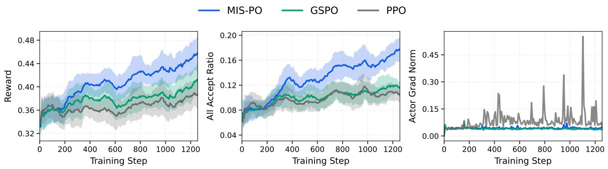  
(a) Comparison on the dense model. While GSPO also effectively reduces the variance of the actor gradient norm, its efficiency is inferior to that of MIS-PO. Under the same iteration budget, MIS-PO achieves higher rewards and all acceptance ratio.

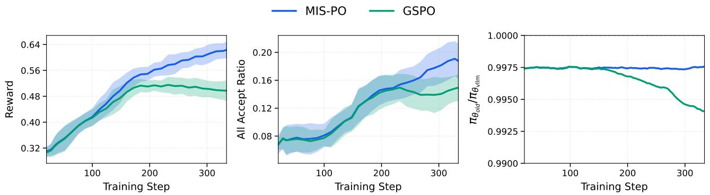  
(b) Comparison on the MoE model. (1) Efficiency: MIS-PO demonstrates superior sample efficiency, achieving higher rewards with accelerated convergence, whereas GSPO plateaus around iteration 200. (2) Stability: GSPO exhibits an increasing training-inference discrepancy during training, quantified by the density ratio $\pi _ { \theta _ { \mathrm { o l d } } } / \pi _ { \theta _ { \mathrm { v l l m } } }$ (where $\pi _ { \theta _ { \mathrm { v l l m } } }$ is the rollout policy in the inference backend and $\pi _ { \theta _ { \mathrm { o l d } } }$ is the pre-update policy snapshot in the training backend). Conversely, MIS-PO consistently maintains this discrepancy within a stable range.   
Figure 7: Performance comparison between MIS-PO and GSPO. The top figure (a) shows results on the dense model, and the bottom figure (b) shows results on the MoE model. MIS-PO consistently outperforms GSPO in both efficiency and stability across different architectures.

# D.2.3. RL Ablation Details

MIS-PO vs. GSPO. To rigorously validate the effectiveness of our method, we benchmark MIS-PO against GSPO [36] on both Dense and MoE architectures. We select GSPO as the primary baseline because it represents a competitive strategy for reducing the gradient variance inherent in importance sampling. In our implementation, we extend the original GSPO estimator to the actor-critic setting by integrating its Generalized Importance Sampling mechanism into the actor loss. Specifically, we replace the standard token-level importance sampling ratio with the geometric mean of trajectory-level ratios. The resulting actor loss is formulated as follows $( \gamma = \lambda = 1$ ):

$$
r _ {\tau} (\theta) = \left(\prod_ {t = 0} ^ {T - 1} \frac {\pi_ {\theta} \left(a _ {t} \mid s _ {t}\right)}{\pi_ {\theta_ {\mathrm {o l d}}} \left(a _ {t} \mid s _ {t}\right)}\right) ^ {\frac {1}{T}} \tag {14}
$$

$$
\hat {A} _ {t} = \hat {R} - V _ {\phi} (s _ {t}) \tag {15}
$$

$$
\mathcal {L} _ {\mathrm {a c t o r}} ^ {\mathrm {G S P O}} = - \mathbb {E} _ {\tau \sim \pi_ {\theta_ {\mathrm {v l l m}}}} \left[ \mathbb {I} (x _ {t}) \cdot \mathbb {I} (\bar {\rho} (\tau)) \cdot \min  (r _ {\tau} (\theta) \hat {A} _ {t}, \operatorname {c l i p} (r _ {\tau} (\theta), 1 - \epsilon , 1 + \epsilon) \hat {A} _ {t}) \right] \tag {16}
$$

To ensure a fair comparison, we apply the same token- and sample-level masking strategies used in MIS-PO to exclude data with significant training–inference mismatches. Regarding the clip ratio $\epsilon$ , we conduct a grid search over $\{ 1 , 2 , 3 , 4 \} \times 1 0 ^ { - 4 }$ . We adopt $\epsilon = 1 0 ^ { - 4 }$ for all experiments primarily because it achieves the best benchmark performance after 200 RL training steps. Additionally, we observe that this setting yields a clip fraction of approximately $1 5 \%$ , consistent with the original GSPO [36].

Figure 7 presents the comparative results. Empirically, MIS-PO demonstrates superior sample efficiency and scalability compared to GSPO. Crucially, MIS-PO effectively constrains the traininginference mismatch within a stable range. This stability proves particularly critical for the large-scale RL training of MoE models, where the baseline GSPO fails to maintain consistent convergence.

Extended Training Dynamics on MoE. To further validate the scalability of our method, we conduct an extended training run of MIS-PO on the MoE model using a challenging dataset. As illustrated in Figure 8, the model maintains a continuous upward trend in rewards, stable actor gradient norms, and well-controlled entropy levels. These results empirically confirm that MIS-PO is reliability for large-scale MoE off-policy RL training.

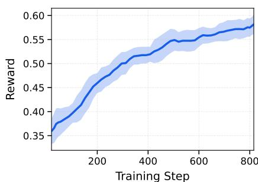


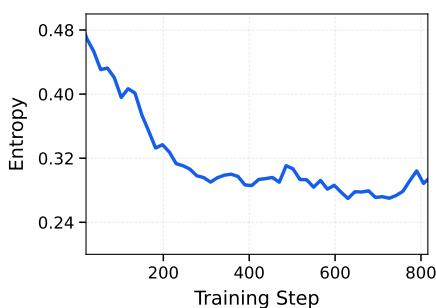  
Figure 8: Extended training dynamics of MIS-PO on the MoE model. The metrics include Reward (left), Actor Gradient Norm (middle), and Entropy (right). Notably, the middle panel displays the raw gradient norm without smoothing or downsampling to highlight the stability of the optimization.

# D.2.4. Search Agent

Regarding the training architecture, the early client–server one-step off-policy framework is severely bottlenecked by long-tail latency: approximately $5 \%$ of samples accounted for roughly $8 0 \%$ of the generation cost. However, our observations indicate that the policy exhibits strong robustness to staleness, maintaining stable performance even with a latency of approximately 20 steps. Consequently, we adopt the FullyAsync paradigm, decoupling generation and updates into a completely asynchronous process. Furthermore, to minimize inference overhead during multi-turn interactions, we implement sticky scheduling, where the same session is consistently dispatched to the same node to maximize KV-cache reuse. Overall, this configuration achieves an approximate $1 0 \times$ efficiency gain while maintaining training stability.

Throughout the training process, the FullyAsync paradigm demonstrates robust stability, evidenced by a sustained increase in rewards and a Truncated Importance Sampling (TIS) truncation rate maintained within a controllable range, thereby indicating limited policy drift induced by asynchrony. Notably, we observe that distinct from the limited scalability of “RL from zero” regarding training budgets, injecting task-relevant knowledge and tool-use priors during the mid-training phase elicited significantly higher performance gains and a more stable emergence of capabilities during the RL.

Table 11: Impact of Tool Usage on Agent Performance. Each cell displays the Baseline Score (internal knowledge only) followed by the ▲Performance Gain achieved by enabling search tools. The final score is the sum of both values. Avg Gain highlights the model’s ability to leverage external information to improve results. Models marked with * denote tool results measured under a 256K setting; the setting for other models is unspecified.   

<table><tr><td>Model</td><td>BrowseComp</td><td>BrowseComp-ZH</td><td>GAIA</td><td>xbench DeepSearch-2505</td><td>xbench DeepSearch-2510</td><td>Avg Gain</td></tr><tr><td colspan="7">AGENT ΔAVG@3 (METRIC: PASS RATE %)</td></tr><tr><td>Step 3.5 Flash*</td><td>1.5 ▲50.1</td><td>25.0 ▲41.9</td><td>17.0 ▲67.5</td><td>26.0 ▲57.7</td><td>11.3 ▲42.7</td><td>52.0</td></tr><tr><td>Kimi K2-Thinking*</td><td>3.6 ▲37.9</td><td>23.8 ▲38.5</td><td>18.8 ▲36.6</td><td>28.7 ▲39.3</td><td>14.3 ▲27.0</td><td>35.9</td></tr><tr><td>Kimi K2.5*</td><td>7.4 ▲53.2</td><td>40.3 ▲22.0</td><td>26.7 ▲49.2</td><td>36.0 ▲40.3</td><td>19.7 ▲36.6</td><td>40.2</td></tr><tr><td>DeepSeek V3.2</td><td>8.1 ▲43.3</td><td>41.2 ▲23.8</td><td>23.4 ▲51.7</td><td>35.7 ▲41.3</td><td>18.7 ▲30.6</td><td>38.1</td></tr><tr><td>GLM-4.7</td><td>3.4 ▲48.6</td><td>30.2 ▲36.4</td><td>19.6 ▲26.5</td><td>29.7 ▲34.6</td><td>19.3 ▲23.4</td><td>33.9</td></tr><tr><td>MiniMax M2.1</td><td>1.3 ▲46.1</td><td>10.1 ▲37.7</td><td>15.4 ▲30.9</td><td>18.7 ▲46.6</td><td>6.0 ▲36.3</td><td>39.5</td></tr><tr><td>MiMo-V2 Flash</td><td>0.9 ▲44.5</td><td>12.9 ▲38.3</td><td>12.9 ▲42.3</td><td>19.7 ▲49.6</td><td>6.3 ▲13.7</td><td>37.7</td></tr><tr><td>Gemini 3.0 Pro</td><td>25.2 ▲12.6</td><td>-</td><td>32.1 ▲44.5</td><td>45.0 ▲32.0</td><td>-</td><td>29.7</td></tr><tr><td>Claude Sonnet 4.5</td><td>1.4 ▲22.7</td><td>21.2 ▲19.6</td><td>16.2 ▲54.7</td><td>24.7 ▲42.6</td><td>7.3 ▲37.7</td><td>35.5</td></tr></table>

Discussion. To rigorously evaluate agentic competence isolated from parametric memorization, we focus on the tool-usage gain, defined as:

$$
\Delta_ {\text {t o o l}} = \text {S c o r e} _ {\text {w i t h t o o l s}} - \text {S c o r e} _ {\text {n o t o o l s}}
$$

This metric decouples the model’s inherent knowledge from its ability to dynamically leverage external tools. As detailed in Table 11, Step 3.5 Flash demonstrates the most robust capability to leverage external information, achieving the highest average gain (52.0) and leading significantly on complex benchmarks such as GAIA and xbench-DeepSearch.

This distinction is critical because high absolute scores on benchmarks like BrowseComp can sometimes stem from strong internalized knowledge rather than effective search strategies. A smaller $\Delta _ { \mathrm { t o o l } }$ in a high-performing model may ambiguously indicate either high efficiency (the model already “knows” the answer) or a failure to effectively utilize tools to improve results. Conversely, a large $\Delta _ { \mathrm { t o o l } }$ explicitly signals the model’s proficiency in bridging knowledge gaps through retrieval. Therefore, we argue that future optimization should not merely chase higher absolute scores (“benchmark grinding”), but should aim to maximize this $\Delta _ { \mathrm { t o o l } }$ in long-context, evidence-critical scenarios. This ensures the agent is truly mastering the process of information retrieval and reasoning, rather than overfitting to static knowledge or benchmark artifacts.

# D.3. Tool-integrated Reasoning and Parallel Reasoning

In this section, we introduce two primary methodologies for test-time scaling in Step 3.5 Flash: tool-integrated reasoning and parallel reasoning.

Tool-integrated Reasoning For complex reasoning tasks, we integrate the model with a Python interpreter to facilitate tool-assisted reasoning. In this framework, the model operates within a sandbox to iteratively think and execute code for computational, simulation, and visualization purposes. In our experiments, we evaluate on AIME 2025, HMMT 2025, IMO-AnswerBench, GPQA, HLEtext, and ARC-AGI-1 with a 100-turn limit. As shown in Table 12, tool-integrated reasoning significantly

enhances performance across challenging mathematics, STEM, and puzzle benchmarks, highlighting the advanced agentic reasoning capabilities of Step 3.5 Flash.

Table 12: Comparison of Step 3.5 Flash and Step 3.5 Flash w. Python.   

<table><tr><td>Benchmark</td><td>Step 3.5 Flash</td><td>Step 3.5 Flash w. Python</td></tr><tr><td>AIME 2025</td><td>97.3</td><td>99.8 (+2.5)</td></tr><tr><td>HMMT 2025 Feb.</td><td>98.4</td><td>98.7 (+0.3)</td></tr><tr><td>HMMT 2025 Nov.</td><td>94.0</td><td>98.0 (+4.0)</td></tr><tr><td>IMO-AnswerBench</td><td>85.4</td><td>86.7 (+1.3)</td></tr><tr><td>GPQA-Diamond</td><td>83.5</td><td>84.4 (+0.9)</td></tr><tr><td>HLEtext</td><td>23.1</td><td>26.5 (+3.4)</td></tr><tr><td>ARC-AGI-1</td><td>54.8</td><td>56.5 (+1.7)</td></tr></table>

Tool-integrated Parallel Reasoning We present a preliminary exploration of extending PaCoRe to a multi-turn interactive environment. By design, PaCoRe preserves the standard LLM message interface. This compatibility allows for seamless integration into existing agentic frameworks that utilize multi-turn tool interaction. To adapt PaCoRe to this setting, we implement a state-aware input serialization protocol as shown in Table 14.

We evaluate this approach on the GPQA and $\mathrm { H L E } _ { \mathrm { t e x t } }$ benchmarks using Step 3.5 Flash equipped with a Python interpreter. As shown in Table 13, extending parallel reasoning to these agentic loops yields significant performance improvements over the standard reasoning baseline. These findings demonstrate that PaCoRe effectively generalizes to environments requiring interactive feedback, highlighting a promising avenue for agentic test-time scaling.

Table 13: Comparison of Step 3.5 Flash w. Python and the same model with PaCoRe test-time scaling.   

<table><tr><td>Benchmark w. Python</td><td>Step 3.5 Flash</td><td>Step 3.5 Flash + PaCoRe</td></tr><tr><td>GPQA-Diamond</td><td>84.4</td><td>85.7 (+1.3)</td></tr><tr><td>HLEtext</td><td>26.5</td><td>28.2 (+1.7)</td></tr></table>

# E. Detailed Evaluation Protocols and Prompts

This section provides the implementation details for our evaluation suite. We outline the specific prompt templates, few-shot configurations, and the judge models employed across different benchmarks. For complex metrics, such as those used in long-context or reasoning tasks, we also detail the underlying calculation logic and scoring criteria to ensure reproducibility. In the templates provided below, {question} denotes the placeholder for the textual problem description, while other placeholders (e.g., {test}, {context}) represent task-specific information.

# E.1. Evaluation Details of Pre-train Models

# E.1.1. General language understanding and reasoning benchmarks

BBH. We use the official CoT-prompts 6 of BBH [132], with only "Q:" and "A:" replaced by "Problem:" and "Solution:" as follows:

Panel A: Standard User Query (Last role: user)   
Now, based on the original problem and reference responses above, please provide your own comprehensive solution.   
You are given a problem and a list of reference responses. Your job is to analyze these references and provide your own response.   
Original Problem:   
{ original_content }   
Reference Responses:   
Note: Some references may contain <tool_call> tags indicating tool calls the reference intended to make. These tool calls have NOT been executed - they are shown only as reference for your analysis. $\{\%}$ for response in refresponses $\%$ Reference { loop.index };   
{ response } $\{\%$ endfor $\%$

Panel B: Tool Observation (Last role: tool)   
You are given a tool response and a list of reference responses analyzing it. Your job is to analyze these references and provide your own response.   
Original Tool Response:   
{ original_content }   
Reference Responses:   
[Same preamble regarding unexecuted tool calls as in Panel A]   
{\% for response in refresponses $\%$ Reference {loop.index}]:   
{\response}   
{\% endfor $\%$ Now, based on the original tool response and reference responses above, please provide your own comprehensive analysis and next steps.

Table 14: Input serialization templates for Tool-integrated PaCoRe. We introduce distinct templates to handle the initial user query (Panel A) and subsequent tool observations (Panel B). Note that tool_calls within reference branches are serialized as text for analysis.

```txt
Problem: {question} Solution: 
```

MMLU. We use the official evaluation metric of MMLU [133] with 5-shot. We employ the following task-specific system prompt:

The following are multiple choice questions (with answers) about {category}.

The corresponding question prompt is structured as follows:

```txt
{question} Answer: 
```

MMLU-Redux. We use the official evaluation metric of MMLU-Redux [134] with 5-shot. and employ the following question prompt:

```txt
Answer the question and place the option (A/B/C/D...) inside \boxed{}.{question} 
```

MMLU-Pro. We follow the official evaluation metric of MMLU-Pro [135] with 5-shot. All evaluations use the following system prompt:

The following are multiple choice questions (with answers) about {category}. Think step by step and then output the answer in the format of "The answer is (X)" at the end.

The question prompt is structured as follows, with a deliberate trailing space after the final period:

Question: {question} Answer: Let’s think step by step.

Notably, we observe that a subset of the original MMLU-Pro dataset (470 out of 12,102 questions) contained an inconsistent leading space before the ground-truth options. We explicitly remove these spaces to mitigate potential formatting bias and ensure evaluation consistency.

HellaSwag. We use the official evaluation metric of HellaSwag [136] with 10-shot. We employ the following question prompt:

Question: {question}

A. {option_0}   
B. {option_1}   
C. {option_2}   
D. {option_3}   
Answer:

WinoGrande. We use the official evaluation metric of WinoGrande [137] with 5-shot. The question prompt is structured to present the binary choices clearly:

Question: {question}

Options:

A. {option_0}   
B. {option_1}

Answer:

GPQA. We use the official evaluation metric of GPQA [138] with 5-shot. The question prompt is structured to present the choices clearly:

Question: {question}

Options:

A. {option_0}   
B. {option_1}   
C. {option_2}   
D. {option_3}

Answer: Let’s think step by step.

SuperGPQA. We use the official evaluation metric of SuperGPQA [139] with 5-shot. The question prompt follows a Chain-of-Thought (CoT) structure, where each few-shot example includes a step-bystep derivation leading to the final answer:

Question: {question}

Answer: Let’s think step by step.

SimpleQA. We use the official evaluation metric of SimpleQA [140] with 5-shot. As SimpleQA requires open-ended short answers, we employ an LLM-based judgement for evaluation, specifically using gpt-oss-120b [33] as the judge model. The question prompt is formatted as a concise query:

Question: {question} Answer:

# E.1.2. Mathematics reasoning benchmarks

GSM8K. We use the official evaluation metric of GSM8K [141] with 8-shot. The question prompt is designed to elicit CoT reasoning by using the following template:

Q: {question}

A: Let’s think step by step.

MATH. We use the official evaluation metric of MATH [142] with 4-shot. The question prompt is structured with explicit problem and solution delimiters:

Problem:

{question}

Solution:

# E.1.3. Coding benchmarks

HumanEval. We use the official evaluation metric of HumanEval [143] with 3-shot. The question prompt is structured with three ground-truth examples to provide contextual guidance for code generation:

```python
Below are the ground-truth solutions:  
def add_twoNumbers(a, b):  
    ''' Given two numbers a and b, return the sum of a and b. '''  
    # get the sum of a and b  
    sum_of_a_and_b = a + b  
    return sum_of_a_and_b  
def reverse_list(some_list: list) -> list:  
    ''' Given a list, return a reversed copy of the list. ''' 
```

```coffeescript
new_list = []  
# iterate over the list  
for item in some_list:  
    # insert item into new list  
    new_list.insert(0, item)  
return new_list  
def fast_reverse_list(some_list: list) -> list:  
    ''' Given a list, return a reversed copy of the list. Be fast! '''  
# use faster built-in reverse  
some_list.reverse()  
return some_list  
{question} 
```

MBPP. We follow the official evaluation metric of MBPP [144] with 3-shot.

HumanEval+. We follow the official evaluation metric of HumanEval+ [145] with 3-shot.

$\mathbf { M B P P + }$ . We use the official evaluation metric of $\mathrm { M B P P + }$ $^ +$ [145] with zero-shot. We employ a structured instruction prompt that specifies the task requirements and includes a sample test case for alignment:

```txt
You are an expert Python programmer, and here is your task:  
{question}  
Your code should pass the test:  
{test}  
Here is the corresponding code:  
```
python 
```

MultiPL-E. We use the official evaluation metric of MultiPL-E [146] with zero-shot. We follow the official test cases to judge the generated code.

# E.1.4. Chinese understanding benchmarks

C-Eval. We use the official evaluation metric of C-Eval [147] and add a 5-shot setting. We employ the following system prompt:

你是一个中文人工智能助 ，以下是中国关于{category}考试的单 选 ，请选出其中的 确 案。

The corresponding question prompt is structured as follows:

{question}案：

CMMLU. We use the official evaluation metric of CMMLU [148] and add a 5-shot setting. We employ the following system prompt:

你是一个中文人工智能助 ，以下是中国关于{category}考试的单 选 ，请选出其中的 确 案。

The corresponding question prompt is structured as follows:

{question}

案：

C-SimpleQA. We use the official evaluation metric and LLM-based judgement protocols of Chinese SimpleQA [149]. We add a 5-shot setting and use gpt-oss-120b [33] as the judge model. We employ the following question prompt:

问 ：{question}

题案：

# E.2. Evaluation Details of Post-Train Models

In this section, we detail the evaluation protocols used to assess the post-trained models across a diverse set of agentic tasks. Our evaluations span both code-centric and general-purpose agent settings, covering software engineering, terminal interaction, deep search, research workflows, and real-world tool use. We report standardized metrics under carefully controlled environments and inference budgets to ensure fair, stable comparisons across benchmarks.

# E.2.1. Reasoning benchmarks

CF-Div2-Stepfun. We evaluate the competitive programming capabilities of our model using a custom CodeForces Div. 2 Benchmark. The benchmark comprises 53 problems sourced from official CodeForces Division 2 contests held between September 2024 and February 2025. We develop an offline evaluation framework that utilizes a local grading mechanism as an alternative to real-time online submissions. We try to construct test cases similar to the original test cases. Specifically, we first generate enough small-scale test cases for evaluation correctness coverage, then add randomized data for large-scale testing. Finally, we performed adversarial construction of edge cases by analyzing common error patterns and "hacked" submissions from actual users. Some edge cases are also autogenerated by the stress testing technique, which keeps generating countless test cases until one can distinguish failed submissions from correct submissions. To validate the reliability of this benchmark, we run both correct and representative failed submissions selected from the original contests. Our evaluator correctly identify $1 0 0 \%$ of the accepted submissions as "Passed," while $9 2 . 4 5 \%$ of the failed submissions are accurately flagged.

Table 15: Full evaluation results of variable models in CF-Div2-Stepfun.   

<table><tr><td rowspan="2">Model</td><td colspan="3">Accuracy (avg@8)</td><td rowspan="2">Codeforces C++ pass@8 Rating</td></tr><tr><td>C++</td><td>Python</td><td>Java</td></tr><tr><td>Step 3.5 Flash</td><td>86.1%</td><td>81.5%</td><td>77.1%</td><td>2489</td></tr><tr><td>Deepseek V3.2</td><td>81.6%</td><td>66.5%</td><td>80.7%</td><td>2319</td></tr><tr><td>GLM-4.7</td><td>74.1%</td><td>63.0%</td><td>70.5%</td><td>2156</td></tr><tr><td>Kimi K2-Thinking</td><td>67.9%</td><td>60.4%</td><td>58.5%</td><td>1976</td></tr><tr><td>Minimax-M2.1</td><td>59.0%</td><td>46.4%</td><td>58.0%</td><td>1869</td></tr><tr><td>Mimo-V2 Flash</td><td>46.9%</td><td>43.6%</td><td>39.6%</td><td>1658</td></tr><tr><td>Gemini 3.0 Pro</td><td>83.5%</td><td>74.1%</td><td>81.6%</td><td>2397</td></tr><tr><td>Claude Opus 4.5</td><td>72.2%</td><td>68.4%</td><td>68.9%</td><td>2100</td></tr></table>

We sample 8 responses for each problem and report the average accuracy. The user prompt utilized for this process is:

You are a coding expert. Given a competition-level coding problem, you need to write a {LANGUAGE} program to solve it. You may start by outlining your thought process. In the end, please provide the complete code in a code block enclosed with

{question}

The compilation and execution commands for $C { + + } ,$ Python, Java are given below:

```batch
g++ -std=c++20 -fno-asm -fsanitizer=bounds -fno-sanitizer-recover= bounds -static
-02 -DONLINE_JUDGE -o code.exe code.cpp
./code.exe
```

```batch
python3 code.py 
```

```batch
javac -J-Xmx544m {JAVA_CLASS_NAME}.java  
java -XX: +UseSerialGC -Xmx544m -Xss64m -D ONLINE_JUDGE {JAVA_CLASS_NAME}
```

To maintain consistency with competitive programming norms and avoid the inconsistent overhead associated with JIT "warm-up" periods, we use the standard Python interpreter with a double time limit rather than PyPy7. We apply this same double time limit to all Java submissions.

While the Table 15 reports raw accuracy, we recognize that problem difficulty varies significantly. Therefore, rating scores provide more robust metrics. Although frameworks like CodeELO [179] can calculate competitive ratings, current top-tier models perform so effectively in Division 2 contests that their ratings may result in statistical outliers. Furthermore, we adopt a simplified rating calculation that disregards time penalties by assuming all solutions are submitted at the onset of the contest. While this approach deviates from empirical competitive scenarios and may result in ratings that are not directly comparable to human participants, it provides a standardized benchmark for consistent cross-model comparison.

LiveCodeBench-v6. We use the official evaluation method of LiveCodeBench [12]. We employ the following system prompt:

You are an expert Python programmer. You will be given a question (problem specification) and will generate a correct Python program that matches the specification and passes all tests.

The corresponding question prompt is structured as follows:

```txt
```java
```java
```java
```java
```java
```java
```java
```java
```java
```java
```java
```java
```java
```java
```java
```java
```java
```java
```java
```java
```java
```java
```java
```java
```java
```java
```java
```java
```java
```java
```java
```java
```java
```java 
```

AIME 2025. We use the official evaluation method of AIME 2025 [166] with repeat@64. We employ the following question prompt:

Answer the question and place the answer inside \boxed {} with MathTeX format. {question}

HMMT 2025 Feb./Nov. We use the official evaluation method of HMMT 2025 [11] with repeat@64. We employ the following question prompt:

Answer the question and place the answer inside \boxed {} with MathTeX format. {question}

IMO-AnswerBench. We use the official evaluation method of IMO-AnswerBench [91] with repeat@64. We employ the following question prompt:

Answer the question and place the answer inside \boxed {} with MathTeX format. {question}

MMLU-Pro. We use the official evaluation method of MMLU-Pro [135]. The processing of dataset remains consistent with our pre-training MMLU-Pro evaluation methodology (see Appendix E.1.1 for details).

Answer the question and place the option (A/B/C/D...) inside \boxed{}. {question}

GPQA-Diamond. We use the official evaluation method of GPQA-Diamond [138]. We employ the following question prompt:

Answer the question and place the option (A/B/C/D...) inside \boxed{}.

{question}

$\mathbf { H L E _ { t e x t } }$ . We use the official evaluation metric and LLM-based judgement protocols of HLE. We use gpt-oss-120b [33] as the judge model.

# E.2.2. Code Agent benchmarks

SWE-Bench. SWE-Bench Verified [13] is a high-quality subset of the original SWE-bench dataset, consisting of 500 software engineering tasks rigorously validated by human expert developers to ensure reliable and accurate evaluation. SWE-Bench Multilingual extends the original benchmark to a diverse set of 300 real-world software engineering tasks across 9 programming languages.

We test the software engineering agent ability of Step 3.5 Flash on SWE-Bench Verified and SWE-Bench Multilingual using our internal agent infrastructure, which is built upon the described session-router architecture. For each evaluation instance, we provision a containerized session orchestrated via Kubernetes. We then perform environment initialization specific to SWE-Bench, which includes removing future commits to prevent data leakage, as well as configuring network proxies and critical system settings. Regarding the agent scaffold, we adopted the OpenHands [127] CodeAct Agent framework, which is widely used in the research community. We enabled a default suite of four tools: execute_bash, str_replace_editor, finish, and think. The max interactive turns is set to 350.

Given the resource-intensive nature of compiled languages, we allocate 12GB of memory for the multilingual setting, whereas the verified instances are restricted to a 4GB limit. In evaluations, the tool execution timeout is set to 1200s, and the model inference parameters are: temperature $^ { : = 1 }$ , top- $\scriptstyle \cdot \mathtt { p } = 0 . 9 5$ . Following the above settings, Step 3.5 Flash reach $7 4 . 4 \%$ on SWE-Bench Verified, and $6 7 . 4 \%$ on SWE-Bench Multilingual benchmark with an average score of 4 repeat of runnings. We also cross-evaluate Step 3.5 Flash on other popular agent scaffolds: SWE-Agent [128] with the original agent pipeline settings achieving $7 4 . 2 \%$ accuracy on SWE-Bench Verified, and standard Claude Code 8 environment scoring $7 2 . 0 \%$ with an extended time limit of 4 hours for each instance and no time limit for single tool execution.

Terminal-Bench 2.0. We test the Terminal-Bench benchmark [16] within task-independent, remote containers. We limit the container memory to 16GB. We have deployed an internal Artifactory repository and update the default package sources for all Docker containers. During session creation and dependency installation of the testing phases, the system will retry multiple times if an error occurs. To simplify communication, we modify the Terminus 2 framework so that it automatically interrupts timed-out commands and prevents subsequent commands in the same round from executing, returning a timeout warning to the agent. Accordingly, we modify the command duration control part of the original system prompt:

Keystroke duration sets the command hard timeout. The system automatically interrupts timed-out commands and prevents subsequent commands in the same

round from executing. You can simply continue with your next round - no special action is required.

During inference, we cap the model’s single-turn output at 64k and the maximum context window at 256k for all interactions. The thinking process will be preserved in the multi-round history. If the model output exceeds the 256k context window limit, we execute a pruning context management: Keep the problem statement and the last $5 0 \%$ of history before retrying. We use the inference parameters of top- $\mathtt { P } ^ { = 0 . 9 5 }$ and temperature $^ { \cdot = 1 }$ . The interaction protocol is primarily conducted using XML-formatted structured responses. The agent is limited to 200 interaction rounds and will proceed directly to the testing phase once this limit is reached. The total time limit for interaction and testing is 6 hours.

To ensure consistency, we verify and refine each task’s checker against its problem statement, which improved overall accuracy by approximately $1 . 5 \%$ . Each task is executed across 8 trials. Notably, $8 8 . 6 \%$ of successful trajectories are completed within 30 interactions. The final pass $@ 8$ stands at 67/89, with an avg@8 of $5 0 . 9 8 \%$ . Our agent achieves a $1 0 0 \%$ success rate across all 8 trials in 23 out of 89 tasks. In the successful trajectories, $9 . 4 1 \%$ of the runs triggered history pruning to manage context limits.

Table 16: Ablation study of inference constraints on Terminal-Bench 2.0.   

<table><tr><td>Setting</td><td>Max Output</td><td>Max Round</td><td>Timeout</td><td>Context Management</td><td>Avg@8</td></tr><tr><td>Baseline</td><td>64k</td><td>200</td><td>6h</td><td>✓</td><td>50.98%</td></tr><tr><td>Limit 16k</td><td>16k</td><td>200</td><td>6h</td><td>✓</td><td>48.03%</td></tr><tr><td>Limit 16k w/o Pruning</td><td>16k</td><td>200</td><td>6h</td><td>×</td><td>45.22%</td></tr><tr><td>Rounds 100</td><td>64k</td><td>100</td><td>6h</td><td>✓</td><td>50.42%</td></tr><tr><td>Timeout 2h</td><td>64k</td><td>200</td><td>2h</td><td>✓</td><td>49.72%</td></tr></table>

The ablation study shows that Limit 16k causes the largest performance drop because the model’s long reasoning for complex tasks often exhausts the token limit before it can output the terminal commands. The further decline to $4 5 . 2 2 \%$ when disabling context management under the 16k limit. Meanwhile, Rounds 100 has minimal impact as most tasks finish early. The Timeout 2h decrease reflects that certain tasks involving model training, heavy compilation, or complex environment configuration require more time to complete.

# E.2.3. General Agent benchmarks

Deep Search. We evaluate our agent’s deep search capabilities on multiple benchmarks (e.g, BrowseComp [17], BrowseComp-ZH [18], GAIA [19], xbench-DeepSearch [20]). The results reported in Table 5 are based on the avg@3 metric; GPT-5.2 xHigh uses avg@1. The agent is equipped with a core toolset including:

• search: Executes multiple search queries in parallel.   
• visit: Analyzes the content of the webpage to answer specific questions based on LLM.   
• google_scholar: Search for academic articles and technical literature.   
• python_interpreter: Runs Python code for calculations and data analysis.   
• file: Downloads and saves files from direct URLs.

During inference, we employ a 256k-token context window with no limit on the maximum generation length. Inference is conducted with top- $\cdot { \mathrm { p } } = 0 . 9 5 $ , temperature $= 1 . 0$ , and presence penalty $= 1 . 1 .$ , allowing for an execution budget of up to 400 steps.

The detailed system prompts for the agent and the LLM judge are consistent with the configurations provided in the GitHub repository associated with [125].

BrowseComp (w. Ctx Manage). The BrowseComp (w. Ctx Manage) result of 69.0 reported in Table 5 corresponds to the discard-all methodology evaluated on the full BrowseComp dataset. This approach, same as DeepSeek V3.2 [1], is triggered when the context length exceeds predefined thresholds, at which point the agent discards its entire context and reinitializes the operational loop. Under a maximum iteration constraint of 1000 steps, this strategy employs a context length threshold of 72k tokens for BrowseComp and 41k tokens for BrowseComp-ZH.

We also evaluate various context management strategies on a subset of 200 instances from BrowseComp, including Summary, Keep-first&last??, Discard-all, and Multi-agent orchestration. As shown in Table 17, our model demonstrates robust adaptability across these diverse paradigms. Among single-agent strategies, Discard-all yields a competitive $6 6 . 0 \%$ accuracy. We posit that Discard-all functions as a test-time pass@?? strategy, forcing the model to re-reason from scratch until a self-verified path is found. The performance follows a clear hierarchy: Multi-agent ranks highest by leveraging a master agent to decompose tasks and dispatch specialized agents for parallel reasoning, followed by Discard-all, Keep-first&last?? and Summary —closely aligns with the increase in real steps. This alignment reflects a direct trade-off between inference cost (number of steps) and accuracy, suggesting that intensive context management effectively converts increased computation into superior performance.

Table 17: Evaluation results of context manager methods.   

<table><tr><td>Method</td><td>Accuracy (%)</td><td>Real Steps</td></tr><tr><td>Step 3.5 Flash</td><td>49.5</td><td>86</td></tr><tr><td>+ Summary</td><td>57.0</td><td>131</td></tr><tr><td>+ Keep-first&amp;lastK</td><td>58.0</td><td>244</td></tr><tr><td>+ Discard-all</td><td>66.0</td><td>302</td></tr><tr><td>+ Multi-Agent</td><td>68.5</td><td>721</td></tr></table>

RESEAR CHRU BRI CS. To evaluate deep research capabilities, we utilize the RES EA RC HRU BRI CS [21] benchmark. This dataset comprises 101 domain-diverse research tasks, each accompanied by 20–43 expert-written, fine-grained scoring criteria that assess factual accuracy, reasoning soundness, and clarity. We benchmark performance against two representative system families: commercial agent systems and ReAct agents.

For commercial agents, we collect reports via their official web interfaces (captured Dec 2–15, 2025) under default configurations. As shown in Table 18, the leading commercial system (Gemini DeepResearch) achieves an aggregated score of 63.69.

For ReAct agents, detailed performance comparisons are presented in Table 5. Our model achieves a score of 65.3, surpassing the complex, proprietary commercial baselines. Notably, when evaluating Gemini 3.0 Pro within our standardized ReAct framework, we observe a score of 50.1. We attribute this performance gap to insufficient search depth when addressing open-ended research questions; the model tends to rely on internal parametric knowledge rather than perform extensive external retrieval. Consequently, the generated reports lack comprehensiveness, failing to adequately cover the user’s implicit criteria.

We standardize the execution environment for ReAct agents with a maximum of 30 reasoning turns and a per-turn output limit of 16k tokens. For inference parameters, other API-based models use their

Table 18: Performance of Commercial Agent Systems on the RES EA RC HRU BRI CS benchmark.   

<table><tr><td>Agent System</td><td>Score</td></tr><tr><td>Gemini DeepResearch</td><td>63.69</td></tr><tr><td>OpenAI DeepResearch</td><td>60.67</td></tr><tr><td>Kimi Researcher</td><td>53.67</td></tr><tr><td>MiniMax Agent Pro</td><td>51.85</td></tr><tr><td>Qwen DeepResearch</td><td>49.24</td></tr></table>

default settings, and our model is configured with a temperature of 1 and top- $\mathtt { \cdot p = } 0 . 9 5$ . All outputs are subsequently appraised by an LLM judge using a ternary grading for each criterion. To support the end-to-end research workflow, our ReAct framework provides access to the following suite of tools:

• batch_web_surfer: For concurrent web searching and multi-page browsing.   
• file: For robust file operations, including reading, writing, and iterative editing.   
• file_parser: For converting files into Markdown format.   
• shell: For interactive command execution and environment interaction.   
• todo: For dynamic task state management and tracking.   
• tmux: For simulating a multiplexed terminal environment with persistent sessions and scrollback history.

$\tau ^ { 2 }$ -Bench. $\tau ^ { 2 }$ -Bench [15] is an agentic benchmark that evaluates general tool-use capability in three customer service domains: airline, retail, telecom. We evaluate Step 3.5 Flash using the official settings in the original codebase. Specifically, we use the default LLM agent framework and set the temperature to 1.0, top-p to 0.95, max sequence length to 256K. The user model is set to GPT-4.1 with 0.0 temperature to ensure a stable interaction during evaluation. For the airline domain, since it has incorrect ground truth answers, we use the fixed version from Claude Opus 4.5 to ensure evaluation reliability 9. For the retail and telecom domains, we also follow Claude Opus 4.5 to include a general prompt addendum to the user prompt to avoid failure modes from the user ending the interaction incorrectly 10. We report an average score of 8 runs to ensure stable evaluation results.

# E.2.4. General benchmarks

Arena-Hard- $\mathbf { \nabla } \cdot \mathbf { v } 2 . \mathbf { 0 }$ . We use the official evaluation metric of Arena-Hard-v2.0 [151] and use GPT-4.1 [180] as the judge model.

MultiChallenge. We use the official evaluation metric of MultiChallenge [153] with o3-mini [181] as the judge model. This follows findings from the GPT-5 [182] release that GPT-4o [180] frequently mis-scores complex responses, leading to underestimated results.

IFBench. We use the official evaluation method of IFBench [152].

# E.2.5. Long Context benchmarks

LongBench v2. We use the official evaluation method of LongBench v2 [154].

MRCR-8needle. For MRCR-8needle [155] benchmark, we report the Area Under Curve (AUC) metric, following the protocol established by ContextArena 11. Specifically, we use the AUC@128k metric, which provides a single holistic score summarizing performance across context lengths up to 131,072 tokens.

The AUC is calculated by plotting the average retrieval accuracy for each context bin (ranging from 8k to 128k) against the bin’s maximum context length. We apply the trapezoidal rule on a linear scale to measure the area under the resulting curve, which is then normalized by the total context width (128k minus the initial bin size) to yield a percentage score between $0 \%$ and $1 0 0 \%$ . This metric effectively penalizes performance degradation as difficulty increases with longer context sequences.

FRAMES-Oracle. We use the official evaluation metric of FRAMES [156]. Since our focus is on long-context capabilities, we specifically report results for the Oracle Prompt subset. In this setting, the model is provided with the question alongside all ground-truth Wikipedia articles used during human annotation. This configuration serves as an upper bound for model performance, simulating a perfect retrieval system that delivers all relevant context to the model.

RepoQA. We use the official evaluation method of REPOQA [157].

# E.3. Internal Evaluation - Benchmarks and Methodology

# E.3.1. Data Analysis Benchmark

To reliably assess Step 3.5 Flash ’s ability to perform practical data-analysis tasks in the Claude Code environment, we develop an internal Data Analysis Benchmark for evaluating end-to-end analytical problem solving under realistic business constraints. The benchmark is constructed by systematically distilling senior practitioners’ tacit expertise into a rubric-grounded evaluation suite. This approach captures the ambiguity and contextual nuance of real-world analytics while ensuring consistent evaluation through standardized rubrics and verifiable ground-truth artifacts.

The benchmark is constructed using an expert-driven, rubric-based protocol to ensure domain authenticity and scoring reliability. Ten senior data analytics leaders from major Chinese internet companies, each with over 15 years of experience, contributed real-world business cases through structured interviews that elicited core analytical patterns and decision logic. This process yields representative tasks paired with expert-endorsed solution strategies.

Interview materials are normalized into machine-consumable tasks, each comprising a problem statement, a CSV dataset, a reference analysis, and a weighted checklist-style scoring rubric. The resulting benchmark contains 50 items spanning diverse analytical intents, with an average of 26.9 rubric items per task. Quality is ensured through iterative expert review, aligning task definitions, data, reference solutions, and evaluation criteria to improve validity and reproducibility.

We further implement a unified end-to-end evaluation framework covering task execution, automated scoring, and report synthesis. The framework supports code-based, research-oriented, and text-based

analyses within a single pipeline, enabling scalable and reproducible evaluation across heterogeneous environments with low integration overhead.

Evaluation Method. Each task is evaluated by a model-based evaluator that scores generated outputs against expert-defined rubrics, with results averaged over 3 identical runs to reduce stochastic variance and ensure reliable, comparable cross-model evaluation.

Table 19: Evaluation Results on the Data Analysis Benchmark   

<table><tr><td>Model</td><td>Avg@3(%)</td></tr><tr><td>Claude Opus 4.5</td><td>45.0</td></tr><tr><td>Step 3.5 Flash</td><td>39.6</td></tr><tr><td>GPT-5.2</td><td>39.3</td></tr><tr><td>Gemini 3.0 Pro</td><td>33.6</td></tr><tr><td>Deepseek V3.2</td><td>27.9</td></tr></table>

Evaluation Results. Table 19 presents the results on the Data Analysis Benchmark. Claude Opus 4.5 ranks first overall, while Step 3.5 Flash achieves a strong second place $( 3 9 . 5 8 \% )$ and remains very close to GPT-5.2 $( 3 9 . 3 1 \% )$ ). Its competitive performance may be partly related to relatively good adaptation to the Claude Code environment. In addition, Step 3.5 Flash demonstrates a favorable speed–capability trade-off, maintaining solid analytical quality while delivering faster responses. The results position Step 3.5 Flash as a highly efficient and competitive option for real-world data analysis tasks.

# E.3.2. Consulting and Recommendations Benchmark

To rigorously evaluate Step 3.5 Flash in real-world advisory scenarios, we curate a benchmark of 500 diverse queries sourced from authentic social platforms such as Reddit, Stack Exchange, and various community forums. These queries represent authentic user intent across everyday life, academic learning, entertainment, and professional workplace contexts.

Here, we implement an "Anchor-Based" scoring framework to evaluate candidate models. In this process, we first utilize leading models, including GPT-5.2, Claude Opus 4.5, and DeepSeek V3.2 to generate independent responses for each query. These high-level outputs are then synthesized and refined by human experts to create a Reference Response as Ground Truth. This reference serves as a high-quality "Anchor" with a standardized performance value of 88/100.

We then measure the performance of the models across four critical dimensions, applying a rigorous scoring rubric, including Usefulness, Logic, Instruction Following, and Tone. Usefulness assesses whether the model delivers a ready-to-use solution that meaningfully resolves the task with expertlevel depth, actionable steps, and feasible recommendations. Logic evaluates factual accuracy and structural soundness, checking for hallucinations, incorrect citations, invalid conclusions, or causal and temporal inconsistencies, as well as overall coherence and argument flow. Instruction Following measures adherence to both explicit constraints (e.g., formatting, length, and stated requirements) and implicit contextual expectations embedded in the user query. Tone assesses communicative quality, including appropriateness of language and register, clarity in unpacking complex reasoning, and calibrated expression that avoids overconfidence while clearly signaling uncertainty when appropriate.

We employ a Hybrid LLM-as-a-Judge system. Recognizing that different frontier models have distinct

evaluative strengths, we assign specific scoring responsibilities as follows: Logic, Instruction Following, and Usefulness: These three dimensions are evaluated by GPT-5.2, leveraging its industry-leading capabilities in factual verification, constraint checking, and objective problem-solving. Tone: This dimension is evaluated by Claude Opus 4.5, utilizing its superior nuance in linguistic style, emotional calibration, and "human-like" resonance. Judge reliability is validated through an alignment study with human experts, yielding a high Pearson correlation between AI- and human-assigned scores. Final scores are computed using equal weighting across the four dimensions $2 5 \%$ each), ensuring a balanced assessment that jointly reflects technical correctness and communicative quality.

Table 20: Evaluation results on the Consulting and Recommendations Benchmark   

<table><tr><td>Model</td><td>Average</td><td>Usefulness</td><td>Logic</td><td>Tone</td><td>Instruction-following</td></tr><tr><td>GPT-5.2</td><td>77.8%</td><td>77.2%</td><td>81.9%</td><td>73.0%</td><td>79.6%</td></tr><tr><td>Kimi K2.5</td><td>72.2%</td><td>77.1%</td><td>62.1%</td><td>72.7%</td><td>77.3%</td></tr><tr><td>Gemini 3.0 Pro</td><td>70.6%</td><td>73.9%</td><td>61.7%</td><td>72.3%</td><td>74.4%</td></tr><tr><td>Step 3.5 Flash</td><td>70.5%</td><td>73.3%</td><td>62.1%</td><td>72.4%</td><td>74.2%</td></tr><tr><td>Deepseek V3.2</td><td>70.3%</td><td>72.5%</td><td>64.4%</td><td>71.2%</td><td>72.9%</td></tr><tr><td>GLM-4.7</td><td>70.3%</td><td>73.5%</td><td>61.5%</td><td>72.5%</td><td>73.6%</td></tr><tr><td>Claude Opus 4.5</td><td>68.5%</td><td>69.7%</td><td>66.5%</td><td>65.9%</td><td>72.1%</td></tr><tr><td>Mimo-V2 Flash</td><td>67.9%</td><td>71.5%</td><td>58.0%</td><td>70.6%</td><td>71.4%</td></tr><tr><td>Minimax M2.1</td><td>67.1%</td><td>70.7%</td><td>60.1%</td><td>67.2%</td><td>70.4%</td></tr></table>

Evaluation Results. Table 20 shows that Step 3.5 Flash achieves an average Score of $7 0 . 5 \%$ on the Consulting and Recommendations Benchmark, securing the 4th position overall. Step 3.5 Flash matches Gemini 3.0 Pro performance across all dimensions, achieving comparable Pro-level scores $( 7 0 . 5 \%$ vs. $7 0 . 6 \%$ ) while offering substantially lower inference cost and latency. Unlike many fast models that trade speed for degraded reasoning quality, Step 3.5 Flash surpasses larger models in the Logic dimension, reducing hallucinations and logical failures and making it well suited for automated consulting workflows where factual integrity is critical.

# E.3.3. Step 3.5 Flash $^ +$ Step-GUI

To validate Step 3.5 Flash’s efficacy in real-world agentic scenarios, we evaluate on AndroidDaily Hard [183], a challenging benchmark designed for Chinese mobile application environments. This benchmark comprises compositional tasks spanning e-commerce transactions, multimedia interactions, and daily mobile operations, offering a naturalistic testbed for assessing GUI agent capabilities in complex, multi-step workflows representative of production deployments.

We empirically investigate two architectural instantiations: (1) Step-GUI [183], a lightweight on-device agent (Edge Only) that executes tasks autonomously using local computational resources, and (2) Step 3.5 Flash $^ +$ Step-GUI, an edge-cloud collaborative framework wherein Step 3.5 Flash functions as a cloud-based reasoning orchestrator that synthesizes high-level task plans, decomposes them into executable primitives via the GUI-MCP protocol, and delegates low-level control to the on-device Step-GUI agent. This hierarchical architecture exploits the complementary strengths of cloud-scale reasoning and edge efficiency: Step 3.5 Flash’s 11B active parameters enable sophisticated multi-step planning and contextual understanding, while Step-GUI ensures low-latency action execution and privacy-preserving local control.

Quantitative Results. The edge-cloud collaborative paradigm achieves a success rate of ${ \bar { 5 7 . 0 \% } }$ on AndroidDaily Hard, substantially outperforming the edge-only baseline $( 4 0 . 0 \% )$ . This result suggests that combining strong cloud-side reasoning with efficient edge execution is an effective strategy for navigating deployment constraints in multi-round agent interactions.

Architectural Generalization. Critically, this collaborative pattern extends beyond mobile ecosystems to heterogeneous platforms including desktop computers and automotive infotainment systems. By decoupling cognitive orchestration (cloud) from embodied execution (edge), the framework establishes a scalable paradigm for deploying sophisticated agents in resource-constrained industrial environments—directly aligned with Step 3.5 Flash’s design objective of redefining the efficiency frontier for production-grade agentic systems. The results underscore that effective real-world agents require not only advanced reasoning capabilities but also architectures that harmonize computational distribution across infrastructure tiers.

# References

[1] DeepSeek-AI. Deepseek-v3.2-exp: Boosting long-context efficiency with deepseek sparse attention, 2025.   
[2] Aohan Zeng, Xin Lv, Qinkai Zheng, Zhenyu Hou, Bin Chen, Chengxing Xie, Cunxiang Wang, Da Yin, Hao Zeng, Jiajie Zhang, et al. Glm-4.5: Agentic, reasoning, and coding (arc) foundation models. arXiv preprint arXiv:2508.06471, 2025.   
[3] LLM-Core Xiaomi. Mimo-v2-flash technical report, 2026.   
[4] Meituan LongCat Team, Bei Li, Bingye Lei, Bo Wang, Bolin Rong, Chao Wang, Chao Zhang, Chen Gao, Chen Zhang, Cheng Sun, et al. Longcat-flash technical report. arXiv preprint arXiv:2509.01322, 2025.   
[5] Kimi Team, Yifan Bai, Yiping Bao, Guanduo Chen, Jiahao Chen, Ningxin Chen, Ruijue Chen, Yanru Chen, Yuankun Chen, Yutian Chen, et al. Kimi k2: Open agentic intelligence. arXiv preprint arXiv:2507.20534, 2025.   
[6] MiniMax Team. Minimax-m2.1, 2025.   
[7] OpenAI. Gpt-5.2, 2025.   
[8] Google DeepMind. Gemini 3 promodel card, 2025.   
[9] Anthropic. System card: Claude opus 4.5, 2025.   
[10] Angelos Katharopoulos, Apoorv Vyas, Nikolaos Pappas, and François Fleuret. Transformers are rnns: fast autoregressive transformers with linear attention. In Proceedings of the 37th International Conference on Machine Learning, ICML’20. JMLR.org, 2020.   
[11] HMMT. Hmmt 2025 feb., 2025.   
[12] Naman Jain, King Han, Alex Gu, Wen-Ding Li, Fanjia Yan, Tianjun Zhang, Sida Wang, Armando Solar-Lezama, Koushik Sen, and Ion Stoica. Livecodebench: Holistic and contamination free evaluation of large language models for code. arXiv preprint arXiv:2403.07974, 2024.   
[13] OpenAI. Introducing SWE-bench verified we’re releasing a human-validated subset of swebench that more, 2024.   
[14] John Yang, Kilian Lieret, Carlos E. Jimenez, Alexander Wettig, Kabir Khandpur, Yanzhe Zhang, Binyuan Hui, Ofir Press, Ludwig Schmidt, and Diyi Yang. Swe-smith: Scaling data for software engineering agents, 2025.

[15] Sierra Research. tau2-bench. https://github.com/sierra-research/tau2-bench, 2025.   
[16] Mike A Merrill, Alexander G Shaw, Nicholas Carlini, Boxuan Li, Harsh Raj, Ivan Bercovich, Lin Shi, Jeong Yeon Shin, Thomas Walshe, E Kelly Buchanan, et al. Terminal-bench: Benchmarking agents on hard, realistic tasks in command line interfaces. arXiv preprint arXiv:2601.11868, 2026.   
[17] Jason Wei, Zhiqing Sun, Spencer Papay, Scott McKinney, Jeffrey Han, Isa Fulford, Hyung Won Chung, Alex Tachard Passos, William Fedus, and Amelia Glaese. Browsecomp: A simple yet challenging benchmark for browsing agents, 2025.   
[18] Peilin Zhou, Bruce Leon, Xiang Ying, Can Zhang, Yifan Shao, Qichen Ye, Dading Chong, Zhiling Jin, Chenxuan Xie, Meng Cao, Yuxin Gu, Sixin Hong, Jing Ren, Jian Chen, Chao Liu, and Yining Hua. Browsecomp-zh: Benchmarking web browsing ability of large language models in chinese, 2025.   
[19] Grégoire Mialon, Clémentine Fourrier, Craig Swift, Thomas Wolf, Yann LeCun, and Thomas Scialom. Gaia: a benchmark for general ai assistants, 2023.   
[20] Kaiyuan Chen, Yixin Ren, Yang Liu, Xiaobo Hu, Haotong Tian, Tianbao Xie, Fangfu Liu, Haoye Zhang, Hongzhang Liu, Yuan Gong, et al. xbench: Tracking agents productivity scaling with profession-aligned real-world evaluations. arXiv preprint arXiv:2506.13651, 2025.   
[21] Manasi Sharma, Chen Bo Calvin Zhang, et al. Researchrubrics: A benchmark of prompts and rubrics for evaluating deep research agents. arXiv preprint arXiv:2511.07685, 2025.   
[22] William Fedus, Barret Zoph, and Noam Shazeer. Switch transformers: Scaling to trillion parameter models with simple and efficient sparsity. arXiv preprint arXiv:2101.03961, 2021.   
[23] Barret Zoph, Irwan Bello, Sameer Kumar, Nan Du, Yanping Huang, Jeff Dean, Noam Shazeer, and William Fedus. St-moe: Designing stable and transferable sparse expert models, 2022.   
[24] Nan Du, Yanping Huang, Andrew M Dai, Simon Tong, Dmitry Lepikhin, Yuanzhong Xu, Maxim Krikun, Yanqi Zhou, Adams Wei Yu, Orhan Firat, Barret Zoph, Liam Fedus, Maarten P Bosma, Zongwei Zhou, Tao Wang, Emma Wang, Kellie Webster, Marie Pellat, Kevin Robinson, Kathleen Meier-Hellstern, Toju Duke, Lucas Dixon, Kun Zhang, Quoc Le, Yonghui Wu, Zhifeng Chen, and Claire Cui. GLaM: Efficient scaling of language models with mixture-of-experts. In Kamalika Chaudhuri, Stefanie Jegelka, Le Song, Csaba Szepesvari, Gang Niu, and Sivan Sabato, editors, Proceedings of the 39th International Conference on Machine Learning, volume 162 of Proceedings of Machine Learning Research, pages 5547–5569. PMLR, 17–23 Jul 2022.   
[25] Dmitry Lepikhin, HyoukJoong Lee, Yuanzhong Xu, Dehao Chen, Orhan Firat, Yanping Huang, Maxim Krikun, Noam Shazeer, and Zhifeng Chen. Gshard: Scaling giant models with conditional computation and automatic sharding, 2020.   
[26] Damai Dai, Chengqi Deng, Chenggang Zhao, R. X. Xu, Huazuo Gao, Deli Chen, Jiashi Li, Wangding Zeng, Xingkai Yu, Y. Wu, Zhenda Xie, Y. K. Li, Panpan Huang, Fuli Luo, Chong Ruan, Zhifang Sui, and Wenfeng Liang. Deepseekmoe: Towards ultimate expert specialization in mixture-of-experts language models, 2024.   
[27] Rewon Child, Scott Gray, Alec Radford, and Ilya Sutskever. Generating long sequences with sparse transformers. CoRR, abs/1904.10509, 2019.   
[28] Fabian Gloeckle, Badr Youbi Idrissi, Baptiste Rozière, David Lopez-Paz, and Gabriel Synnaeve. Better & faster large language models via multi-token prediction. arXiv preprint arXiv:2404.19737, 2024.   
[29] DeepSeek-AI. Deepseek-v3 technical report. arXiv preprint arXiv:2412.19437, 2024.   
[30] LLM Xiaomi, Bingquan Xia, Bowen Shen, Dawei Zhu, Di Zhang, Gang Wang, Hailin Zhang, Huaqiu Liu, Jiebao Xiao, Jinhao Dong, et al. Mimo: Unlocking the reasoning potential of language model–from pretraining to posttraining. arXiv preprint arXiv:2505.07608, 2025.

[31] Zihan Qiu, Zekun Wang, Bo Zheng, Zeyu Huang, Kaiyue Wen, Songlin Yang, Rui Men, Le Yu, Fei Huang, Suozhi Huang, Dayiheng Liu, Jingren Zhou, and Junyang Lin. Gated attention for large language models: Non-linearity, sparsity, and attention-sink-free, 2025.   
[32] StepFun Team. Step3: Cost-effective multimodal intelligence.   
[33] OpenAI. Gpt-oss-120b & gpt-oss-20b model card, 2025.   
[34] Keller Jordan, Yuchen Jin, Vlado Boza, Jiacheng You, Franz Cesista, Laker Newhouse, and Jeremy Bernstein. Muon: An optimizer for hidden layers in neural networks, 2024.   
[35] Jason Wei, Nguyen Karina, Hyung Won Chung, Yunxin Joy Jiao, Spencer Papay, Amelia Glaese, John Schulman, and William Fedus. Measuring short-form factuality in large language models. arXiv preprint arXiv:2411.04368, 2024.   
[36] Chujie Zheng, Shixuan Liu, Mingze Li, Xiong-Hui Chen, Bowen Yu, Chang Gao, Kai Dang, Yuqiong Liu, Rui Men, An Yang, et al. Group sequence policy optimization. arXiv preprint arXiv:2507.18071, 2025.   
[37] Feng Yao, Liyuan Liu, Dinghuai Zhang, Chengyu Dong, Jingbo Shang, and Jianfeng Gao. Your efficient rl framework secretly brings you off-policy rl training, August 2025.   
[38] Wenhan Ma, Hailin Zhang, Liang Zhao, Yifan Song, Yudong Wang, Zhifang Sui, and Fuli Luo. Stabilizing moe reinforcement learning by aligning training and inference routers. arXiv preprint arXiv:2510.11370, 2025.   
[39] Nicholas Metropolis, Arianna W Rosenbluth, Marshall N Rosenbluth, Augusta H Teller, and Edward Teller. Equation of state calculations by fast computing machines. The journal of chemical physics, 21(6):1087–1092, 1953.   
[40] W Keith Hastings. Monte carlo sampling methods using markov chains and their applications. 1970.   
[41] Thang Luong, Dawsen Hwang, Hoang H. Nguyen, Golnaz Ghiasi, Yuri Chervonyi, Insuk Seo, Junsu Kim, Garrett Bingham, Jonathan Lee, Swaroop Mishra, Alex Zhai, Clara Huiyi Hu, Henryk Michalewski, Jimin Kim, Jeonghyun Ahn, Junhwi Bae, Xingyou Song, Trieu H. Trinh, Quoc V. Le, and Junehyuk Jung. Towards robust mathematical reasoning, 2025.   
[42] Jingcheng Hu, Yinmin Zhang, Shijie Shang, Xiaobo Yang, Yue Peng, Zhewei Huang, Hebin Zhou, Xin Wu, Jie Cheng, Fanqi Wan, Xiangwen Kong, Chengyuan Yao, Kaiwen Yan, Ailin Huang, Hongyu Zhou, Qi Han, Zheng Ge, Daxin Jiang, Xiangyu Zhang, and Heung-Yeung Shum. Pacore: Learning to scale test-time compute with parallel coordinated reasoning, 2026.   
[43] Building effective agents. https://www.anthropic.com/engineering/building-effec tive-agents.   
[44] Unrolling the codex agent loop. https://openai.com/index/unrolling-the-codex-a gent-loop/.   
[45] Charlie Victor Snell, Jaehoon Lee, Kelvin Xu, and Aviral Kumar. Scaling LLM test-time compute optimally can be more effective than scaling parameters for reasoning. In The Thirteenth International Conference on Learning Representations, 2025.   
[46] Niklas Muennighoff, Zitong Yang, Weijia Shi, Xiang Lisa Li, Li Fei-Fei, Hannaneh Hajishirzi, Luke Zettlemoyer, Percy Liang, Emmanuel Candès, and Tatsunori B Hashimoto. s1: Simple test-time scaling. In Proceedings of the 2025 Conference on Empirical Methods in Natural Language Processing, pages 20286–20332, 2025.   
[47] Xinyu Yang, Yuwei An, Hongyi Liu, Tianqi Chen, and Beidi Chen. Multiverse: Your language models secretly decide how to parallelize and merge generation. In The Thirty-ninth Annual Conference on Neural Information Processing Systems, 2025.

[48] Iz Beltagy, Matthew E. Peters, and Arman Cohan. Longformer: The long-document transformer. arXiv:2004.05150, 2020.   
[49] Gemma Team, Aishwarya Kamath, Johan Ferret, et al. Gemma 3 technical report, 2025.   
[50] Yaniv Leviathan, Matan Kalman, and Yossi Matias. Fast inference from transformers via speculative decoding. In Proceedings of the 40th International Conference on Machine Learning, ICML’23. JMLR.org, 2023.   
[51] Imanol Schlag, Kazuki Irie, and Jürgen Schmidhuber. Linear transformers are secretly fast weight programmers. In International conference on machine learning, pages 9355–9366. PMLR, 2021.   
[52] Jikai Wang, Yi Su, Juntao Li, Qingrong Xia, Zi Ye, Xinyu Duan, Zhefeng Wang, and Min Zhang. Opt-tree: Speculative decoding with adaptive draft tree structure. Transactions of the Association for Computational Linguistics, 13:188–199, 2025.   
[53] Yunfan Xiong, Ruoyu Zhang, Yanzeng Li, and Lei Zou. Dyspec: Faster speculative decoding with dynamic token tree structure. World Wide Web, 28(3):36, 2025.   
[54] Haoran You, Yichao Fu, Zheng Wang, Amir Yazdanbakhsh, and Yingyan (Celine) Lin. When linear attention meets autoregressive decoding: towards more effective and efficient linearized large language models. In Proceedings of the 41st International Conference on Machine Learning, ICML’24. JMLR.org, 2024.   
[55] Joshua Ainslie, James Lee-Thorp, Michiel de Jong, Yury Zemlyanskiy, Federico Lebron, and Sumit Sanghai. GQA: Training generalized multi-query transformer models from multi-head checkpoints. In Houda Bouamor, Juan Pino, and Kalika Bali, editors, Proceedings of the 2023 Conference on Empirical Methods in Natural Language Processing, pages 4895–4901, Singapore, December 2023. Association for Computational Linguistics.   
[56] Yuhui Li, Fangyun Wei, Chao Zhang, and Hongyang Zhang. EAGLE: Speculative sampling requires rethinking feature uncertainty. In International Conference on Machine Learning, 2024.   
[57] Gemma Team, Thomas Mesnard, Cassidy Hardin, Robert Dadashi, Surya Bhupatiraju, Shreya Pathak, Laurent Sifre, Morgane Rivière, Mihir Sanjay Kale, Juliette Love, et al. Gemma: Open models based on gemini research and technology, 2024.   
[58] Team Cohere, :, Aakanksha, Arash Ahmadian, Marwan Ahmed, et al. Command a: An enterprise-ready large language model, 2025.   
[59] Guangxuan Xiao, Yuandong Tian, Beidi Chen, Song Han, and Mike Lewis. Efficient streaming language models with attention sinks. In The Twelfth International Conference on Learning Representations, 2024.   
[60] Mingjie Sun, Xinlei Chen, J Zico Kolter, and Zhuang Liu. Massive activations in large language models. In First Conference on Language Modeling, 2024.   
[61] Xiangming Gu, Tianyu Pang, Chao Du, Qian Liu, Fengzhuo Zhang, Cunxiao Du, Ye Wang, and Min Lin. When attention sink emerges in language models: An empirical view. In The Thirteenth International Conference on Learning Representations, 2025.   
[62] John Jumper, Richard Evans, Alexander Pritzel, Tim Green, Michael Figurnov, Olaf Ronneberger, Kathryn Tunyasuvunakool, Russ Bates, Augustin Žídek, Anna Potapenko, Alex Bridgland, Clemens Meyer, Simon A. A. Kohl, Andrew J. Ballard, Andrew Cowie, Bernardino Romera-Paredes, Stanislav Nikolov, Rishub Jain, Jonas Adler, Trevor Back, Stig Petersen, David Reiman, Ellen Clancy, Michal Zielinski, Martin Steinegger, Michalina Pacholska, Tamas Berghammer, Sebastian Bodenstein, David Silver, Oriol Vinyals, Andrew W. Senior, Koray Kavukcuoglu, Pushmeet Kohli, and Demis Hassabis. Highly accurate protein structure prediction with AlphaFold. Nature, 596(7873):583–589, August 2021.

[63] Zhixuan Lin, Evgenii Nikishin, Xu He, and Aaron Courville. Forgetting transformer: Softmax attention with a forget gate. In The Thirteenth International Conference on Learning Representations, 2025.   
[64] Lean Wang, Huazuo Gao, Chenggang Zhao, Xu Sun, and Damai Dai. Auxiliary-loss-free load balancing strategy for mixture-of-experts. arXiv preprint arXiv:2408.15664, 2024.   
[65] Yuxuan Cai, Xiaozhuan Liang, Xinghua Wang, Jin Ma, Haijin Liang, Jinwen Luo, Xinyu Zuo, Lisheng Duan, Yuyang Yin, and Xi Chen. Fastmtp: Accelerating llm inference with enhanced multi-token prediction, 2025.   
[66] Jason Ansel, Edward Yang, Horace He, Natalia Gimelshein, Animesh Jain, Michael Voznesensky, Bin Bao, Peter Bell, David Berard, Evgeni Burovski, Geeta Chauhan, Anjali Chourdia, Will Constable, Alban Desmaison, Zachary DeVito, Elias Ellison, Will Feng, Jiong Gong, Michael Gschwind, Brian Hirsh, Sherlock Huang, Kshiteej Kalambarkar, Laurent Kirsch, Michael Lazos, Mario Lezcano, Yanbo Liang, Jason Liang, Yinghai Lu, CK Luk, Bert Maher, Yunjie Pan, Christian Puhrsch, Matthias Reso, Mark Saroufim, Marcos Yukio Siraichi, Helen Suk, Michael Suo, Phil Tillet, Eikan Wang, Xiaodong Wang, William Wen, Shunting Zhang, Xu Zhao, Keren Zhou, Richard Zou, Ajit Mathews, Gregory Chanan, Peng Wu, and Soumith Chintala. PyTorch 2: Faster Machine Learning Through Dynamic Python Bytecode Transformation and Graph Compilation. In 29th ACM International Conference on Architectural Support for Programming Languages and Operating Systems, Volume 2 (ASPLOS ’24). ACM, April 2024.   
[67] Mohammad Shoeybi, Mostofa Patwary, Raul Puri, Patrick LeGresley, Jared Casper, and Bryan Catanzaro. Megatron-lm: Training multi-billion parameter language models using model parallelism. arXiv preprint arXiv:1909.08053, 2019.   
[68] Deepak Narayanan, Mohammad Shoeybi, Jared Casper, Patrick LeGresley, Mostofa Patwary, Vijay Anand Korthikanti, Dmitri Vainbrand, Prethvi Kashinkunti, Julie Bernauer, Bryan Catanzaro, Amar Phanishayee, and Matei Zaharia. Efficient large-scale language model training on gpu clusters using megatron-lm, 2021.   
[69] Samyam Rajbhandari, Jeff Rasley, Olatunji Ruwase, and Yuxiong He. Zero: Memory optimizations toward training trillion parameter models. In SC20: International Conference for High Performance Computing, Networking, Storage and Analysis, pages 1–16, 2020.   
[70] Dennis Liu, Zijie Yan, Xin Yao, Tong Liu, Vijay Korthikanti, Evan Wu, Shiqing Fan, Gao Deng, Hongxiao Bai, Jianbin Chang, Ashwath Aithal, Michael Andersch, Mohammad Shoeybi, Jiajie Yao, Chandler Zhou, David Wu, Xipeng Li, and June Yang. Moe parallel folding: Heterogeneous parallelism mappings for efficient large-scale moe model training with megatron core, 2025.   
[71] Wentao Guo, Mayank Mishra, Xinle Cheng, Ion Stoica, and Tri Dao. Sonicmoe: Accelerating moe with io and tile-aware optimizations, 2025.   
[72] Jeremy Bernstein and Laker Newhouse. Old optimizer, new norm: An anthology, 2024.   
[73] Noah Amsel, David Persson, Christopher Musco, and Robert M. Gower. The polar express: Optimal matrix sign methods and their application to the muon algorithm, 2025.   
[74] Zihan Qiu, Zeyu Huang, Bo Zheng, Kaiyue Wen, Zekun Wang, Rui Men, Ivan Titov, Dayiheng Liu, Jingren Zhou, and Junyang Lin. Demons in the detail: On implementing load balancing loss for training specialized mixture-of-expert models. arXiv preprint arXiv:2501.11873, 2025.   
[75] An Yang, Anfeng Li, Baosong Yang, Beichen Zhang, Binyuan Hui, Bo Zheng, Bowen Yu, Chang Gao, Chengen Huang, Chenxu Lv, Chujie Zheng, Dayiheng Liu, Fan Zhou, Fei Huang, Feng Hu, Hao Ge, Haoran Wei, Huan Lin, Jialong Tang, Jian Yang, Jianhong Tu, Jianwei Zhang, Jianxin Yang, Jiaxi Yang, Jing Zhou, Jingren Zhou, Junyang Lin, Kai Dang, Keqin Bao, Kexin Yang, Le Yu, Lianghao Deng, Mei Li, Mingfeng Xue, Mingze Li, Pei Zhang, Peng Wang, Qin Zhu, Rui Men, Ruize Gao, Shixuan Liu, Shuang Luo, Tianhao Li, Tianyi Tang, Wenbiao Yin, Xingzhang Ren,

Xinyu Wang, Xinyu Zhang, Xuancheng Ren, Yang Fan, Yang Su, Yichang Zhang, Yinger Zhang, Yu Wan, Yuqiong Liu, Zekun Wang, Zeyu Cui, Zhenru Zhang, Zhipeng Zhou, and Zihan Qiu. Qwen3 technical report. arXiv preprint arXiv:2505.09388, 2025.   
[76] Alec Radford, Jeff Wu, Rewon Child, David Luan, Dario Amodei, and Ilya Sutskever. Language models are unsupervised multitask learners. 2019.   
[77] Ruibin Xiong, Yunchang Yang, Di He, Kai Zheng, Shuxin Zheng, Chen Xing, Huishuai Zhang, Yanyan Lan, Liwei Wang, and Tieyan Liu. On layer normalization in the transformer architecture. In International conference on machine learning, pages 10524–10533. PMLR, 2020.   
[78] Noam Shazeer. Glu variants improve transformer, 2020.   
[79] Common Crawl. Common crawl. https://commoncrawl.org.   
[80] Siming Huang, Tianhao Cheng, J. K. Liu, Jiaran Hao, Liuyihan Song, Yang Xu, J. Yang, Jiaheng Liu, Chenchen Zhang, Linzheng Chai, Ruifeng Yuan, Zhaoxiang Zhang, Jie Fu, Qian Liu, Ge Zhang, Zili Wang, Yuan Qi, Yinghui Xu, and Wei Chu. Opencoder: The open cookbook for top-tier code large language models, 2025.   
[81] Carlos E Jimenez, John Yang, Alexander Wettig, Shunyu Yao, Kexin Pei, Ofir Press, and Karthik R Narasimhan. SWE-bench: Can language models resolve real-world github issues? In The Twelfth International Conference on Learning Representations, 2024.   
[82] Chunqiu Steven Xia, Yinlin Deng, Soren Dunn, and Lingming Zhang. Agentless: Demystifying llm-based software engineering agents. arXiv preprint arXiv:2407.01489, 2024.   
[83] Jianlin Su, Murtadha Ahmed, Yu Lu, Shengfeng Pan, Wen Bo, and Yunfeng Liu. Roformer: Enhanced transformer with rotary position embedding, 2024.   
[84] Wenhan Xiong, Jingyu Liu, Igor Molybog, Hejia Zhang, Prajjwal Bhargava, Rui Hou, Louis Martin, Rashi Rungta, Karthik Abinav Sankararaman, Barlas Oguz, et al. Effective long-context scaling of foundation models, 2024.   
[85] Aixin Liu, Aoxue Mei, Bangcai Lin, Bing Xue, Bingxuan Wang, Bingzheng Xu, Bochao Wu, Bowei Zhang, Chaofan Lin, Chen Dong, et al. Deepseek-v3. 2: Pushing the frontier of open large language models. arXiv preprint arXiv:2512.02556, 2025.   
[86] Yixin Ye, Zhen Huang, Yang Xiao, Ethan Chern, Shijie Xia, and Pengfei Liu. Limo: Less is more for reasoning, 2025.   
[87] Fabio Pardo, Arash Tavakoli, Vitaly Levdik, and Petar Kormushev. Time limits in reinforcement learning, 2022.   
[88] Michael Luo, Sijun Tan, Justin Wong, Xiaoxiang Shi, William Y. Tang, Manan Roongta, Colin Cai, Jeffrey Luo, Li Erran Li, Raluca Ada Popa, and Ion Stoica. Deepscaler: Surpassing o1-preview with a 1.5b model by scaling rl. https://pretty-radio-b75.notion.site/DeepScale R-Surpassing-O1-Preview-with-a-1-5B-Model-by-Scaling-RL-19681902c1468 005bed8ca303013a4e2, 2025. Notion Blog.   
[89] Qiying Yu, Zheng Zhang, Ruofei Zhu, Yufeng Yuan, Xiaochen Zuo, Yu Yue, Weinan Dai, Tiantian Fan, Gaohong Liu, Lingjun Liu, et al. Dapo: An open-source llm reinforcement learning system at scale. arXiv preprint arXiv:2503.14476, 2025.   
[90] Jingcheng Hu, Yinmin Zhang, Qi Han, Daxin Jiang, Xiangyu Zhang, and Heung-Yeung Shum. Open-Reasoner-Zero: An open source approach to scaling up reinforcement learning on the base model. arXiv preprint arXiv:2503.24290, 2025.

[91] Minh-Thang Luong, Dawsen Hwang, Hoang H Nguyen, Golnaz Ghiasi, Yuri Chervonyi, Insuk Seo, Junsu Kim, Garrett Bingham, Jonathan Lee, Swaroop Mishra, et al. Towards robust mathematical reasoning. In Proceedings of the 2025 Conference on Empirical Methods in Natural Language Processing, pages 35406–35430, 2025.   
[92] François Chollet. On the measure of intelligence. arXiv preprint arXiv:1911.01547, 2019.   
[93] Long Phan, Alice Gatti, Ziwen Han, Nathaniel Li, Josephina Hu, Hugh Zhang, Chen Bo Calvin Zhang, Mohamed Shaaban, John Ling, Sean Shi, et al. Humanity’s last exam, 2025.   
[94] Zhihong Shao, Peiyi Wang, Qihao Zhu, Runxin Xu, Junxiao Song, Xiao Bi, Haowei Zhang, Mingchuan Zhang, Y. K. Li, Y. Wu, and Daya Guo. Deepseekmath: Pushing the limits of mathematical reasoning in open language models, 2024.   
[95] Long Ouyang, Jeff Wu, Xu Jiang, Diogo Almeida, Carroll L. Wainwright, Pamela Mishkin, Chong Zhang, Sandhini Agarwal, Katarina Slama, Alex Ray, John Schulman, Jacob Hilton, Fraser Kelton, Luke Miller, Maddie Simens, Amanda Askell, Peter Welinder, Paul Christiano, Jan Leike, and Ryan Lowe. Training language models to follow instructions with human feedback, 2022.   
[96] Lunjun Zhang, Arian Hosseini, Hritik Bansal, Mehran Kazemi, Aviral Kumar, and Rishabh Agarwal. Generative verifiers: Reward modeling as next-token prediction, 2025.   
[97] Ralph Allan Bradley and Milton E Terry. Rank analysis of incomplete block designs: I. the method of paired comparisons. Biometrika, 39(3/4):324–345, 1952.   
[98] Chen Hu, Haikuo Du, Heng Wang, Lin Lin, Mingrui Chen, Peng Liu, Ruihang Miao, Tianchi Yue, Wang You, Wei Ji, Wei Yuan, Wenjin Deng, Xiaojian Yuan, Xiaoyun Zhang, Xiangyu Liu, Xikai Liu, Yanming Xu, Yicheng Cao, Yifei Zhang, Yongyao Wang, Yubo Shu, Yurong Zhang, Yuxiang Zhang, Zheng Gong, Zhichao Chang, Binyan Li, Dan Ma, Furong Jia, Hongyuan Wang, Jiayu Liu, Jing Bai, Junlan Liu, Manjiao Liu, Na Wang, Qiuping Wu, Qinxin Du, Shiwei Li, Wen Sun, Yifeng Gong, Yonglin Chen, Yuling Zhao, Yuxuan Lin, Ziqi Ren, Zixuan Wang, Aihu Zhang, Brian Li, Buyun Ma, Kang An, Li Xie, Mingliang Li, Pan Li, Shidong Yang, Xi Chen, Xiaojia Liu, Yuchu Luo, Yuan Song, YuanHao Ding, Yuanwei Liang, Zexi Li, Zhaoning Zhang, Zixin Zhang, Binxing Jiao, Daxin Jiang, Jiansheng Chen, Jing Li, Xiangyu Zhang, and Yibo Zhu. Step-deepresearch technical report, 2025.   
[99] Jia Li, Edward Beeching, Lewis Tunstall, Ben Lipkin, Roman Soletskyi, Shengyi Huang, Kashif Rasul, Longhui Yu, Albert Q Jiang, Ziju Shen, et al. Numinamath: The largest public dataset in ai4maths with 860k pairs of competition math problems and solutions. 2024.   
[100] Alon Albalak et al. Big-math: A large-scale, high-quality math dataset for reinforcement learning in language models. arXiv preprint arXiv:2502.17387, 2025.   
[101] Arindam Mitra, Hamed Khanpour, Corby Rosset, and Ahmed Awadallah. Orca-math: Unlocking the potential of slms in grade school math. arXiv preprint arXiv:2402.14830, 2024.   
[102] aslawliet. Olympiads. https://huggingface.co/datasets/aslawliet/olympiads, 2024. Hugging Face dataset.   
[103] aslawliet. Cn-k12. https://huggingface.co/datasets/aslawliet/cn-k12, 2024. Hugging Face dataset of Chinese K-12 math problems.   
[104] Open-R1 Team. Openr1-math-220k. https://huggingface.co/datasets/open-r1/Open R1-Math-220k, 2025. Open-source distilled math reasoning dataset.   
[105] X. He et al. Deepmath-103k: A large-scale, challenging math qa benchmark. arXiv preprint arXiv:2504.11456, 2025.

[106] Qiying Yu, Zheng Zhang, Ruofei Zhu, Yufeng Yuan, Xiaochen Zuo, Yu Yue, Tiantian Fan, Gaohong Liu, Lingjun Liu, Xin Liu, Haibin Lin, Zhiqi Lin, Bole Ma, Guangming Sheng, Yuxuan Tong, Chi Zhang, Mofan Zhang, Wang Zhang, Hang Zhu, Jinhua Zhu, Jiaze Chen, Jiangjie Chen, Chengyi Wang, Hongli Yu, Weinan Dai, Yuxuan Song, Xiangpeng Wei, Hao Zhou, Jingjing Liu, Wei-Ying Ma, Ya-Qin Zhang, Lin Yan, Mu Qiao, Yonghui Wu, and Mingxuan Wang. DAPO: An open-source LLM reinforcement learning system at scale, 2025.   
[107] Etash Guha et al. Openthoughts: Data recipes for reasoning models. arXiv preprint arXiv:2506.04178, 2025.   
[108] Niklas Muennighoff et al. s1: Simple test-time scaling. https://arxiv.org/abs/2501.193 93, 2025.   
[109] Yunjie Ji, Xiaoyu Tian, Sitong Zhao, Haotian Wang, Shuaiting Chen, Yiping Peng, Han Zhao, and Xiangang Li. Am-thinking-v1: Advancing the frontier of reasoning at 32b scale, 2025.   
[110] LIMO Authors. Less is more for reasoning: Semi-parametric math reasoners. arXiv preprint arXiv:2502.03387, 2025.   
[111] Rongao Li, Jie Fu, Bo-Wen Zhang, Tao Huang, Zhihong Sun, Chen Lyu, Guang Liu, Zhi Jin, and Ge Li. Taco: Topics in algorithmic code generation dataset, 2023.   
[112] Michael Luo, Sijun Tan, Roy Huang, Ameen Patel, Alpay Ariyak, Qingyang Wu, Xiaoxiang Shi, Rachel Xin, Colin Cai, Maurice Weber, Ce Zhang, Li Erran Li, Raluca Ada Popa, and Ion Stoica. Deepcoder: A fully open-source 14b coder at o3-mini level. https://www.together.ai/bl og/deepcoder, 2025. Technical Blog.   
[113] Zihan Wang, Siyao Liu, Yang Sun, Hongyan Li, and Kai Shen. Codecontests+: High-quality test case generation for competitive programming, 2025.   
[114] Guohao Li, Hasan Abed Al Kader Hammoud, Hani Itani, Dmitrii Khizbullin, and Bernard Ghanem. Camel: Communicative agents for "mind" exploration of large scale language model society, 2023.   
[115] Akhiad Bercovich, Itay Levy, Izik Golan, Mohammad Dabbah, Ran El-Yaniv, Omri Puny, Ido Galil, Zach Moshe, Tomer Ronen, Najeeb Nabwani, et al. Llama-nemotron: Efficient reasoning models, 2025.   
[116] Run-Ze Fan, Zengzhi Wang, and Pengfei Liu. Megascience: Pushing the frontiers of post-training datasets for science reasoning. arXiv preprint arXiv:2507.16812, 2025.   
[117] Wenting Zhao, Xiang Ren, Jack Hessel, Claire Cardie, Yejin Choi, and Yuntian Deng. Wildchat: 1m chatgpt interaction logs in the wild. arXiv preprint arXiv:2405.01470, 2024.   
[118] Junteng Liu, Yunji Li, Chi Zhang, Jingyang Li, Aili Chen, Ke Ji, Weiyu Cheng, Zijia Wu, Chengyu Du, Qidi Xu, et al. Webexplorer: Explore and evolve for training long-horizon web agents. arXiv preprint arXiv:2509.06501, 2025.   
[119] Kuan Li, Zhongwang Zhang, Huifeng Yin, Liwen Zhang, Litu Ou, Jialong Wu, Wenbiao Yin, Baixuan Li, Zhengwei Tao, Xinyu Wang, et al. Websailor: Navigating super-human reasoning for web agent. arXiv preprint arXiv:2507.02592, 2025.   
[120] Yuetai Li, Huseyin A Inan, Xiang Yue, Wei-Ning Chen, Lukas Wutschitz, Janardhan Kulkarni, Radha Poovendran, Robert Sim, and Saravan Rajmohan. Simulating environments with reasoning models for agent training. arXiv preprint arXiv:2511.01824, 2025.   
[121] Lianghong Guo, Yanlin Wang, Caihua Li, Wei Tao, Pengyu Yang, Jiachi Chen, Haoyu Song, Duyu Tang, and Zibin Zheng. Swe-factory: Your automated factory for issue resolution training data and evaluation benchmarks, 2026.

[122] Jiaran Zhang, Luck Ma, Yanhao Li, Fanqi Wan, Di Qi, Xu Zhao, Jieyi Hou, Zhe Xie, Mengqiang Ren, Xin Wu, Zhewei Huang, Liangyu Chen, Yingwei Ma, Qi Han, and Xiangyu Zhang. Docksmith: Scaling reliable coding environments via an agentic docker builder, 2026.   
[123] Xiaozhi Wang, Tianyu Gao, Zhaocheng Zhu, Zhengyan Zhang, Zhiyuan Liu, Juanzi Li, and Jian Tang. Kepler: A unified model for knowledge embedding and pre-trained language representation. Transactions of the Association for Computational Linguistics, 9:176–194, 2021.   
[124] Daya Guo, Dejian Yang, Haowei Zhang, Junxiao Song, Ruoyu Zhang, Runxin Xu, Qihao Zhu, Shirong Ma, Peiyi Wang, Xiao Bi, et al. Deepseek-r1 incentivizes reasoning in llms through reinforcement learning. Nature, 645(8081):633–638, September 2025.   
[125] Chen Hu, Haikuo Du, Heng Wang, Lin Lin, Mingrui Chen, Peng Liu, Ruihang Miao, Tianchi Yue, Wang You, Wei Ji, Wei Yuan, Wenjin Deng, Xiaojian Yuan, Xiaoyun Zhang, Xiangyu Liu, Xikai Liu, Yanming Xu, Yicheng Cao, Yifei Zhang, Yongyao Wang, Yubo Shu, Yurong Zhang, Yuxiang Zhang, Zheng Gong, Zhichao Chang, Binyan Li, Dan Ma, Furong Jia, Hongyuan Wang, Jiayu Liu, Jing Bai, Junlan Liu, Manjiao Liu, Na Wang, Qiuping Wu, Qinxin Du, Shiwei Li, Wen Sun, Yifeng Gong, Yonglin Chen, Yuling Zhao, Yuxuan Lin, Ziqi Ren, Zixuan Wang, Aihu Zhang, Brian Li, Buyun Ma, Kang An, Li Xie, Mingliang Li, Pan Li, Shidong Yang, Xi Chen, Xiaojia Liu, Yuchu Luo, Yuan Song, YuanHao Ding, Yuanwei Liang, Zexi Li, Zhaoning Zhang, Zixin Zhang, Binxing Jiao, Daxin Jiang, Jiansheng Chen, Jing Li, Xiangyu Zhang, and Yibo Zhu. Step-deepresearch technical report, 2025.   
[126] An Yang, Anfeng Li, Baosong Yang, Beichen Zhang, Binyuan Hui, Bo Zheng, Bowen Yu, Chang Gao, Chengen Huang, Chenxu Lv, Chujie Zheng, Dayiheng Liu, Fan Zhou, Fei Huang, Feng Hu, Hao Ge, Haoran Wei, Huan Lin, Jialong Tang, Jian Yang, Jianhong Tu, Jianwei Zhang, Jianxin Yang, Jiaxi Yang, Jing Zhou, Jingren Zhou, Junyang Lin, Kai Dang, Keqin Bao, Kexin Yang, Le Yu, Lianghao Deng, Mei Li, Mingfeng Xue, Mingze Li, Pei Zhang, Peng Wang, Qin Zhu, Rui Men, Ruize Gao, Shixuan Liu, Shuang Luo, Tianhao Li, Tianyi Tang, Wenbiao Yin, Xingzhang Ren, Xinyu Wang, Xinyu Zhang, Xuancheng Ren, Yang Fan, Yang Su, Yichang Zhang, Yinger Zhang, Yu Wan, Yuqiong Liu, Zekun Wang, Zeyu Cui, Zhenru Zhang, Zhipeng Zhou, and Zihan Qiu. Qwen3 technical report, 2025.   
[127] Xingyao Wang, Boxuan Li, Yufan Song, Frank F Xu, Xiangru Tang, Mingchen Zhuge, Jiayi Pan, Yueqi Song, Bowen Li, Jaskirat Singh, et al. Openhands: An open platform for ai software developers as generalist agents. arXiv preprint arXiv:2407.16741, 2024.   
[128] John Yang, Carlos E Jimenez, Alexander Wettig, Kilian Lieret, Shunyu Yao, Karthik Narasimhan, and Ofir Press. Swe-agent: Agent-computer interfaces enable automated software engineering. Advances in Neural Information Processing Systems, 37:50528–50652, 2024.   
[129] Inc. Kilo Code. Move at kilo speed. https://kilo.ai/, 2026. Kilo Code webpage.   
[130] Roo Code. Your ai software engineering team is here. https://roocode.com/, 2026. Roo Code webpage.   
[131] ANTHROPIC PBC. Autocomplete finishes lines. claude code finishes features. https://clau de.com/product/claude-code, 2026. Claude Code webpage.   
[132] Mirac Suzgun, Nathan Scales, Nathanael Schärli, Sebastian Gehrmann, Yi Tay, Hyung Won Chung, Aakanksha Chowdhery, Quoc V. Le, Ed H. Chi, Denny Zhou, and Jason Wei. Challenging big-bench tasks and whether chain-of-thought can solve them, 2022.   
[133] Dan Hendrycks, Collin Burns, Steven Basart, Andy Zou, Mantas Mazeika, Dawn Song, and Jacob Steinhardt. Measuring massive multitask language understanding, 2020.   
[134] Aryo Pradipta Gema, Joshua Ong Jun Leang, Giwon Hong, Alessio Devoto, Alberto Carlo Maria Mancino, Rohit Saxena, Xuanli He, Yu Zhao, Xiaotang Du, Mohammad Reza Ghasemi Madani, Claire Barale, Robert McHardy, Joshua Harris, Jean Kaddour, Emile van Krieken, and Pasquale Minervini. Are we done with mmlu?, 2024.

[135] Yubo Wang, Xueguang Ma, Ge Zhang, Yuansheng Ni, Abhranil Chandra, Shiguang Guo, Weiming Ren, Aaran Arulraj, Xuan He, Ziyan Jiang, Tianle Li, Max Ku, Kai Wang, Alex Zhuang, Rongqi Fan, Xiang Yue, and Wenhu Chen. Mmlu-pro: A more robust and challenging multi-task language understanding benchmark, 2024.   
[136] Rowan Zellers, Ari Holtzman, Yonatan Bisk, Ali Farhadi, and Yejin Choi. Hellaswag: Can a machine really finish your sentence?, 2019.   
[137] Keisuke Sakaguchi, Ronan Le Bras, Chandra Bhagavatula, and Yejin Choi. Winogrande: An adversarial winograd schema challenge at scale, 2019.   
[138] David Rein, Betty Li Hou, Asa Cooper Stickland, Jackson Petty, Richard Yuanzhe Pang, Julien Dirani, Julian Michael, and Samuel R. Bowman. Gpqa: A graduate-level google-proof q&a benchmark, 2023.   
[139] Xinrun Du, Yifan Yao, Kaijing Ma, Bingli Wang, Tianyu Zheng, King Zhu, Minghao Liu, Yiming Liang, Xiaolong Jin, Zhenlin Wei, et al. Supergpqa: Scaling llm evaluation across 285 graduate disciplines, 2025.   
[140] OpenAI. Simpleqa. https://github.com/openai/simple-evals, 2024.   
[141] Karl Cobbe, Vineet Kosaraju, Mohammad Bavarian, Mark Chen, Heewoo Jun, Lukasz Kaiser, Matthias Plappert, Jerry Tworek, Jacob Hilton, Reiichiro Nakano, Christopher Hesse, and John Schulman. Training verifiers to solve math word problems, 2021.   
[142] Dan Hendrycks, Collin Burns, Saurav Kadavath, Akul Arora, Steven Basart, Eric Tang, Dawn Song, and Jacob Steinhardt. Measuring mathematical problem solving with the math dataset, 2021.   
[143] Mark Chen, Jerry Tworek, Heewoo Jun, Qiming Yuan, Henrique Ponde de Oliveira Pinto, Jared Kaplan, Harri Edwards, Yuri Burda, Nicholas Joseph, Greg Brockman, Alex Ray, Raul Puri, Gretchen Krueger, Michael Petrov, Heidy Khlaaf, Girish Sastry, Pamela Mishkin, Brooke Chan, Scott Gray, Nick Ryder, Mikhail Pavlov, Alethea Power, Lukasz Kaiser, Mohammad Bavarian, Clemens Winter, Philippe Tillet, Felipe Petroski Such, Dave Cummings, Matthias Plappert, Fotios Chantzis, Elizabeth Barnes, Ariel Herbert-Voss, William Hebgen Guss, Alex Nichol, Alex Paino, Nikolas Tezak, Jie Tang, Igor Babuschkin, Suchir Balaji, Shantanu Jain, William Saunders, Christopher Hesse, Andrew N. Carr, Jan Leike, Josh Achiam, Vedant Misra, Evan Morikawa, Alec Radford, Matthew Knight, Miles Brundage, Mira Murati, Katie Mayer, Peter Welinder, Bob McGrew, Dario Amodei, Sam McCandlish, Ilya Sutskever, and Wojciech Zaremba. Evaluating large language models trained on code, 2021.   
[144] Jacob Austin, Augustus Odena, Maxwell Nye, Maarten Bosma, Henryk Michalewski, David Dohan, Ellen Jiang, Carrie Cai, Michael Terry, Quoc Le, and Charles Sutton. Program synthesis with large language models, 2021.   
[145] Jiawei Liu, Chunqiu Steven Xia, Yuyao Wang, and Lingming Zhang. Is your code generated by chatgpt really correct? rigorous evaluation of large language models for code generation, 2023.   
[146] Federico Cassano, John Gouwar, Daniel Nguyen, Sydney Nguyen, Luna Phipps-Costin, Donald Pinckney, Ming-Ho Yee, Yangtian Zi, Carolyn Jane Anderson, Molly Q Feldman, Arjun Guha, Michael Greenberg, and Abhinav Jangda. Multipl-e: A scalable and extensible approach to benchmarking neural code generation, 2022.   
[147] Yuzhen Huang, Yuzhuo Bai, Zhihao Zhu, Junlei Zhang, Jinghan Zhang, Tangjun Su, Junteng Liu, Chuancheng Lv, Yikai Zhang, Jiayi Lei, Yao Fu, Maosong Sun, and Junxian He. C-eval: A multi-level multi-discipline chinese evaluation suite for foundation models, 2023.   
[148] Haonan Li, Yixuan Zhang, Fajri Koto, Yifei Yang, Hai Zhao, Yeyun Gong, Nan Duan, and Timothy Baldwin. Cmmlu: Measuring massive multitask language understanding in chinese, 2023.

[149] Yancheng He, Shilong Li, Jiaheng Liu, Yingshui Tan, Weixun Wang, Hui Huang, Xingyuan Bu, Hangyu Guo, Chengwei Hu, Boren Zheng, et al. Chinese simpleqa: A chinese factuality evaluation for large language models, 2024.   
[150] Long Phan, Tony CY Pang, Adam Wecker, Yifan Xiong, Dan Hendrycks, et al. Humanity’s last exam, 2025.   
[151] Tianle Li, Wei-Lin Chiang, Evan Frick, Lisa Dunlap, Banghua Zhu, Joseph E. Gonzalez, and Ion Stoica. From live data to high-quality benchmarks: The arena-hard pipeline, April 2024.   
[152] Valentina Pyatkin, Saumya Malik, Victoria Graf, Hamish Ivison, Shengyi Huang, Pradeep Dasigi, Nathan Lambert, and Hannaneh Hajishirzi. Generalizing verifiable instruction following. arXiv preprint arXiv:2507.02833, 2025.   
[153] Ved Sirdeshmukh, Kaustubh Deshpande, Johannes Mols, Lifeng Jin, Ed-Yeremai Cardona, Dean Lee, Jeremy Kritz, Willow Primack, Summer Yue, and Chen Xing. Multichallenge: A realistic multi-turn conversation evaluation benchmark challenging to frontier llms, 2025.   
[154] Yushi Bai, Shangqing Tu, Jiajie Zhang, Hao Peng, Xiaozhi Wang, Xin Lv, Shulin Cao, Jiazheng Xu, Lei Hou, Yuxiao Dong, Jie Tang, and Juanzi Li. Longbench v2: Towards deeper understanding and reasoning on realistic long-context multitasks, 2024.   
[155] Kiran Vodrahalli, Santiago Ontanon, Nilesh Tripuraneni, Kelvin Xu, Sanil Jain, Rakesh Shivanna, Jeffrey Hui, Nishanth Dikkala, Mehran Kazemi, Bahare Fatemi, et al. Michelangelo: Long context evaluations beyond haystacks via latent structure queries. arXiv preprint arXiv:2409.12640, 2024.   
[156] Satyapriya Krishna, Kalpesh Krishna, Anhad Mohananey, Steven Schwarcz, Adam Stambler, Shyam Upadhyay, and Manaal Faruqui. Fact, fetch, and reason: A unified evaluation of retrievalaugmented generation. In Proceedings of the 2025 Conference of the Nations of the Americas Chapter of the Association for Computational Linguistics: Human Language Technologies (Volume 1: Long Papers), pages 4745–4759, 2025.   
[157] Jiawei Liu, Jia Le Tian, Vijay Daita, Yuxiang Wei, Yifeng Ding, Yuhan Katherine Wang, Jun Yang, and Lingming Zhang. Repoqa: Evaluating long context code understanding, 2024.   
[158] Bowen Peng, Jeffrey Quesnelle, Honglu Fan, and Enrico Shippole. Yarn: Efficient context window extension of large language models, 2023.   
[159] Tianyu Gao, Alexander Wettig, Luxi He, Yihe Dong, Sadhika Malladi, and Danqi Chen. Metadata conditioning accelerates language model pre-training. In International Conference on Machine Learning (ICML), 2025.   
[160] Zeyuan Allen-Zhu and Yuanzhi Li. Physics of language models: Part 3.3, knowledge capacity scaling laws. arXiv preprint arXiv:2404.05405, 2024.   
[161] Dongyang Fan, Diba Hashemi, Sai Praneeth Karimireddy, and Martin Jaggi. Beyond urls: Metadata diversity and position for efficient llm pretraining, 2025.   
[162] Mark Chen, Jerry Tworek, Heewoo Jun, Qiming Yuan, Henrique Ponde De Oliveira Pinto, Jared Kaplan, Harri Edwards, Yuri Burda, Nicholas Joseph, Greg Brockman, et al. Evaluating large language models trained on code. arXiv preprint arXiv:2107.03374, 2021.   
[163] Jacob Austin, Augustus Odena, Maxwell Nye, Maarten Bosma, Henryk Michalewski, David Dohan, Ellen Jiang, Carrie Cai, Michael Terry, Quoc Le, et al. Program synthesis with large language models. arXiv preprint arXiv:2108.07732, 2021.   
[164] Colin White, Samuel Dooley, Manley Roberts, Arka Pal, Ben Feuer, Siddhartha Jain, Ravid Shwartz-Ziv, Neel Jain, Khalid Saifullah, Sreemanti Dey, Shubh-Agrawal, Sandeep Singh Sandha, Siddartha Naidu, Chinmay Hegde, Yann LeCun, Tom Goldstein, Willie Neiswanger, and Micah Goldblum. Livebench: A challenging, contamination-limited llm benchmark, 2025.

[165] MAA. American invitational mathematics examination - aime. In American Invitational Mathematics Examination - AIME, 2024.   
[166] MAA. American invitational mathematics examination - aime. In American Invitational Mathematics Examination - AIME, 2025.   
[167] Mislav Balunovi´c, Jasper Dekoninck, Ivo Petrov, Nikola Jovanovi´c, and Martin Vechev. Matharena: Evaluating llms on uncontaminated math competitions. arXiv preprint arXiv:2505.23281, 2025.   
[168] Jeffrey Zhou, Tianjian Lu, Swaroop Mishra, Siddhartha Brahma, Sujoy Basu, Yi Luan, Denny Zhou, and Le Hou. Instruction-following evaluation for large language models, 2023.   
[169] Bill Yuchen Lin, Yuntian Deng, Khyathi Chandu, Faeze Brahman, Abhilasha Ravichander, Valentina Pyatkin, Nouha Dziri, Ronan Le Bras, and Yejin Choi. Wildbench: Benchmarking llms with challenging tasks from real users in the wild, 2024.   
[170] Cheng-Ping Hsieh, Simeng Sun, Samuel Kriman, Shantanu Acharya, Dima Rekesh, Fei Jia, Yang Zhang, and Boris Ginsburg. Ruler: What’s the real context size of your long-context language models?, 2024.   
[171] Howard Yen, Tianyu Gao, Minmin Hou, Ke Ding, Daniel Fleischer, Peter Izsak, Moshe Wasserblat, and Danqi Chen. Helmet: How to evaluate long-context language models effectively and thoroughly, 2024.   
[172] Yang Zhou, Hongyi Liu, Zhuoming Chen, Yuandong Tian, and Beidi Chen. Gsm-infinite: How do your llms behave over infinitely increasing context length and reasoning complexity?, 2025.   
[173] Yongqi An, Xu Zhao, Tao Yu, Ming Tang, and Jinqiao Wang. Systematic outliers in large language models. In The Thirteenth International Conference on Learning Representations, 2025.   
[174] Alexander Wettig, Kyle Lo, Sewon Min, Hannaneh Hajishirzi, Danqi Chen, and Luca Soldaini. Organize the web: Constructing domains enhances pre-training data curation, 2025.   
[175] Dan Su, Kezhi Kong, Ying Lin, Joseph Jennings, Brandon Norick, Markus Kliegl, Mostofa Patwary, Mohammad Shoeybi, and BryanCatanzaro. Nemotron-cc: Transforming common crawl into a refined long-horizon pretraining dataset, 2025.   
[176] Zhihong Shao, Peiyi Wang, Qihao Zhu, Runxin Xu, Junxiao Song, Xiao Bi, Haowei Zhang, Mingchuan Zhang, Y. K. Li, Y. Wu, and Daya Guo. Deepseekmath: Pushing the limits of mathematical reasoning in open language models, 2024.   
[177] Fan Zhou, Zengzhi Wang, Nikhil Ranjan, Zhoujun Cheng, Liping Tang, Guowei He, Zhengzhong Liu, and Eric P. Xing. Megamath: Pushing the limits of open math corpora, 2025.   
[178] Loubna Ben Allal, Anton Lozhkov, Elie Bakouch, Gabriel Martín Blázquez, Guilherme Penedo, Lewis Tunstall, Andrés Marafioti, Hynek Kydlíˇcek, Agustín Piqueres Lajarín, Vaibhav Srivastav, Joshua Lochner, Caleb Fahlgren, Xuan-Son Nguyen, Clémentine Fourrier, Ben Burtenshaw, Hugo Larcher, Haojun Zhao, Cyril Zakka, Mathieu Morlon, Colin Raffel, Leandro von Werra, and Thomas Wolf. Smollm2: When smol goes big – data-centric training of a small language model, 2025.   
[179] Shanghaoran Quan, Jiaxi Yang, Bowen Yu, Bo Zheng, Dayiheng Liu, An Yang, Xuancheng Ren, Bofei Gao, Yibo Miao, Yunlong Feng, Zekun Wang, Jian Yang, Zeyu Cui, Yang Fan, Yichang Zhang, Binyuan Hui, and Junyang Lin. Codeelo: Benchmarking competition-level code generation of llms with human-comparable elo ratings, 2025.   
[180] OpenAI, Josh Achiam, Steven Adler, Sandhini Agarwal, Lama Ahmad, Ilge Akkaya, Florencia Leoni Aleman, Diogo Almeida, Janko Altenschmidt, Sam Altman, Shyamal Anadkat, et al. Gpt-4 technical report, 2024.

[181] OpenAI. Openai o3-mini, 2025.   
[182] OpenAI. Introducing gpt-5, 2025.   
[183] Haolong Yan, Jia Wang, Xin Huang, Yeqing Shen, Ziyang Meng, Zhimin Fan, Kaijun Tan, Jin Gao, Lieyu Shi, Mi Yang, et al. Step-gui technical report. arXiv preprint arXiv:2512.15431, 2025.